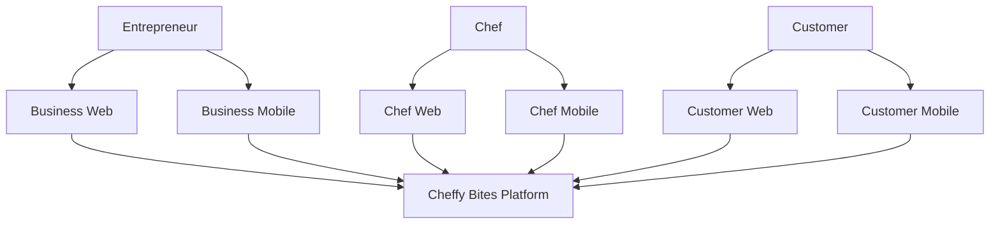
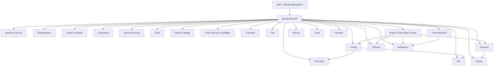
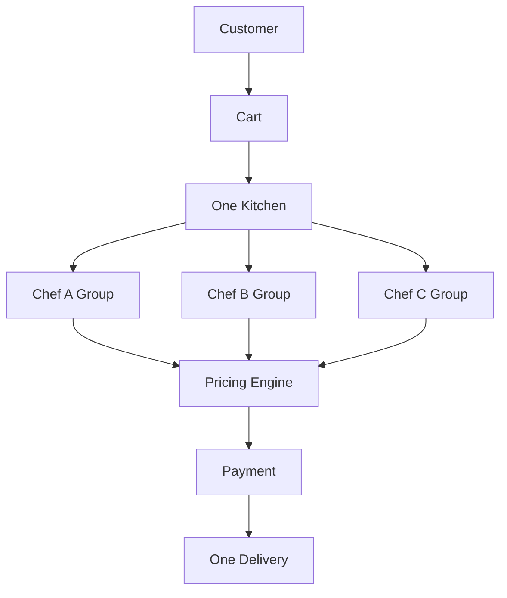
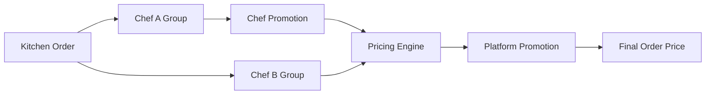
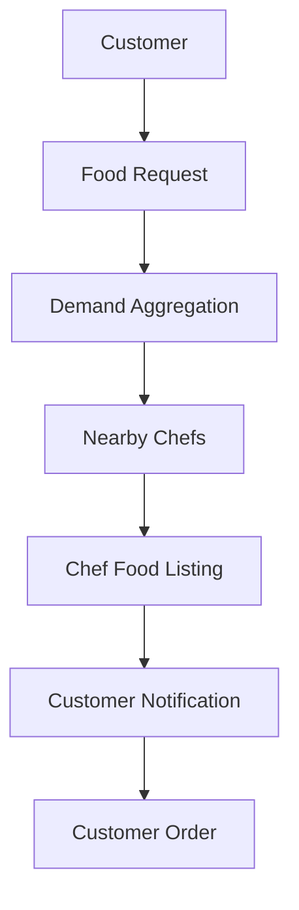
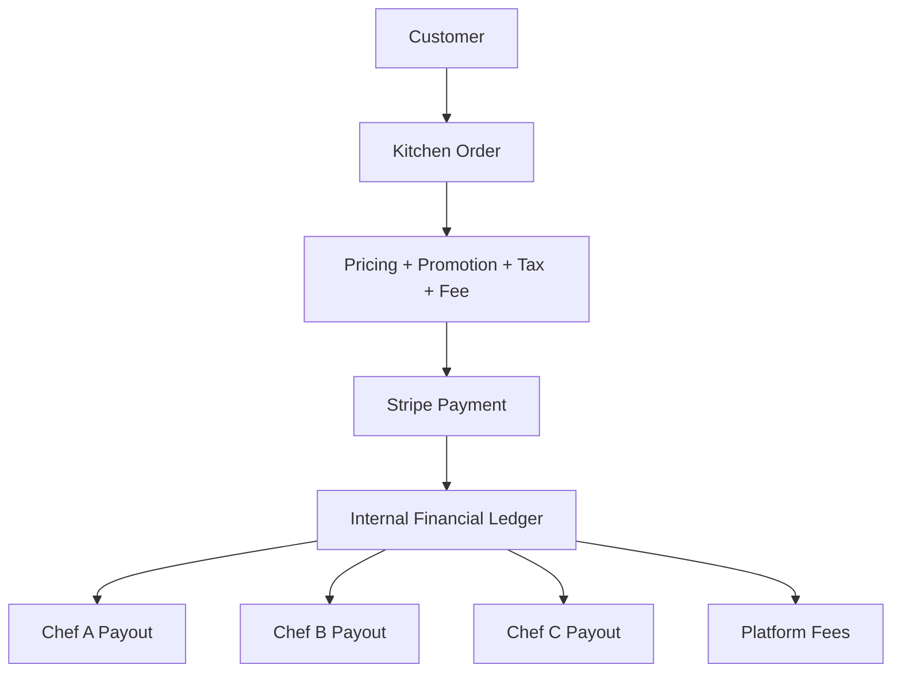

# Cheffy Bites — Master Architecture, Technology & AI Development Specification

**Document:** Master Product + Architecture + Technology Specification  
**Version:** 1.0  
**Status:** Architecture Baseline / Development Contract  
**Audience:** Product owners, software architects, developers, QA, DevOps, AI coding assistants  
**Primary Goal:** Serve as the single source of truth for architecture design, technology decisions, implementation, and AI-assisted code generation.

---

# 1. How This Document Must Be Used

This document combines:

1. Business requirements
2. Confirmed business rules
3. Domain model
4. Functional requirements
5. Architecture baseline
6. Recommended technology stack
7. Data architecture
8. API and event conventions
9. Security requirements
10. Testing requirements
11. DevOps requirements
12. AI code-generation contract
13. Remaining architecture decisions

An AI receiving this document must treat it as the **current source of truth**.

When requirements and implementation details conflict, the priority is:

```text
Confirmed Business Rules
        ↓
Architecture Rules
        ↓
Security / Financial / Data Integrity Rules
        ↓
Technology Decisions
        ↓
Implementation Details
```

Do not introduce a new framework, database, service, dependency, architectural style, or deployment technology merely because it is popular. Any deviation from this specification must be proposed as an Architecture Decision Record (ADR).

---

# 2. Product Overview

## 2.1 Product Name

**Cheffy Bites**

## 2.2 Product Vision

Cheffy Bites is a SaaS marketplace connecting:

- Entrepreneurs who own or manage commercial kitchens.
- Chefs who rent commercial kitchen space and sell food.
- Customers who discover and purchase food.

The platform creates two primary marketplaces and one future demand marketplace:

```text
                 CHEFFY BITES
                      │
        ┌─────────────┼─────────────┐
        │             │             │
        ▼             ▼             ▼
    KITCHEN         FOOD          DEMAND
  MARKETPLACE    MARKETPLACE    MARKETPLACE
        │             │             │
        ▼             ▼             ▼
 Entrepreneurs       Chefs       Customers
        │             │             │
        ▼             ▼             ▼
     Kitchens        Food      Food Requests
     & Spaces       Listings       / Demand
```

Long term, the platform should create a continuous supply/demand loop:

```text
Kitchen Supply
      ↓
Chefs
      ↓
Food Supply
      ↓
Customers
      ↓
Food Demand / Requests
      ↓
Chefs discover demand
      ↓
New Food Supply
```

---

# 3. User Types

## 3.1 Entrepreneur

Owns or manages one or more commercial kitchens.

Can:

- Own/manage multiple kitchens.
- Operate kitchens in multiple physical locations.
- Create multiple rentable spaces/units inside a kitchen.
- Define base equipment for each space.
- Offer additional equipment for hourly rental.
- Define operating hours.
- Define hourly pricing.
- Define minimum booking duration.
- Define cleaning time.
- Manage bookings.
- Manage Chef access/use of spaces.
- Create promotions for kitchen bookings and equipment.
- View revenue and payout information.

## 3.2 Chef

Uses commercial kitchen spaces and operates a food business.

Can:

- Maintain professional profile.
- Search nearby kitchens/spaces.
- Book kitchen spaces.
- Rent additional equipment.
- Create food listings.
- Use the platform's master food/cuisine catalog to pre-populate data.
- Customize food information.
- Add food images.
- Add ingredients and nutrition information.
- Add optional recipes.
- Add optional YouTube videos.
- Schedule food availability by date/time.
- Receive and manage customer orders.
- Create promotions.
- See local customer food demand.
- Respond to Food Requests through controlled workflows.
- View financial information and payouts.

## 3.3 Customer

Can:

- Discover chefs and food.
- Search by cuisine, food, chef, location, and dietary attributes.
- Filter vegetarian/non-vegetarian and future dietary classifications.
- Maintain saved food/wishlist items.
- Create Food Requests for desired food.
- Add another customer's Food Request to their own wishlist/request list.
- Subscribe to availability notifications.
- Add food from multiple chefs **only when those chefs operate from the same kitchen**.
- Place an order from one kitchen at a time.
- Pay for the order.
- Track preparation and delivery.
- Chat through permitted order/request workflows.
- Rate food and chefs.

## 3.4 Platform Administrator

Required as a core internal role even if the first administrative application is limited.

Can eventually manage:

- Users
- Organizations
- Entrepreneurs
- Chefs
- Customers
- Kitchens
- Kitchen spaces
- Equipment catalog
- Food catalog
- Cuisine catalog
- Ingredients
- Nutrition data
- Promotions
- Orders
- Payments
- Refunds
- Payouts
- Delivery integrations
- Food Requests
- Reviews
- Disputes
- Reports
- Audit logs
- Platform configuration

---

# 4. Applications

Cheffy Bites will have three independent user-facing application experiences, each on web and mobile.

## 4.1 Entrepreneur

Web:

`https://business.cheffybites.com`

Mobile:

**Cheffy Bites Business**

## 4.2 Chef

Web:

`https://chef.cheffybites.com`

Mobile:

**Cheffy Bites Chef**

## 4.3 Customer

Web:

`https://www.cheffybites.com`

Mobile:

**Cheffy Bites**

## 4.4 Internal Administration

Recommended future domain:

`https://admin.cheffybites.com`

The admin application must never be exposed as a normal customer-facing application.

---

# 5. Core Domain Model

The most important conceptual hierarchy is:

```text
Organization / Business
        │
        ├── Locations
        │     │
        │     └── Kitchens
        │           │
        │           └── Rentable Spaces / Units
        │                 │
        │                 ├── Included Equipment
        │                 └── Additional Rental Equipment
        │
        └── Users / Members
```

For the food marketplace:

```text
Chef Business
     │
     ├── Chef / Members
     ├── Food Listings
     ├── Menus
     ├── Food Availability
     └── Promotions
```

For customer ordering:

```text
Customer
   │
   └── Cart
         │
         └── Exactly ONE Kitchen
               │
               ├── Chef Order Group A
               │     └── Food Items
               │
               ├── Chef Order Group B
               │     └── Food Items
               │
               └── Chef Order Group C
                     └── Food Items
```

This hierarchy is a core architecture rule.

---

# 6. Critical Business Rule: One Kitchen Per Customer Order

## 6.1 Rule

A customer order may contain food from **multiple Chefs**, but **all Chefs must belong to the same physical Kitchen** for that order.

Food from different Kitchens cannot be combined into one Order.

## 6.2 Example

```text
Kitchen A
 ├── Chef A → Food 1
 ├── Chef B → Food 2
 └── Chef C → Food 3

Allowed:
ONE ORDER
ONE KITCHEN
THREE CHEFS
ONE DELIVERY
ONE DELIVERY FEE
```

But:

```text
Kitchen A → Chef A
Kitchen B → Chef C

Not allowed in one order.

Customer creates separate orders:
Order #1001 → Kitchen A
Order #1002 → Kitchen B
```

## 6.3 Backend Enforcement

This is not merely a frontend restriction.

The backend must reject an order/cart mutation that attempts to add an item associated with a different kitchen.

## 6.4 Delivery Benefit

For a single-kitchen order, delivery is calculated once for the Kitchen Order, not once per Chef.

---

# 7. Kitchen Domain

## 7.1 Entrepreneur → Multiple Kitchens

One Entrepreneur/organization can own or manage multiple kitchens.

Example:

```text
ABC Foods
 ├── Hello Kitchen - Montreal
 │     ├── Space 1
 │     ├── Space 2
 │     └── Space 3
 │
 ├── Hello Kitchen - Laval
 │     ├── Space 1
 │     └── Space 2
 │
 └── Hello Kitchen - Toronto
       ├── Space 1
       ├── Space 2
       └── Space 3
```

## 7.2 Kitchen

A Kitchen represents a physical commercial kitchen facility.

Attributes include:

- Name
- Description
- Address
- Latitude/longitude
- Images
- Business owner
- Amenities
- Operating schedule
- Rules
- Status
- Spaces

## 7.3 Kitchen Space / Unit

A Space/Unit is the **actual rentable resource**.

Each Space has:

- Name
- Description
- Size
- Capacity
- Images
- Included equipment
- Optional equipment available for rental
- Hourly rate
- Minimum booking duration
- Maximum duration if applicable
- Cleaning duration
- Availability
- Status

## 7.4 Booking Occupancy

A booking occupies both cooking time and cleaning time.

Example:

```text
Cooking:
10:00 - 14:00

Cleaning:
14:00 - 15:00

Resource Occupied:
10:00 - 15:00
```

Another Chef cannot book the same Space during any part of the occupied period.

---

# 8. Equipment Domain

## 8.1 Master Equipment Catalog

The platform will maintain a reusable master catalog of kitchen equipment/supplies, with images.

Examples:

- Commercial oven
- Convection oven
- Pizza oven
- Stove
- Induction stove
- Tandoor
- Grill
- Deep fryer
- Refrigerator
- Freezer
- Mixer
- Blender
- Food processor
- Prep table
- Commercial sink
- Dishwasher
- Storage rack
- Microwave
- Rice cooker

## 8.2 Included Equipment

A Kitchen Space can select equipment from the master catalog as included equipment.

Entrepreneurs should not manually create every common piece of equipment.

## 8.3 Additional Equipment Rental

Additional equipment can be independently rented on an hourly basis.

Each rental-capable equipment item must support:

- Rate
- Quantity
- Availability
- Booking/occupancy period
- Applicable promotion

Inventory must prevent overbooking.

Example:

```text
Tandoor quantity = 2

Booking A → 1
Booking B → 1
Booking C → 1

Booking C must be rejected if periods overlap.
```

---

# 9. Kitchen Availability and Pricing

Entrepreneurs can configure:

- Operating hours by day.
- Closed days.
- Holidays.
- Temporary closure.
- Special hours.
- Blackout periods.
- Hourly rate.
- Minimum booking hours.
- Cleaning duration.
- Additional equipment rates.

The availability engine must be timezone-aware.

Store timestamps in UTC and maintain the applicable location timezone for business scheduling.

---

# 10. Kitchen Booking Domain

## 10.1 Booking Flow

```text
Search Kitchen / Space
        ↓
Select Date / Time
        ↓
Validate Space Availability
        ↓
Select Additional Equipment
        ↓
Validate Equipment Availability
        ↓
Calculate Base Price
        ↓
Apply Entrepreneur Promotion
        ↓
Calculate Fees + Taxes
        ↓
Checkout
        ↓
Payment
        ↓
Booking Confirmed
```

## 10.2 Temporary Hold

When a Chef selects a Space and begins checkout, the resource may be temporarily held.

```text
AVAILABLE
   ↓
TEMPORARILY_HELD
   ├── Payment Success → CONFIRMED
   └── Payment Failed/Expired → AVAILABLE
```

Hold duration is configurable.

The booking mechanism must prevent race conditions and double booking.

---

# 11. Chef Domain

Chef profile supports:

- Name
- Profile photo
- Biography
- Experience
- Cuisine specialties
- Certifications
- Business details
- Service locations
- Ratings
- Reviews

A Chef may eventually belong to a Chef Business organization with multiple members.

---

# 12. Food Master Catalog

The platform will maintain master data for:

- Food
- Cuisine
- Ingredients
- Nutrition
- Dietary attributes
- Allergens
- Images
- Categories

Example:

```text
Cuisine: Indian
 ├── Palak Paneer
 ├── Chole
 ├── Biryani
 ├── Dosa
 └── Butter Chicken
```

Master data must be separate from Chef-owned food listings.

---

# 13. Master Food vs Chef Food Listing

A Chef must never modify the global master catalog accidentally.

Conceptually:

```text
MASTER FOOD
   │
   ├── Standard name
   ├── Cuisine
   ├── Ingredients
   ├── Nutrition
   └── Reference image
        │
        ▼
CHEF FOOD LISTING
   ├── Chef-specific name
   ├── Description
   ├── Chef images
   ├── Price
   ├── Recipe
   ├── YouTube video
   ├── Customized ingredients
   ├── Customized nutrition where permitted
   └── Availability
```

A Chef can use master information as a starting point and customize permitted fields.

---

# 14. Food Listing Requirements

Each Chef food listing can contain:

- Food name
- Cuisine
- Category
- Description
- Multiple images
- Ingredients
- Nutrition information
- Serving size
- Dietary attributes
- Allergens
- Preparation time
- Recipe
- YouTube URL/video identifier
- Price
- Availability
- Status

Optional fields must remain optional.

---

# 15. Food Availability

Chefs schedule food by date/time.

Example:

```text
Palak Paneer

Aug 25 → 12:00–15:00
Aug 26 → 12:00–15:00
Aug 27 → 18:00–21:00
```

Support:

- One-time availability
- Recurring availability
- Start/end time
- Temporary disablement
- Cutoff time
- Preparation time

The architecture must eventually define the relationship among Food Availability, Chef Availability, Kitchen Availability, and Order Cutoff.

---

# 16. Customer Food Discovery

Customers can discover and filter by:

- Cuisine
- Food item
- Chef
- Location
- Price
- Availability
- Vegetarian/non-vegetarian
- Future dietary attributes

The dietary model should be extensible, not hard-coded to only two values.

Possible future attributes:

- Vegan
- Jain
- Gluten-free
- Dairy-free
- Nut-free
- Halal
- Kosher
- Spicy level

---

# 17. Customer Cart and Order Model

## 17.1 Multiple Carts

A customer may maintain multiple active carts, but each cart belongs to exactly one Kitchen.

```text
Customer
 ├── Cart A → Kitchen A
 │     ├── Chef A items
 │     └── Chef B items
 │
 ├── Cart B → Kitchen B
 │     └── Chef C items
 │
 └── Cart C → Kitchen C
       ├── Chef D items
       └── Chef E items
```

Checkout of each cart produces a separate Order.

## 17.2 One Order / One Kitchen / Multiple Chefs

```text
Order
 └── Kitchen A
       ├── Chef Order Group A
       │     ├── Item A1
       │     └── Item A2
       │
       ├── Chef Order Group B
       │     └── Item B1
       │
       └── Chef Order Group C
             └── Item C1
```

## 17.3 Chef Order Group

A Chef Order Group represents that Chef's portion of a Kitchen Order.

It exists because:

- Chef promotions are evaluated at Chef scope.
- Chef preparation status is independent.
- Chef reporting is independent.
- Chef payout is independent.
- Chef-specific cancellation/refund effects may occur.

---

# 18. Order Lifecycle

## 18.1 Overall Order

```text
CART
  ↓
CHECKOUT
  ↓
PAYMENT_PENDING
  ↓
PAID
  ↓
PENDING_CHEF_ACCEPTANCE
  ├── ACCEPTED
  │      ↓
  │   PREPARING
  │      ↓
  │   READY_FOR_FULFILLMENT
  │      ├── PICKUP → PICKED_UP → COMPLETED
  │      └── DELIVERY → DELIVERY_REQUESTED
  │                         ↓
  │                    DRIVER_ASSIGNED
  │                         ↓
  │                      PICKED_UP
  │                         ↓
  │                   OUT_FOR_DELIVERY
  │                         ↓
  │                      DELIVERED
  │                         ↓
  │                     COMPLETED
  │
  └── REJECTED → REFUND_PENDING → REFUNDED
```

Possible terminal states:

- COMPLETED
- CANCELLED
- REFUNDED
- PARTIALLY_REFUNDED
- FAILED

## 18.2 Chef Order Group Lifecycle

Each Chef Group has its own operational lifecycle.

Example:

```text
PENDING_ACCEPTANCE
  ↓
ACCEPTED
  ↓
PREPARING
  ↓
READY
```

The overall Kitchen Order should not be considered ready for handoff until the required Chef Groups are ready.

---

# 19. Delivery

## 19.1 One Delivery Per Kitchen Order

A delivery fee is calculated for the Kitchen Order, not per Chef.

```text
Kitchen A Order
 ├── Chef A
 ├── Chef B
 └── Chef C
       ↓
 ONE DELIVERY
       ↓
 ONE DELIVERY FEE
```

## 19.2 Delivery Provider Abstraction

Potential providers:

- DoorDash
- Uber
- Future provider

Use an internal abstraction:

```text
DeliveryService
 ├── ProviderAdapterA
 ├── ProviderAdapterB
 └── ProviderAdapterFuture
```

Do not embed provider-specific API behavior throughout Order code.

## 19.3 Delivery Status

Delivery provider status must synchronize with Cheffy Bites order state.

```text
DELIVERY_REQUESTED
 ↓
DRIVER_ASSIGNED
 ↓
PICKED_UP
 ↓
OUT_FOR_DELIVERY
 ↓
DELIVERED
```

The Chef and Customer should see the appropriate current status.

Provider webhooks must be authenticated and idempotent.

---

# 20. Promotions Engine

Promotions are a dedicated domain.

Three owners exist:

```text
PLATFORM
CHEF
ENTREPRENEUR
```

## 20.1 Chef Promotions

Chef can promote:

- One food item.
- Multiple food items.
- Entire menu.

Examples:

- 10% off
- 20% off 2 or more items
- Buy one get one free
- X% off second item
- First-time Chef order discount
- Quantity-based discount

## 20.2 Entrepreneur Promotions

Entrepreneurs can promote:

- Kitchen bookings
- Kitchen spaces
- Additional equipment rentals

Examples:

- 10% off booking
- First booking discount
- Free hour after X hours
- Equipment rental discount

## 20.3 Platform Promotions

Platform promotions can target:

- Customers
- Chefs
- Food orders
- Kitchen bookings
- Equipment rentals
- Specific customer segments
- Specific locations

---

# 21. Promotion Stacking Rules

Confirmed rules:

1. A Chef promotion cannot stack with another Chef promotion.
2. A Platform promotion can stack with a Chef promotion.
3. A customer may use only one promo code per transaction.
4. A promo code is single-use.
5. A promotion can target multiple food items.
6. A promotion can target an entire Chef menu.
7. An Entrepreneur promotion may apply to equipment rental.
8. Platform promo codes may be restricted to specific users/segments.
9. An expired promotion is invalid at checkout even if an item was previously added to the cart.
10. After a partial refund, promotion eligibility must be recalculated.

The exact stacking rules involving Entrepreneur + Platform promotions remain an ADR/business decision unless explicitly finalized.

---

# 22. Chef Promotion Scope — Critical Rule

Chef-level promotions must be evaluated **only against that Chef's portion of the Kitchen Order**.

Example:

```text
Kitchen A
│
├── Chef A
│    ├── Item A1 $20
│    └── Item A2 $20
│
├── Chef B
│    ├── Item B1 $30
│    └── Item B2 $30
│
└── Chef C
     └── Item C1 $20
```

Chef A promotion:

> 20% off when buying 2 or more Chef A items.

Only Chef A's $40 qualifies.

```text
Chef A subtotal   $40
Chef A discount    $8
Chef A net        $32

Chef B subtotal   $60
Chef B discount    $0

Chef C subtotal   $20
Chef C discount    $0
```

The promotion engine must never use total Kitchen Order quantity to satisfy a Chef promotion.

---

# 23. Promotion Evaluation Model

A Promotion should be evaluated using at least:

```text
Owner
Scope
Eligibility Rules
Target Items
Conditions
Priority
Validity Window
Usage Limit
Customer Limit
Promotion Type
Discount Calculation
```

Potential promotion types:

- Percentage
- Fixed amount
- Buy One Get One
- Buy X Get Y
- Second item percentage discount
- First order
- Quantity threshold
- Minimum order amount
- Free delivery
- Free kitchen hours

The implementation can support an MVP subset, but the model must be extensible.

---

# 24. Promotion Validation

The backend is authoritative.

```text
Cart
 ↓
Promotion Engine
 ├── Validate date/time
 ├── Validate customer eligibility
 ├── Validate item scope
 ├── Validate quantity
 ├── Validate usage
 ├── Validate stacking
 └── Calculate discount
 ↓
Pricing Result
```

The frontend may show estimated pricing but never becomes the final source of truth.

---

# 25. Partial Refund + Promotion Recalculation

If a partial refund changes promotion eligibility, the original promotion must be recalculated.

Example:

```text
BUY 2 GET 1 FREE

Original:
A + B + C
C free

Customer returns B

Remaining:
A + C

Promotion no longer valid.
```

The financial engine must calculate the correct refund/adjustment and preserve an audit trail.

Historical financial records must remain immutable.

---

# 26. Food Requests / Demand Marketplace

Food Requests are different from a normal wishlist.

## 26.1 Saved Food

Customer saves an existing food listing for later.

## 26.2 Food Request

Customer requests food they want a Chef to offer.

The request may contain:

- Food name
- Description
- Cuisine
- Image
- YouTube link
- Reference link
- Location
- Notes
- Availability preferences
- Dietary requirements

Anonymous requests are not allowed.

---

# 27. Nearby Chef Food Requests

Food Requests should primarily be visible to nearby Chefs.

The platform therefore requires geospatial capabilities.

Chef-facing data should include:

- Food request
- Approximate service area
- Number of interested customers
- Relevant dietary information
- Date requested

Do not expose unnecessary personal information such as home address, phone, or private email.

---

# 28. Similar Food Request Aggregation

The platform should automatically associate similar requests where possible.

Example:

```text
Mysore Masala Dosa
Mysore Dosa
Mysore Masala Dosai
```

may map to the same master food concept.

The architecture should support future AI-assisted:

- Similarity matching
- Normalization
- Duplicate detection
- Cuisine classification
- Multilingual matching

AI is not required for the MVP core transaction path.

---

# 29. Customer Adds Another Customer's Request

A customer can add another customer's requested food to their own wishlist/request list.

This increases demand count.

Example:

```text
Customer A → requests Dosa
Customer B → adds Dosa to wishlist
Customer C → adds Dosa to wishlist

Aggregated demand = 3 customers
```

Chefs can see the demand count.

---

# 30. Multiple Chef Responses

Multiple Chefs may respond to the same food demand.

Customers should be notified when a Chef adds the requested food to their menu.

Example:

```text
Mysore Masala Dosa

27 customers interested

Chef A → Added
Chef B → Added
Chef C → Interested
```

---

# 31. Chef Interaction with Food Requests

A Chef must not automatically receive unrestricted direct messaging access to a customer's private account merely by viewing a request.

The interaction should use a controlled workflow with notification/consent as appropriate.

Final UX approval/consent behavior must be explicitly defined before implementation.

---

# 32. Food Request Lifecycle

Recommended lifecycle:

```text
DRAFT
 ↓
ACTIVE
 ├── CHEF_INTERESTED
 ├── FOOD_ADDED
 ├── AVAILABLE
 ├── FULFILLED
 ├── DISABLED
 └── DELETED
```

When food becomes available through a Chef, the user's request may automatically close/fulfill according to the defined business rule.

The customer can:

- Keep the food saved.
- Re-enable the request.
- Delete it.
- Subscribe again.

---

# 33. Payments

## 33.1 Payment Principle

Order and Payment are separate domains.

```text
Order
  ↕
Payment
```

A single Order can have:

- Multiple payment attempts.
- One successful charge.
- Partial refund(s).
- Full refund.
- Adjustments.

## 33.2 Marketplace Payment Requirement

A single Kitchen Order may contain items from multiple Chefs, so the payment system must support one customer payment with allocation to multiple sellers/connected accounts.

The recommended payment technology is **Stripe Connect**, subject to final legal/merchant-of-record validation. Stripe documents Connect specifically for marketplaces that collect customer payments and pay multiple sellers/service providers, including application fees and payouts. citeturn201369search0turn201369search1

## 33.3 Payment Lifecycle

```text
CHECKOUT
 ↓
PAYMENT_PENDING
 ↓
Payment Provider
 ├── SUCCESS → PAID
 └── FAILURE → PAYMENT_FAILED
```

## 33.4 Payment Idempotency

Payment creation and processing must use idempotency keys.

Repeated user clicks, network retries, and repeated webhooks must not result in duplicate charges.

---

# 34. Payment Provider Integration

Recommended baseline:

**Stripe Connect** for marketplace payments/payout orchestration.

The platform should use a provider abstraction so it can evolve later.

```text
PaymentGateway
 ├── StripePaymentGateway
 └── FuturePaymentGateway
```

Do not store raw card numbers or CVV data in Cheffy Bites systems.

Stripe Connect supports connected-account onboarding, payment routing, payouts, platform fees, refunds, and other marketplace workflows. citeturn201369search0turn201369search1

---

# 35. Revenue / Fees

The final commission percentages are configurable/TBD.

The architecture must support:

- Percentage fee
- Fixed fee
- Percentage + fixed fee
- Fee by transaction type
- Fee by Chef
- Fee by Entrepreneur
- Fee by geography
- Future subscription fees

Potential fee types:

```text
PLATFORM_FEE
MARKETPLACE_COMMISSION
DELIVERY_FEE
SERVICE_FEE
EQUIPMENT_FEE
CANCELLATION_FEE
```

Never hard-code business commission percentages throughout business code.

---

# 36. Food Order Revenue Allocation

For a multi-Chef Kitchen Order:

```text
Customer Payment
       ↓
Kitchen Order
       ├── Chef A payable
       ├── Chef B payable
       ├── Chef C payable
       ├── Platform fees
       ├── Delivery
       └── Taxes
```

Chef payouts must be derived from immutable transaction line items.

Stripe Connect supports marketplace payment flows and payouts to connected accounts; final charge/transfer configuration must be selected during payment architecture ADR review. citeturn201369search0turn201369search3

---

# 37. Kitchen Booking Financial Model

For Kitchen Booking:

```text
Chef Payment
      ↓
Booking Total
 ├── Space rental
 ├── Additional equipment
 ├── Entrepreneur promotion
 ├── Platform fee
 └── Taxes
      ↓
Entrepreneur payable
```

The same payment/payout framework should support Kitchen and Food marketplace transactions.

---

# 38. Payouts

Primary payout recipients:

- Chefs
- Entrepreneurs

Payouts must have a state machine:

```text
PENDING
 ↓
ELIGIBLE
 ↓
PROCESSING
 ├── SUCCESS
 └── FAILED
```

Possible hold state:

```text
ON_HOLD
```

for disputes, verification, fraud review, or account problems.

Stripe Connect supports scheduled or manual payouts and payout status webhooks; exact payout schedule is a business decision. citeturn201369search4

---

# 39. Payout Timing

Payout timing is configurable and initially TBD.

Recommended operational concept:

```text
Food Order
 → Completed
 → Settlement eligibility
 → Payout

Kitchen Booking
 → Completed
 → Settlement eligibility
 → Payout
```

The architecture must allow settlement delays/holds without changing the original Order amount.

---

# 40. Refunds

Supported refund concepts:

- Full refund
- Partial refund
- Item-level refund
- Delivery refund
- Fee refund
- Promotion adjustment

Refund lifecycle:

```text
REFUND_REQUESTED
 ↓
REFUND_PENDING
 ↓
REFUND_PROCESSING
 ├── REFUNDED
 └── REFUND_FAILED
```

Refund operations must be idempotent and auditable.

---

# 41. Cancellation

Cancellation actor must be stored.

Potential actors:

```text
CUSTOMER
CHEF
ENTREPRENEUR
DELIVERY_PROVIDER
PLATFORM
SYSTEM
```

Cancellation policy depends on state and transaction type.

Example Food Order policy concept:

```text
Before Chef acceptance
 → cancellation potentially allowed

After Chef acceptance
 → business policy applies

Preparing
 → generally no customer cancellation unless policy allows

Delivered
 → cannot cancel; issue/refund flow applies if appropriate
```

Exact refund windows are TBD.

Kitchen Booking cancellation policy must be separately configurable.

---

# 42. Taxes

Tax must be calculated from configurable rules, not hard-coded into source code.

The architecture must support:

- Country
- Province/State
- Region
- Product/service tax category
- Effective dates
- Registration status
- Tax rate
- Historical tax rule snapshot

For an initial Canadian rollout, the system must be capable of handling applicable GST/QST and future provincial/country rules. Final tax treatment requires legal/accounting validation.

Stripe provides Stripe Tax integration for Connect marketplace flows, which should be evaluated as the initial tax-engine option. citeturn201369search1

---

# 43. Financial Immutability

Financial records must be append-only from a business perspective.

Do not overwrite historical financial facts.

For corrections, create new financial events:

```text
Original Charge
      +
Refund Transaction
      +
Adjustment Transaction
```

Every financial record should preserve:

- Transaction ID
- Order/booking ID
- Currency
- Amount
- Type
- Timestamp
- Actor
- External provider reference
- Correlation ID
- Reason
- State

---

# 44. Ledger / Financial Model

The architecture should introduce a financial ledger abstraction.

Conceptual records:

```text
Payment
PaymentAttempt
PaymentTransaction
Refund
RefundTransaction
PromotionApplication
FeeLineItem
TaxLineItem
Payout
PayoutLineItem
LedgerEntry
FinancialAdjustment
```

The final database design may use fewer/more physical tables, but the business concepts must be preserved.

---

# 45. Order Financial Snapshot

At checkout, store a complete commercial snapshot:

```text
Product name
Product price
Quantity
Chef promotion
Platform promotion
Fees
Delivery
Taxes
Final total
Currency
```

Later changes to:

- Food price
- Promotion
- Fee configuration
- Tax rules
- Delivery configuration

must not alter historical orders.

---

# 46. Recommended Architecture Style

## 46.1 Baseline Decision

Use a **Modular Monolith + Event-Driven Integration Architecture** for the initial product.

Do **not** start with dozens of microservices.

Rationale:

- Many domains exist, but the initial product is still being validated.
- Transactional consistency is important.
- Promotions, orders, payments, refunds, payouts, inventory, and booking interact closely.
- A modular monolith gives strong domain boundaries without operational overhead.
- Asynchronous events can decouple notifications, analytics, delivery integrations, and background workflows.
- Individual modules can later be extracted into services when justified.

## 46.2 Architecture Evolution

```text
Phase 1
Modular Monolith
+
Transactional Outbox
+
Async Messaging

        ↓

Phase 2
Extract high-scale/independent modules if justified

        ↓

Phase 3
Selective Microservices
```

Potential extraction candidates later:

- Notification
- Search
- Delivery Integration
- Food Demand Matching
- Promotion Engine
- Payment/Payout Processing
- Analytics

Do not extract them prematurely.

---

# 47. Recommended Technology Stack

This is the **baseline technology decision** for implementation unless an ADR changes it.

## Frontend Web

- TypeScript
- React
- Next.js App Router
- Tailwind CSS
- Accessible shared design system
- TanStack Query for server state
- Zod for client-side schema validation where useful
- OpenAPI-generated TypeScript API client
- pnpm

Next.js is a current React framework with an App Router intended for modern React applications. citeturn472196search0

## Mobile

- TypeScript
- React Native
- Expo tooling where practical
- React Navigation
- TanStack Query
- Shared API types/client
- Shared business UI primitives where appropriate

React Native's New Architecture is the current direction and is enabled by default in modern React Native projects; native modules should use New Architecture-compatible libraries when possible. citeturn472196search3turn472196search11

## Backend

- Java 21 LTS
- Spring Boot 4.x
- Spring Security
- Spring Data JPA where appropriate
- Hibernate
- Flyway for database migrations
- Gradle Kotlin DSL
- Bean Validation
- Spring Web
- OpenAPI/Swagger
- Testcontainers
- JUnit 5
- Mockito where appropriate

Current official Spring documentation lists Spring Boot 4.1.x as a stable line; use the latest supported patch release at project bootstrap rather than hard-coding an outdated patch here. citeturn472196search10turn472196search12

## Primary Database

- PostgreSQL
- PostGIS extension for geospatial search

## Cache

- Redis

## Object Storage

- Amazon S3

## CDN

- Amazon CloudFront

## Messaging / Async

Initial recommendation:

- Amazon SQS
- Amazon SNS/EventBridge where useful
- Transactional Outbox in PostgreSQL

Do **not** introduce Kafka initially unless throughput or integration requirements justify it.

## Search

MVP:

- PostgreSQL full-text search
- PostGIS for location queries

Later:

- OpenSearch if search volume/relevance requirements justify it.

## Authentication / Identity

Recommended baseline:

- Auth0 / OpenID Connect
- OAuth 2.0 / OIDC
- MFA
- Role + permission based authorization

The application must not implement password authentication from scratch unless an ADR explicitly approves it.

## Payments

- Stripe Connect
- Stripe Payments
- Stripe Tax evaluation

## Notifications

- Push: Firebase Cloud Messaging / Apple Push Notification service through a notification abstraction
- Email: Amazon SES or equivalent provider
- SMS: provider abstraction, initially optional

## Observability

- OpenTelemetry
- CloudWatch
- Structured JSON logs
- Prometheus-compatible metrics where useful
- Grafana can be introduced as the operational dashboard layer

## Container / Runtime

- Docker
- AWS ECS Fargate for backend runtime

Avoid Kubernetes for the MVP unless a concrete operational requirement exists.

## Infrastructure as Code

- Terraform

## CI/CD

- GitHub Actions

---

# 48. Frontend Architecture

Use a monorepo for TypeScript applications and shared packages.

Recommended:

```text
apps/
  business-web/
  chef-web/
  customer-web/
  business-mobile/
  chef-mobile/
  customer-mobile/

packages/
  api-client/
  domain-types/
  validation/
  ui-web/
  ui-mobile/
  design-tokens/
  config/
  eslint-config/
  tsconfig/
```

The three applications should share:

- API client
- Domain types
- Design tokens
- Validation schemas where appropriate
- Utility packages

Do not force unrelated screens/business logic into a giant shared component package.

---

# 49. Backend Architecture

Use a single deployable Spring Boot application initially, organized by domain/bounded context.

Recommended structure:

```text
backend/
  src/main/java/com/cheffybites/
    identity/
    organization/
    entrepreneur/
    kitchen/
    equipment/
    booking/
    chef/
    catalog/
    food/
    customer/
    cart/
    order/
    promotion/
    pricing/
    payment/
    refund/
    tax/
    payout/
    delivery/
    notification/
    chat/
    review/
    foodrequest/
    administration/
    common/
```

Each module should have internal boundaries such as:

```text
module/
  api/
  application/
  domain/
  infrastructure/
```

The domain layer must not depend directly on controllers or external provider SDKs.

---

# 50. Backend Module Rules

## API Layer

Responsible for:

- REST controllers
- Request/response DTOs
- Authentication context
- HTTP validation

## Application Layer

Responsible for:

- Use cases
- Transaction orchestration
- Authorization checks
- Domain service coordination

## Domain Layer

Responsible for:

- Business invariants
- Domain models
- Value objects
- Domain rules
- State transitions

## Infrastructure Layer

Responsible for:

- JPA repositories
- External APIs
- Stripe integration
- Delivery providers
- Messaging
- S3
- Redis

Business code should not directly depend on Stripe/DoorDash/Uber/AWS SDKs.

Use interfaces/ports and infrastructure adapters.

---

# 51. API Style

Use REST for public/application APIs.

Use OpenAPI as the contract.

Recommended path:

```text
/api/v1/...
```

Examples:

```text
GET    /api/v1/kitchens
POST   /api/v1/kitchens
GET    /api/v1/kitchens/{kitchenId}
POST   /api/v1/kitchens/{kitchenId}/spaces

GET    /api/v1/food
POST   /api/v1/foods

POST   /api/v1/carts
POST   /api/v1/carts/{cartId}/items
POST   /api/v1/orders
GET    /api/v1/orders/{orderId}

POST   /api/v1/promotions
POST   /api/v1/orders/{orderId}/promo-code

POST   /api/v1/payments
POST   /api/v1/refunds
```

The final endpoint list is generated during implementation from use cases.

---

# 52. API Design Rules

- Use nouns/resources rather than RPC-style URLs where practical.
- Version APIs.
- Validate all request input.
- Return consistent error structures.
- Do not expose database entity objects directly.
- Use DTOs.
- Implement pagination for list endpoints.
- Support sorting/filtering where required.
- Use optimistic concurrency/versioning where appropriate.
- Use idempotency keys on mutation APIs that create financial/reservation side effects.

---

# 53. Error Response Standard

Use a consistent structure such as:

```json
{
  "code": "PROMOTION_NOT_APPLICABLE",
  "message": "The promotion is no longer valid for this order.",
  "traceId": "...",
  "details": {}
}
```

Never expose stack traces or internal infrastructure details to users.

---

# 54. Database Architecture

Use PostgreSQL as the system of record.

Use logical domain ownership inside the same database initially.

Potential schema/domain groups:

```text
identity
organization
kitchen
booking
equipment
chef
catalog
food
customer
cart
orders
promotion
pricing
payment
refund
tax
payout
delivery
notification
chat
review
food_request
audit
```

Whether these become actual PostgreSQL schemas or table prefixes can be decided during implementation, but domain ownership must be clear.

---

# 55. Core Entities

Initial conceptual entities include:

```text
User
Organization
OrganizationMember
Role
Permission

EntrepreneurBusiness
Location
Kitchen
KitchenSpace
KitchenAvailability
KitchenBooking

EquipmentCatalogItem
KitchenSpaceEquipment
EquipmentRental
EquipmentAvailability

ChefProfile
ChefBusiness
Menu
MenuItem
FoodListing
FoodAvailability

Cuisine
MasterFood
Ingredient
NutritionProfile
DietaryAttribute
Allergen

CustomerProfile
CustomerAddress
Cart
CartItem

Order
ChefOrderGroup
OrderItem
OrderStatusHistory

Promotion
PromotionRule
PromotionTarget
PromotionApplication
PromoCode
PromotionUsage
PricingSnapshot

Payment
PaymentAttempt
PaymentTransaction
Refund
RefundTransaction

FeeLineItem
TaxLineItem
Payout
PayoutLineItem
LedgerEntry
FinancialAdjustment

Delivery
DeliveryEvent
DeliveryProviderReference

ChatConversation
ChatParticipant
ChatMessage

Rating
Review

FoodRequest
FoodRequestInterest
FoodRequestSubscription
FoodRequestResponse

Notification
NotificationPreference
AuditLog
```

The physical model may be normalized/optimized during database design.

---

# 56. Data Integrity Rules

## Money

Do not use floating-point types for monetary values.

Use an exact monetary representation, preferably:

- Integer minor units (recommended for persisted monetary amounts), plus currency.

Example:

```text
amount_minor = 1050
currency = CAD
```

or an appropriately constrained decimal model if dictated by accounting requirements.

## IDs

Use UUID/UUIDv7 or another time-sortable unique identifier strategy consistently.

## Dates

- Store timestamps in UTC.
- Store local timezone identifiers for locations/businesses.
- Never infer timezone from browser locale alone.

## Soft Delete

Use soft delete only where business/audit needs justify it.

Financial records must not be physically deleted as a normal operation.

---

# 57. Geospatial Architecture

Use PostgreSQL + PostGIS initially.

Use geospatial indexes for:

- Kitchens near Chef
- Chefs near Customer demand
- Food listings by service area
- Delivery location queries

Conceptual queries:

```text
Find kitchens within radius R of location L.
Find active food requests within radius R of Chef service location.
Find chefs serving a requested food near a customer.
```

Keep the radius/configuration business-driven.

---

# 58. Search Architecture

MVP:

1. PostgreSQL search for structured fields.
2. PostgreSQL full-text search for text.
3. PostGIS for geographic filtering.

Search fields may include:

- Cuisine
- Food name
- Chef
- Kitchen
- Location
- Dietary attributes
- Availability

Later, OpenSearch may be introduced if relevance, scale, typo-tolerance, faceting, or ranking requirements exceed PostgreSQL capability.

---

# 59. Caching

Use Redis selectively for:

- Short-lived availability/search caches
- Rate limiting
- Session/temporary state if needed
- Idempotency records where appropriate
- Frequently accessed master data

Do not treat Redis as the authoritative source of transactional state.

Availability and payment correctness must come from the transactional database/provider.

---

# 60. File and Image Architecture

Use S3 for:

- Kitchen images
- Space images
- Food images
- Profile photos
- Business verification documents
- Other uploaded files

Use pre-signed upload URLs.

Images should support:

- Original object
- Optimized variants
- Thumbnail
- Metadata
- Content-type validation
- Size limits

Use CloudFront/CDN for public/authorized media delivery.

Do not store image binaries directly in PostgreSQL.

---

# 61. Authentication and Authorization

Use OIDC/OAuth2 identity provider.

Authorization must be based on:

```text
User
  ↓
Organization / Business
  ↓
Role
  ↓
Permission
  ↓
Resource Ownership
```

Examples:

- Entrepreneur Owner can manage all kitchens in their organization.
- Kitchen Manager can manage assigned kitchens.
- Chef can manage their Chef Business.
- Chef can manage only food listings belonging to their business.
- Customer can access only their carts/orders/requests.
- Admin can access privileged operational functions.

Never rely only on frontend route protection.

Every backend mutation must verify authorization.

---

# 62. Tenant / Organization Isolation

The platform is multi-tenant from a business-data perspective.

Every organization-owned resource should have a clear ownership path.

Example:

```text
Organization
 → Kitchen
 → Space
 → Booking
```

and:

```text
Chef Business
 → Food Listing
 → Promotion
 → Chef Order Group
```

Authorization must prevent cross-organization data access.

---

# 63. Security Requirements

Implement at minimum:

- HTTPS everywhere.
- Secure OAuth/OIDC.
- MFA support.
- Short-lived access tokens and secure refresh handling.
- Secrets in AWS Secrets Manager or equivalent.
- Encryption at rest.
- Encryption in transit.
- Input validation.
- Output encoding.
- Rate limiting.
- CORS restrictions.
- CSRF protection where applicable.
- SSRF protection for external URL processing.
- File upload validation.
- Malware scanning strategy for sensitive uploads.
- Audit logging for privileged/financial operations.
- OWASP-aligned secure coding.

Never store:

- Raw card data.
- Passwords in application tables when using a managed identity provider.
- Secrets in source code.

---

# 64. Chat Architecture

Chat is a controlled feature, not unrestricted social messaging.

Potential conversation types:

- Customer ↔ Chef order conversation.
- Food Request interaction after permitted workflow.

Recommended transport:

- WebSocket for real-time chat.
- REST for conversation history and message pagination.

Messages should be persisted.

Support:

- Message timestamp
- Read status
- Delivery status
- Push notification
- Abuse/reporting controls

---

# 65. Notification Architecture

Notification creation should be event-driven where possible.

Example:

```text
OrderAccepted
      ↓
Notification Service
 ├── Push → Customer
 └── Email → Customer if configured
```

Events should not make transactional requests wait for every notification provider.

Use an asynchronous worker.

---

# 66. Event-Driven Architecture

Use domain/integration events selectively.

Examples:

```text
OrderCreated
PaymentSucceeded
OrderAccepted
OrderRejected
OrderPreparing
OrderReady
DeliveryRequested
DriverAssigned
OrderPickedUp
OrderOutForDelivery
OrderDelivered
OrderCancelled
RefundProcessed
PayoutCreated
PayoutPaid
PromotionApplied
PromotionInvalidated
KitchenBookingConfirmed
KitchenBookingCancelled
FoodRequestCreated
FoodRequestFulfilled
FoodPublished
```

Use a transactional outbox so database changes and event publication are reliable.

---

# 67. Transactional Outbox

For important events:

```text
Business Transaction
       │
       ├── Update domain tables
       └── Insert outbox event
                 │
                 ▼
            Outbox Worker
                 │
                 ▼
              SQS/Event Bus
                 │
          ┌──────┼──────┐
          ▼      ▼      ▼
      Notify   Search  Analytics
```

The consumer must be idempotent.

---

# 68. Messaging Rule

Do not use asynchronous messaging to replace simple in-process method calls inside the modular monolith.

Use async events when they provide one or more of:

- Reliability isolation
- External integration
- Background processing
- Notification
- Analytics
- Search indexing
- Eventual consistency that is acceptable

---

# 69. Observability

Every request should have:

- Trace ID
- Correlation ID where applicable
- Structured logs

Use OpenTelemetry for:

- HTTP tracing
- Database tracing
- External API calls
- Messaging
- Background jobs

Monitor:

- API latency
- Error rate
- Database latency
- Connection pool usage
- Queue depth
- Payment failures
- Refund failures
- Booking conflicts
- Delivery failures
- Notification failures
- Payout failures

---

# 70. Audit Logging

Audit sensitive actions such as:

- Login/security events.
- Role/permission changes.
- Kitchen publication.
- Booking cancellation.
- Promotion creation/change.
- Price changes where required.
- Payment/refund action.
- Payout changes.
- Admin changes.
- Master data changes.

Audit records should identify:

- Actor
- Action
- Resource
- Old value where appropriate
- New value where appropriate
- Timestamp
- Correlation ID

Never log secrets or payment-sensitive data.

---

# 71. Testing Strategy

Testing must occur at multiple levels.

## Unit Tests

Required for:

- Promotion rules
- Pricing
- Order state transitions
- Booking conflict logic
- Equipment capacity logic
- Tax calculation integration boundary
- Refund recalculation
- Fee calculation
- Authorization policies

## Integration Tests

Use Testcontainers for:

- PostgreSQL
- Redis where required
- Messaging dependencies where appropriate

## API Tests

Validate OpenAPI contract behavior.

## End-to-End Tests

At minimum:

- Customer registration/login
- Kitchen creation
- Space creation
- Chef booking
- Food publishing
- Customer checkout
- Multi-Chef same-Kitchen cart
- Cross-Kitchen cart rejection
- Chef promotion
- Platform + Chef stacking
- Expired promotion
- Partial refund and promotion recalculation
- Delivery status flow
- Food Request
- Chef response

## Mobile Testing

Include device/platform coverage for iOS and Android.

---

# 72. Critical Automated Tests

These scenarios are mandatory because they protect core business rules.

### Cart / Order

```text
Given Kitchen A
And Chef A item
And Chef B item
When both chefs belong to Kitchen A
Then customer can checkout one order.
```

```text
Given Kitchen A item
And Kitchen B item
When customer tries to combine them
Then API rejects the operation.
```

### Chef Promotion

```text
Given Chef A has 20% off for 2+ items
And Chef B has 2 items
And Chef A has 1 item
Then Chef A promotion must not be satisfied using Chef B quantity.
```

### Stacking

```text
Given Chef promotion = 10%
And Platform promotion = 10%
Then both may apply according to configured order.
```

### Single Promo Code

```text
Two valid promo codes
→ only one promo code may be applied.
```

### Single-Use Code

```text
Promo code successfully used once
→ second successful use is rejected.
```

### Booking

```text
Same Space + overlapping occupancy
→ second booking rejected.
```

### Equipment

```text
Equipment quantity = 2
Three overlapping reservations
→ only two succeed.
```

---

# 73. CI/CD

Recommended environments:

```text
LOCAL
 ↓
DEV
 ↓
QA
 ↓
STAGING
 ↓
PRODUCTION
```

CI pipeline should include:

1. Install dependencies.
2. Static analysis.
3. Lint.
4. Unit tests.
5. Integration tests.
6. Build.
7. Container scan.
8. Dependency/security scan.
9. Publish artifact.
10. Deploy environment.

Production deployment should require controlled approval.

---

# 74. Database Migration Strategy

Use Flyway.

Rules:

- Every schema change is a migration.
- Never manually modify production schema.
- Migrations are version-controlled.
- Destructive migrations require special handling.
- Backward-compatible migrations should be preferred for rolling deployments.

---

# 75. API Contract Strategy

OpenAPI is the authoritative HTTP contract.

The project should generate:

- TypeScript client/types for web/mobile where practical.
- Server-side documentation.

Avoid duplicating DTO definitions manually across six frontend applications.

---

# 76. Frontend State Management

Separate:

## Server State

Use TanStack Query for:

- Food catalog
- Kitchens
- Orders
- Bookings
- Promotions
- Requests

## Local UI State

Use React state and lightweight stores for:

- Modal state
- Filters
- UI preferences
- Temporary form state

Do not store the entire server database in a global client store.

---

# 77. Mobile Architecture Principles

Use React Native with shared business/application packages where practical.

Keep native integration behind platform abstractions.

Examples:

```text
LocationService
NotificationService
PaymentService
MapService
CameraService
```

The business domain should not know whether the underlying implementation is iOS or Android.

---

# 78. Web Architecture Principles

Use Next.js App Router.

Use:

- Server rendering where beneficial.
- Client components only where interactivity requires them.
- Shared design system.
- Strong accessibility.
- SEO for public customer-facing food/chef pages.
- Protected route boundaries for business/chef dashboards.

The customer web application should support search-engine-friendly public food/chef discovery pages where business requirements justify it.

---

# 79. Design System

All three web applications and all three mobile applications should share a brand/design foundation.

Shared:

- Typography tokens
- Spacing tokens
- Component states
- Icon system
- Colors
- Accessibility rules
- Forms
- Buttons
- Cards
- Tables
- Modals
- Toasts
- Loading states
- Error states

Role-specific applications can have different navigation and workflows without duplicating the design system.

---

# 80. UX Principles

Cheffy Bites should be intuitive for non-technical entrepreneurs and chefs.

## Entrepreneur

Use guided setup:

```text
Create Business
 → Add Kitchen
 → Add Spaces
 → Select Equipment
 → Set Hours
 → Set Pricing
 → Publish
```

## Chef

Use guided setup:

```text
Create Profile
 → Find Kitchen
 → Book Space
 → Create Food
 → Schedule Availability
 → Publish
```

## Customer

Keep the primary workflow extremely simple:

```text
Discover
 → Food
 → Chef
 → Cart
 → Checkout
 → Track
 → Rate
```

---

# 81. Recommended Repository Structure

```text
cheffy-bites/
│
├── apps/
│   ├── business-web/
│   ├── chef-web/
│   ├── customer-web/
│   ├── business-mobile/
│   ├── chef-mobile/
│   └── customer-mobile/
│
├── packages/
│   ├── api-client/
│   ├── domain-types/
│   ├── validation/
│   ├── design-tokens/
│   ├── ui-web/
│   ├── ui-mobile/
│   ├── eslint-config/
│   └── typescript-config/
│
├── backend/
│   ├── build.gradle.kts
│   └── src/
│       ├── main/
│       └── test/
│
├── infrastructure/
│   ├── terraform/
│   ├── environments/
│   └── modules/
│
├── docs/
│   ├── architecture/
│   ├── adr/
│   ├── api/
│   ├── diagrams/
│   └── business-rules/
│
├── .github/
│   └── workflows/
│
├── package.json
├── pnpm-workspace.yaml
├── turbo.json
└── README.md
```

A separate backend repository is acceptable if the team strongly prefers independent lifecycle management, but the initial default is one Git repository to make AI-assisted development and cross-project changes easier.

---

# 82. Mermaid — High-Level Context



---

# 83. Mermaid — Backend Domain Architecture



---

# 84. Mermaid — Customer Single-Kitchen Order



---

# 85. Mermaid — Promotion Evaluation



The implementation may apply platform discounts according to the exact configured stacking/calculation rule; the key invariant is that Chef A's promotion only evaluates Chef A's eligible scope.

---

# 86. Mermaid — Food Demand Loop



---

# 87. Mermaid — Financial Flow



---

# 88. Architecture Decision Records Required

Before production implementation, create ADRs for at least:

1. Modular monolith vs microservices.
2. Next.js architecture.
3. React Native/Expo architecture.
4. PostgreSQL/PostGIS strategy.
5. Auth0 or selected identity provider.
6. Stripe Connect charge/transfer model.
7. Merchant of record model.
8. Tax calculation model.
9. Delivery provider strategy.
10. SQS/SNS/EventBridge vs Kafka.
11. Search: PostgreSQL vs OpenSearch.
12. Repository strategy.
13. Monorepo tooling.
14. Multi-Chef single-Kitchen order model.
15. Promotion calculation/stacking order.
16. Partial refund recalculation model.
17. Payout settlement/hold model.
18. Data retention/audit strategy.

---

# 89. Recommended MVP Scope

The MVP should focus on proving the two-sided marketplace first.

## Phase 1 — Foundation

- Identity
- Roles
- Organization
- Customer
- Chef
- Entrepreneur
- Common UI/design system
- Base cloud infrastructure
- CI/CD

## Phase 2 — Kitchen Marketplace

- Kitchen
- Spaces
- Equipment catalog
- Equipment rental
- Availability
- Pricing
- Booking
- Booking payment
- Entrepreneur dashboard
- Chef kitchen search

## Phase 3 — Food Marketplace

- Chef profile
- Master food catalog
- Food listing
- Food images
- Nutrition
- Menu
- Food availability
- Customer discovery

## Phase 4 — Ordering

- Single-kitchen cart
- Multi-Chef order within same kitchen
- Chef Order Groups
- Checkout
- Payment
- Order state machine
- Pickup

## Phase 5 — Promotions

- Chef promotions
- Platform promotions
- Promo codes
- Stacking rules
- Promotion usage
- Refund recalculation

## Phase 6 — Delivery

- Delivery abstraction
- First provider integration
- Webhooks
- Customer tracking
- Chef status

## Phase 7 — Financial Operations

- Payouts
- Refunds
- Ledger
- Reconciliation
- Tax integration

## Phase 8 — Demand Marketplace

- Food Requests
- Nearby Chef demand
- Request aggregation
- Wishlist adoption
- Notifications
- Chef response workflow

## Phase 9 — Advanced

- OpenSearch
- AI demand matching
- Recommendations
- Advanced analytics
- Dynamic promotions
- Multi-city/multi-country

---

# 90. AI Code Generation Contract

Any AI coding assistant receiving this document must follow these rules.

## 90.1 Do Not Redesign Silently

Do not change architecture or technology without explicitly stating:

```text
PROPOSED ARCHITECTURE CHANGE
```

and explaining:

- Why
- Alternatives
- Impact
- Migration requirements

## 90.2 Implement Incrementally

Do not attempt to generate the entire platform in one response.

Implement one bounded feature at a time.

Every implementation step should include:

1. Files created/changed.
2. Business rules implemented.
3. Database changes.
4. API changes.
5. Tests.
6. Migration notes.
7. Run/build commands.

## 90.3 Preserve Existing Code

Before generating code:

- Inspect repository structure.
- Inspect existing conventions.
- Inspect existing API contracts.
- Inspect current database migrations.
- Do not recreate files unnecessarily.

## 90.4 Production-Quality Code

Generated code must include:

- Error handling
- Validation
- Logging
- Tests
- Authorization
- Transaction boundaries
- Idempotency where required
- Null/edge-case handling
- Documentation for non-obvious business rules

## 90.5 No Placeholder Business Logic

Do not implement:

```text
TODO calculate promotion
TODO calculate tax
TODO validate booking
TODO implement payment
```

for functionality being claimed as completed.

If an external provider is unavailable, create a clean adapter/mock boundary and clearly label it as an unimplemented integration.

---

# 91. AI Database Rules

When generating database code:

- Use Flyway migrations.
- Never silently modify an existing migration.
- Add new migration files.
- Add appropriate indexes.
- Add foreign keys where appropriate.
- Use uniqueness constraints for invariants.
- Use optimistic/pessimistic locking where needed.
- Use transactional boundaries for booking/payment/promotion usage.

Examples of database-level invariants:

```text
A cart belongs to one kitchen.

An order belongs to one kitchen.

A Chef Order Group belongs to exactly one order and one Chef.

A kitchen space cannot have overlapping confirmed occupancy.

A single-use promo code cannot be successfully redeemed twice.
```

Where complex temporal constraints cannot be expressed simply in the schema, use transaction-safe application logic plus appropriate locking.

---

# 92. AI Promotion Implementation Rules

Promotion code must be isolated from normal Order calculations.

Recommended conceptual interfaces:

```java
PromotionEvaluationResult evaluate(
    PromotionContext context
);
```

The context should include enough information to determine:

- Customer
- Kitchen
- Chef groups
- Items
- Quantities
- Current promotions
- Date/time
- Promo code

The engine should return a detailed result:

```text
Eligible promotions
Applied promotions
Rejected promotions
Discount line items
Eligibility reasons
```

The final Order must store the applied financial snapshot.

---

# 93. AI Booking Implementation Rules

Never check availability with a simple:

```text
SELECT available = true
```

Availability is temporal.

The system must consider:

- Requested interval
- Existing confirmed bookings
- Temporary holds
- Cleaning buffer
- Operating hours
- Blackout periods
- Equipment availability

Booking creation must be race-condition safe.

---

# 94. AI Payment Implementation Rules

Never treat the frontend payment success page as proof of payment.

Payment status must be confirmed through the payment provider/backend.

Webhook handling must be:

- Signature verified.
- Idempotent.
- Persisted.
- Retry-safe.
- Auditable.

Never log:

- Secret keys.
- Payment credentials.
- Raw payment data.

---

# 95. AI Order State Rules

Every state transition must be explicitly modeled and validated.

Example:

```text
ACCEPTED → PREPARING     valid
PREPARING → READY       valid
READY → PREPARING       invalid unless explicit exception rule exists
DELIVERED → PREPARING   invalid
```

External delivery status must not bypass domain validation.

---

# 96. AI API Development Sequence

For each domain, implement in this order:

```text
Domain Model
 ↓
Migration
 ↓
Repository
 ↓
Application Service / Use Case
 ↓
Authorization
 ↓
API DTOs
 ↓
Controller
 ↓
Unit Tests
 ↓
Integration Tests
 ↓
OpenAPI
 ↓
Frontend API Client
 ↓
UI
 ↓
E2E Test
```

Do not build UI first and invent the backend later for transactional workflows.

---

# 97. AI Frontend Rules

Frontend applications must not contain authoritative business rules.

Examples of rules that belong to the backend:

- Promotion eligibility
- Final price
- Tax
- Booking availability
- Order state transition
- Payment success
- Refund amount
- Payout amount

The frontend may:

- Display validation.
- Improve UX.
- Preview availability.
- Show estimated pricing.

But the backend remains authoritative.

---

# 98. AI Documentation Rules

Whenever code introduces a meaningful architectural decision, update:

- ADR
- OpenAPI
- README
- Domain documentation as appropriate

Do not let implementation drift silently from this specification.

---

# 99. Definition of Done

A feature is complete only when:

- Business rule implemented.
- Backend authorization implemented.
- Database migration completed.
- API documented.
- Unit tests pass.
- Integration tests pass where applicable.
- Frontend behavior implemented.
- Error states implemented.
- Loading states implemented.
- Audit/observability requirements addressed.
- No known critical security issue.
- CI passes.

---

# 100. Important Open Decisions

The following are intentionally not invented in this document and must be finalized through product/architecture decisions.

## Commercial

1. Exact platform commission on food orders.
2. Exact platform commission on kitchen bookings.
3. Equipment rental commission.
4. Delivery fee ownership.
5. Service fee model.
6. Chef payout percentage.
7. Entrepreneur payout percentage.
8. Settlement period.
9. Refund windows.
10. Cancellation policy.
11. No-show policy.
12. Chef acceptance timeout.
13. Temporary booking/payment hold duration.

## Payments / Legal

14. Merchant of record.
15. Stripe Connect account configuration.
16. Connected account onboarding model.
17. Tax registration responsibilities.
18. Tax calculation provider.
19. Dispute/chargeback handling.
20. Currency for MVP.

## Delivery

21. Pickup support in MVP.
22. Delivery support in MVP.
23. First delivery provider.
24. Delivery geographic coverage.
25. Delivery fee calculation.
26. Failed delivery/refund rules.

## Food Requests

27. Exact nearby-radius definition.
28. Which customer location determines proximity.
29. Exact customer consent/chat workflow.
30. Exact Food Request fulfilled state.
31. Whether customers can vote on others' requests beyond adding to their list.

## Promotions

32. Exact platform + Chef calculation order.
33. Entrepreneur + Platform stacking behavior.
34. Chef promotion priority when multiple Chef promotions are eligible.
35. Exact BOGO accounting rules.
36. Promotion behavior when tax/delivery is refunded.

---

# 101. Current Architecture Baseline

Unless an ADR changes it, the baseline is:

```text
WEB
Next.js + React + TypeScript

MOBILE
React Native + Expo + TypeScript

BACKEND
Java 21 + Spring Boot 4.x
Modular Monolith

API
REST + OpenAPI

DATABASE
PostgreSQL + PostGIS

CACHE
Redis

SEARCH
PostgreSQL initially; OpenSearch later if justified

MESSAGING
Transactional Outbox + AWS SQS/SNS/EventBridge

OBJECT STORAGE
Amazon S3

CDN
CloudFront

IDENTITY
Auth0/OIDC

PAYMENTS
Stripe Connect

TAX
Stripe Tax evaluation + legally validated tax strategy

DELIVERY
Provider adapter abstraction

RUNTIME
Docker + AWS ECS Fargate

INFRASTRUCTURE
Terraform

CI/CD
GitHub Actions

OBSERVABILITY
OpenTelemetry + structured logs + CloudWatch/Grafana as appropriate

TESTING
JUnit 5 + Testcontainers + frontend/mobile unit/E2E tooling
```

---

# 102. Technology Decision Rationale

## Why Next.js

Provides a mature React web framework, modern routing/rendering capabilities, and strong support for public/customer pages plus protected dashboards. Official documentation supports App Router as the current modern routing option. citeturn472196search0turn472196search7

## Why React Native

Allows three mobile applications to share a large amount of TypeScript and React development knowledge while still supporting native platform integration. Modern React Native's New Architecture is the current direction. citeturn472196search3turn472196search11

## Why Spring Boot

Provides a production-grade Java backend framework with established support for web, security, data, observability, messaging, and containerized deployments. Current official documentation lists Spring Boot 4.1.x in the stable line. citeturn472196search10

## Why PostgreSQL + PostGIS

The platform has strong relational and transactional requirements plus location-based search. PostgreSQL provides transactional integrity while PostGIS provides geospatial capabilities. This combination reduces the need to introduce separate databases early.

## Why Modular Monolith

The platform has strong transactional relationships among booking, inventory, promotions, orders, payment, refunds, and payouts. Keeping the first implementation in one deployable backend reduces operational complexity while preserving domain boundaries.

## Why Stripe Connect

Cheffy Bites is fundamentally a marketplace. Stripe Connect is specifically designed for marketplace payments, connected accounts, application fees, payouts, and related flows. citeturn201369search0turn201369search1

## Why SQS/Event Bus Instead of Kafka Initially

The initial product needs reliable asynchronous workflows more than it needs a large-scale streaming platform. SQS/SNS/EventBridge provides managed infrastructure and lower operational burden. Kafka may be introduced later if sustained throughput, replay, streaming analytics, or integration requirements justify it.

## Why ECS Fargate Instead of Kubernetes Initially

Kubernetes provides substantial flexibility but adds operational complexity. ECS Fargate is sufficient for a modular Spring Boot platform and keeps the initial infrastructure simpler. Kubernetes can be reconsidered if future platform/team requirements justify it.

---

# 103. AI Architecture Review Prompt

When sharing this document with an architecture-capable AI, use the following instruction:

> Act as the Principal Architect for Cheffy Bites.
>
> Treat this document as the current source of truth.
>
> Review the architecture baseline critically rather than agreeing automatically.
>
> Validate the business domains, transactional boundaries, concurrency model, security model, payment/payout architecture, geospatial design, delivery integration, and promotion engine.
>
> Identify contradictions and missing requirements.
>
> Do not replace technologies merely because another technology is trendy.
>
> Produce:
>
> 1. System context diagram.
> 2. C4 container diagram.
> 3. Component diagrams for critical modules.
> 4. Deployment architecture.
> 5. Database ERD.
> 6. API architecture.
> 7. Event architecture.
> 8. Security architecture.
> 9. Payment/payout flow.
> 10. Booking/resource locking design.
> 11. Promotion engine design.
> 12. Food Request/demand architecture.
> 13. Recommended repository structure.
> 14. ADR list.
> 15. MVP implementation roadmap.
>
> When proposing a change, state the reason and impact explicitly.
>
> Do not generate production code until the architecture baseline and ADRs are sufficiently defined.

---

# 104. AI Code Generation Prompt

When the architecture is approved and code generation begins, use the following instruction:

> Act as a Staff/Principal Software Engineer implementing Cheffy Bites according to this specification.
>
> Never invent business rules.
>
> Never silently change the architecture or technology stack.
>
> Inspect the existing repository before modifying it.
>
> Implement one coherent vertical slice at a time.
>
> For each change:
>
> 1. Explain the affected domain.
> 2. List files to create/change.
> 3. Implement database migration.
> 4. Implement backend domain/application/infrastructure code.
> 5. Implement REST API/OpenAPI.
> 6. Implement authorization.
> 7. Implement frontend/mobile API integration.
> 8. Implement UI behavior.
> 9. Add unit/integration/E2E tests appropriate to the feature.
> 10. Update documentation/ADR if architecture changes.
>
> For financial, booking, promotion, payment, refund, and payout workflows, prioritize correctness over convenience.
>
> All important business invariants must be enforced on the backend and tested automatically.
>
> Do not implement business-critical rules only in the frontend.

---

# 105. AI Development Sequence

Recommended development order:

```text
1. Repository / CI foundation
2. Identity / authorization
3. Organization / roles
4. Master data
5. Entrepreneur / kitchen
6. Kitchen spaces
7. Equipment catalog
8. Equipment rental
9. Scheduling / availability
10. Kitchen booking
11. Chef profile
12. Food catalog
13. Food listings
14. Food availability
15. Customer discovery
16. Cart
17. Single-kitchen/multi-Chef order
18. Pricing engine
19. Chef promotions
20. Platform promotions
21. Payment
22. Order fulfillment
23. Pickup
24. Delivery provider integration
25. Refund/cancellation
26. Payouts
27. Tax
28. Chat
29. Ratings/reviews
30. Food Requests
31. Demand aggregation
32. Notifications
33. Administration
34. Analytics
35. Advanced search/AI
```

---

# 106. Non-Goals for Initial Architecture

Do not prematurely implement:

- Full microservices decomposition.
- Kubernetes.
- Kafka.
- AI-dependent order processing.
- Complex recommendation systems.
- Multi-country tax automation.
- Multiple payment providers.
- Multiple delivery providers simultaneously.
- Fully automated demand forecasting.
- Dynamic pricing.

The architecture should allow them later without making them prerequisites for the MVP.

---

# 107. Final Architectural Principles

The Cheffy Bites architecture must follow these principles:

1. **One order belongs to one physical Kitchen.**
2. **One order may contain multiple Chefs from that Kitchen.**
3. **Chef promotions apply only within the Chef's eligible scope.**
4. **Platform promotions may stack with Chef promotions.**
5. **Chef promotions cannot stack with each other.**
6. **Only one promo code is allowed per transaction.**
7. **Promo codes are single-use.**
8. **Promotion eligibility is authoritative on the backend.**
9. **Payments, refunds, fees, taxes, and payouts are separate financial concepts.**
10. **Financial history is immutable/auditable.**
11. **Booking/resource availability must be concurrency-safe.**
12. **Delivery is associated with the Kitchen Order, not with each Chef.**
13. **Chef fulfillment status is independently tracked.**
14. **Master catalog data is separated from user-owned data.**
15. **Geospatial functionality is a core capability.**
16. **Food Requests are distinct from ordinary saved-food wishlists.**
17. **Event-driven processing is used selectively.**
18. **The modular monolith is preferred until extraction is justified.**
19. **Security and authorization are enforced server-side.**
20. **AI must follow the approved architecture instead of inventing its own.**

---

# 108. Final Target Architecture

```text
                         ┌──────────────────────┐
                         │      Customers       │
                         └──────────┬───────────┘
                                    │
                         ┌──────────▼───────────┐
                         │   Customer Web/App   │
                         └──────────┬───────────┘
                                    │
        ┌───────────────────────────┼────────────────────────────┐
        │                           │                            │
        ▼                           ▼                            ▼
┌───────────────┐           ┌────────────────┐          ┌───────────────┐
│ Business Web  │           │    Chef Web     │          │ Customer APIs │
│   + Mobile    │           │    + Mobile     │          │ / Mobile APIs │
└───────┬───────┘           └────────┬───────┘          └───────┬───────┘
        │                            │                           │
        └────────────────────────────┼───────────────────────────┘
                                     │
                          ┌──────────▼───────────┐
                          │   API / Auth Layer   │
                          └──────────┬───────────┘
                                     │
             ┌───────────────────────┼────────────────────────┐
             │                       │                        │
             ▼                       ▼                        ▼
      ┌─────────────┐        ┌──────────────┐        ┌──────────────┐
      │ Kitchen /   │        │ Food / Order │        │ Promotions / │
      │ Booking     │        │ / Pricing    │        │ Demand       │
      └──────┬──────┘        └──────┬───────┘        └──────┬───────┘
             │                       │                       │
             └───────────────────────┼───────────────────────┘
                                     │
                          ┌──────────▼───────────┐
                          │  PostgreSQL/PostGIS  │
                          └──────────┬───────────┘
                                     │
             ┌───────────────────────┼────────────────────────┐
             │                       │                        │
             ▼                       ▼                        ▼
        ┌─────────┐             ┌─────────┐             ┌──────────┐
        │  Redis  │             │   S3    │             │ SQS/Event│
        │  Cache  │             │  Media  │             │   Bus    │
        └─────────┘             └─────────┘             └────┬─────┘
                                                             │
                    ┌────────────────────────────────────────┼─────────────┐
                    │                                        │             │
                    ▼                                        ▼             ▼
             ┌────────────┐                          ┌─────────────┐ ┌──────────┐
             │ Payment /  │                          │ Delivery    │ │ Notify   │
             │ Payout     │                          │ Providers   │ │ Workers  │
             │ Stripe     │                          │             │ │          │
             └────────────┘                          └─────────────┘ └──────────┘
```

This is the baseline architecture to refine through ADRs and then implement incrementally.

---

# 109. Reference Documentation

The technology recommendations in this document should be verified against official documentation at implementation time.

- Next.js: https://nextjs.org/docs
- React Native: https://reactnative.dev/docs/getting-started
- React Native New Architecture: https://reactnative.dev/architecture/landing-page
- Spring Boot: https://docs.spring.io/spring-boot/
- Stripe Connect: https://docs.stripe.com/connect
- Stripe Marketplace: https://docs.stripe.com/connect/marketplace
- Stripe Tax: https://docs.stripe.com/tax
- PostgreSQL: https://www.postgresql.org/docs/
- PostGIS: https://postgis.net/documentation/
- AWS ECS: https://docs.aws.amazon.com/ecs/
- AWS SQS: https://docs.aws.amazon.com/sqs/
- AWS S3: https://docs.aws.amazon.com/s3/
- OpenTelemetry: https://opentelemetry.io/docs/

---

# 110. Document Status

This document is the **current master specification**.

Business requirements are substantially defined.

Technology stack has a recommended baseline.

Architecture is intentionally designed as a **modular monolith with event-driven integration**, subject to ADR review.

The remaining work before production implementation is:

1. Resolve the listed open business decisions.
2. Create and approve ADRs.
3. Create the detailed database ERD.
4. Create complete OpenAPI contracts.
5. Create deployment/network diagrams.
6. Define exact payment/payout configuration.
7. Define exact tax/legal model.
8. Define the first delivery-provider integration.
9. Freeze MVP scope.
10. Begin vertical-slice implementation.

**No AI-generated production code should override these principles without an explicit architectural decision.**
