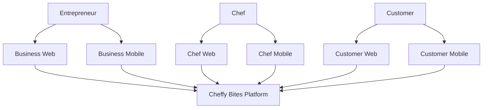
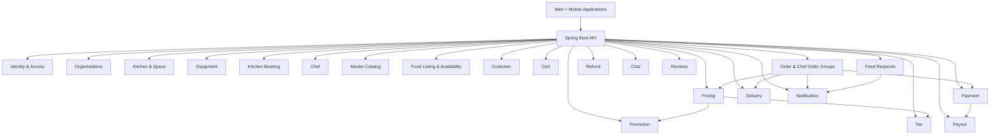
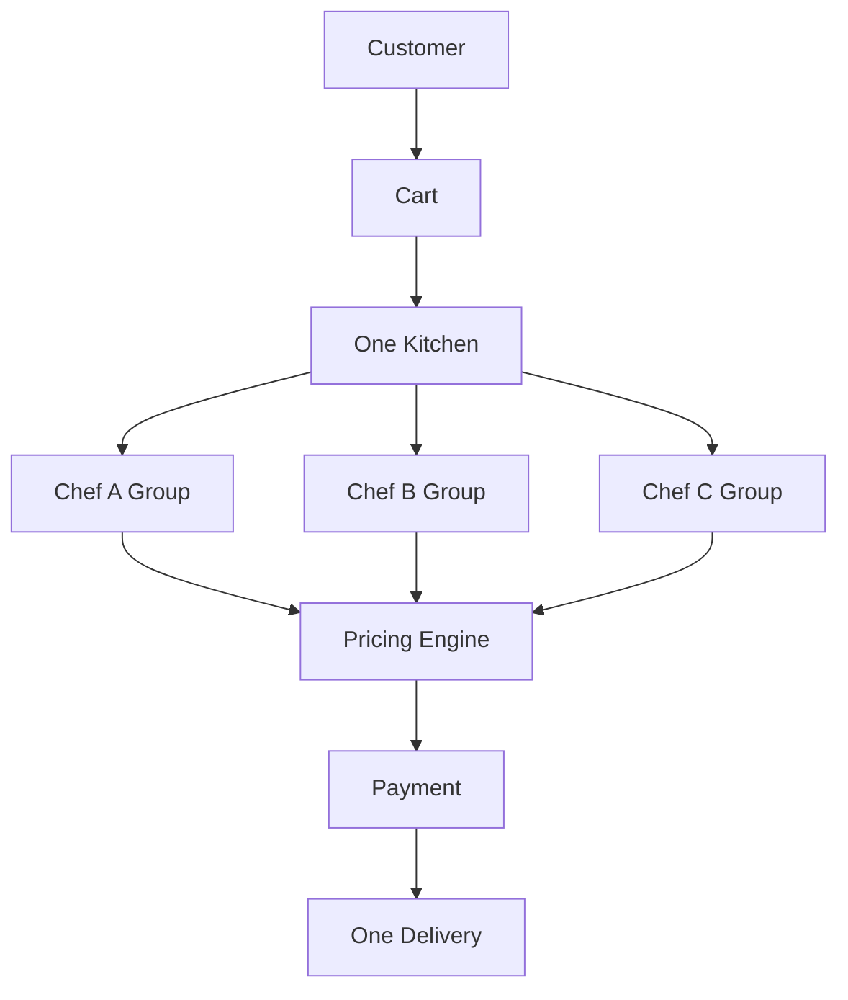
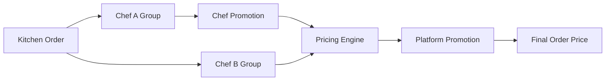
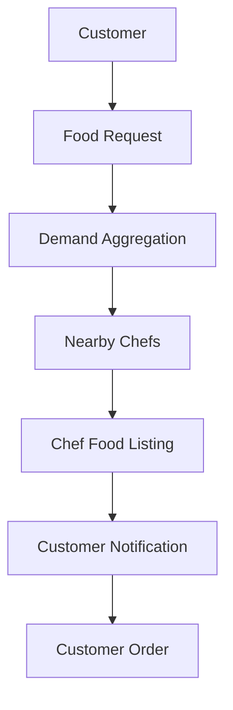
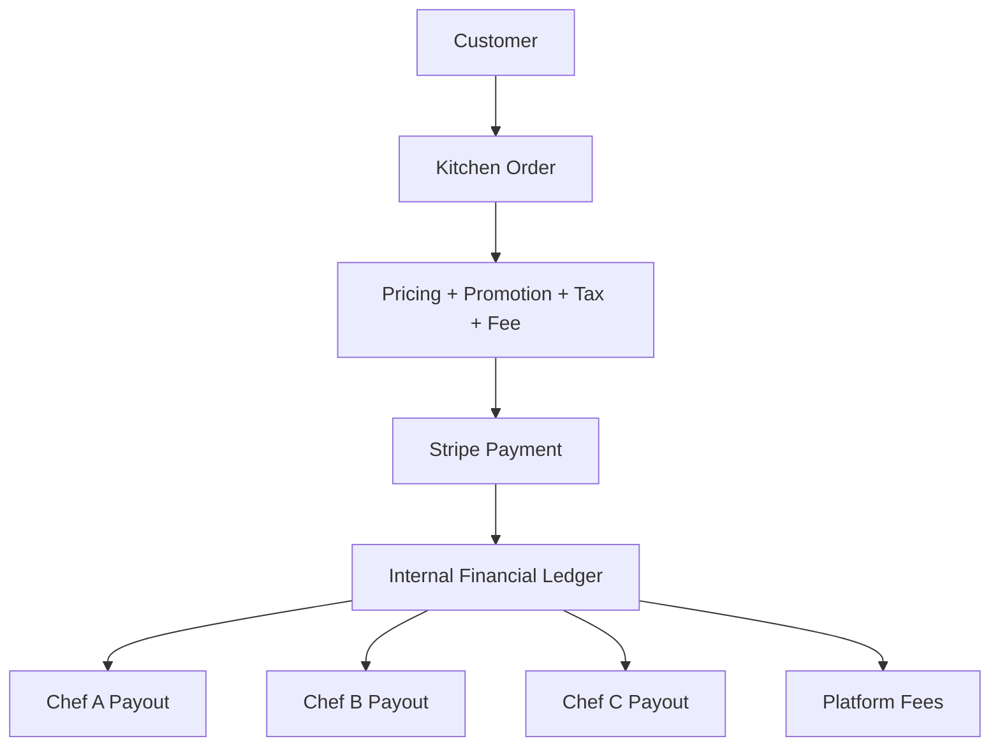

# Cheffy Bites — Master Product and Business Specification

**Document:** Master Product and Business Requirements Specification
**Version:** 1.0
**Status:** Product Requirements Baseline
**Audience:** Product owners, software architects, developers, QA, DevOps, AI coding assistants
**Primary Goal:** Serve as the canonical source for Cheffy Bites product and business requirements.

---

# 1. How This Document Must Be Used

This document is the canonical source for Cheffy Bites product and business requirements.

It contains:

1. Business requirements
2. Confirmed business rules
3. Domain model
4. Functional requirements

For architecture, technology, persistence, API, and event representation, refer to the established canonical sources:

- Architecture decisions: `docs/adr/` (Accepted ADRs govern architectural decisions)
- Persistence: `docs/03-database-erd.md`
- API contracts: `docs/04-api-contracts.md`
- Event contracts: `docs/05-event-contracts.md`
- Integrated architecture overview: `docs/02-detailed-architecture.md`
- Current coding-agent guidance: `AGENTS.md`

Each referenced canonical document is authoritative within its declared scope. Implementation details must conform to the applicable product/business requirements, architecture decisions, persistence contract, API contract, and event contract rather than relying on a global document-precedence order.

Do not introduce a new framework, database, service, dependency, architectural style, or deployment technology merely because it is popular. Any deviation from this specification must be proposed as an Architecture Decision Record (ADR).

---

# 1A. Canonical Document Ownership and Conflict Resolution

This section establishes scope-specific canonical ownership for repository documents. It prevents competing source-of-truth claims without imposing a global linear hierarchy.

## Document Ownership

| Document | Canonical Authority | Scope |
|----------|---------------------|-------|
| `docs/adr/` (Accepted ADRs) | **Architecture decisions** | Architectural boundaries, technology choices, integration patterns, data model decisions, concurrency models, security architecture |
| `docs/01-master-spec.md` | **Product and business requirements** | Business rules, domain model, functional requirements, user experiences, product scope |
| `docs/02-detailed-architecture.md` | **Integrated architecture overview** | Cross-cutting architecture view, component diagrams, deployment, infrastructure |
| `docs/03-database-erd.md` | **Persistence model** | Schema, tables, relationships, constraints, indexes |
| `docs/04-api-contracts.md` | **API contracts** | REST endpoints, request/response schemas, error contracts |
| `docs/05-event-contracts.md` | **Event contracts** | Event types, payloads, versioning, outbox patterns |
| `AGENTS.md` | **Coding-agent implementation guidance** | Workflow rules, module boundaries, testing requirements, prohibited behaviors |
| `plans/architecture-review.md` | **Historical / superseded** | Reference only; does not govern current decisions |

## Conflict Resolution

Each canonical document is authoritative within the scope declared above. An Accepted ADR governs the architecture decision it records; the specialized canonical documents express that decision within their respective persistence, API, and event representation scopes. The integrated architecture explains and coordinates those representations but does not override them.

**Rules:**

1. **Accepted ADRs govern architecture.** No document may override an Accepted ADR without a new ADR.
2. **This document (01-master-spec.md) governs product/business requirements.** It does not govern architecture, technology, persistence, API, or event representation.
3. **Proposed ADRs are not authoritative.** They represent proposals under review and must not be treated as finalized.
4. **Specialized contracts govern their representation scopes.** `docs/03-database-erd.md` governs exact persistence, `docs/04-api-contracts.md` governs exact APIs, and `docs/05-event-contracts.md` governs exact events.
5. **If a conflict is found:** Do not silently choose a purportedly higher document or invent a reconciliation. Stop implementation of the conflicting area, identify the conflict and impact, reconcile the owning canonical documents or ADR explicitly, and wait for approval before implementing.

---

# 2. Product Overview

## 2.1 Product Name

**Cheffy Bites**

## 2.2 Product Vision

Cheffy Bites is a SaaS marketplace connecting:

- Entrepreneurs who own or manage commercial kitchens.
- Chefs who rent commercial kitchen space and sell food.
- Customers who discover and purchase food.

The platform creates two primary marketplaces and one future demand marketplace:

```text
                 CHEFFY BITES
                      │
        ┌─────────────┼─────────────┐
        │             │             │
        ▼             ▼             ▼
    KITCHEN         FOOD          DEMAND
  MARKETPLACE    MARKETPLACE    MARKETPLACE
        │             │             │
        ▼             ▼             ▼
 Entrepreneurs       Chefs       Customers
        │             │             │
        ▼             ▼             ▼
     Kitchens        Food      Food Requests
     & Spaces       Listings       / Demand
```

Long term, the platform should create a continuous supply/demand loop:

```text
Kitchen Supply
      ↓
Chefs
      ↓
Food Supply
      ↓
Customers
      ↓
Food Demand / Requests
      ↓
Chefs discover demand
      ↓
New Food Supply
```

---

# 3. User Types

## 3.1 Entrepreneur

Owns or manages one or more commercial kitchens.

Can:

- Own/manage multiple kitchens.
- Operate kitchens in multiple physical locations.
- Create multiple rentable spaces/units inside a kitchen.
- Define base equipment for each space.
- Describe included, shared, unavailable, or additional equipment to discuss.
- Define operating hours.
- Define one or more RentalOffers using approved rate bases and terms.
- Define cleaning time.
- Manage bookings.
- Manage Chef access/use of spaces.
- Create promotions for kitchen bookings and equipment.
- View revenue and payout information.

## 3.2 Chef

Uses commercial kitchen spaces and operates a food business.

Can:

- Maintain professional profile.
- Search nearby kitchens/spaces.
- Book kitchen spaces.
- Rent additional equipment.
- Create food listings.
- Use the platform's master food/cuisine catalog to pre-populate data.
- Customize food information.
- Add food images.
- Add ingredients and nutrition information.
- Add optional recipes.
- Add optional YouTube videos.
- Schedule food availability by date/time.
- Receive and manage customer orders.
- Create promotions.
- See local customer food demand.
- Respond to Food Requests through controlled workflows.
- View applicable operational and financial information. Marketplace payout information is available only where the Chef or Chef-controlled business is the commercial provider or settlement beneficiary.

## 3.3 Customer

Can:

- Discover chefs and food.
- Search by cuisine, food, chef, location, and dietary attributes.
- Filter vegetarian/non-vegetarian and future dietary classifications.
- Maintain saved food/wishlist items.
- Create Food Requests for desired food.
- Add another customer's Food Request to their own wishlist/request list.
- Subscribe to availability notifications.
- Add food from multiple chefs **only when those chefs operate from the same kitchen**.
- Place an order from one kitchen at a time.
- Pay for the order.
- Track preparation and delivery.
- Chat through permitted order/request workflows.
- Rate food and chefs.

## 3.4 Dietitian

A Dietitian is a first-class professional actor who may provide consultations, professional recommendations, Dietitian Meal Plans, and ongoing client care.

An authenticated user may hold more than one platform role. Chef and Dietitian remain distinct roles, profiles, permissions, and domain concepts even when the same authenticated user holds both roles.

A practicing Dietitian has exactly one individual `DietitianProfessionalProfile` per practicing user. The professional profile identifies **who** provides the professional service and represents the Dietitian's:

- Professional identity.
- Appropriate public credential metadata.
- Private credential evidence and supporting documents.
- Specialties.
- Professional and jurisdictional eligibility.
- Consultations and appointments.
- Dietitian Meal Plans.
- Client engagements.
- Professional reputation.

Before a practicing Dietitian's professional profile may become active for professional service offerings, the Dietitian must provide the required professional credential, degree, license, or certificate metadata and all required supporting credential evidence. Initial credential status is self-attested unless Cheffy Bites has actually performed the applicable verification. Self-attested credentials must never be represented as independently verified. Original credential evidence and supporting documents are private; only approved public credential metadata may be displayed. Future actual Platform verification may be supported as a distinct status and evidence process only where Cheffy Bites actually performs that verification.

Cheffy Bites is not automatically an electronic medical record (EMR) or clinical-record system. Collection of diagnoses, medications, laboratory results, clinical notes, or similarly sensitive clinical records is not an assumed MVP capability. Expanding the product to collect or manage such information requires an explicit privacy, compliance, and product decision. This MVP scope boundary does not remove any legal, privacy, security, consent, retention, or other obligations applicable to information Cheffy Bites does collect.

Dietitian businesses and clinics reuse the existing Organization concept. The Organization identifies **which** business, legal, or commercial organization the professional operates through. Organization membership may include practicing Dietitians, administrators, and other authorized staff. A DietitianProfessionalProfile is not unnecessarily restricted to one Organization. Every professional service must identify the actual practicing Dietitian even when billing or settlement occurs through an Organization.

Can:

- Maintain a professional profile and submit credential evidence.
- Publish Consultation Offerings and explicitly offered availability.
- Establish authorized Customer engagements.
- Create Dietitian Meal Plans and recommendations.
- Help a Customer express marketplace meal requirements without commercially selecting a Chef or owning/modifying a Chef offering.
- Earn income for eligible Dietitian consultations under the applicable professional-service and Platform-fee terms.
- Participate in permitted Customer professional-engagement conversations.
- View applicable professional reputation and financial information.

Professional-title use, credential representation, jurisdictional authorization, and professional-service eligibility remain compliance-sensitive launch gates.

## 3.5 Platform Administrator

Required as a core internal role even if the first administrative application is limited.

Can eventually manage:

- Users
- Organizations
- Entrepreneurs
- Chefs
- Dietitians
- Customers
- Kitchens
- Kitchen spaces
- Equipment catalog
- Food catalog
- Cuisine catalog
- Ingredients
- Nutrition data
- Professional taxonomy and credential review
- Consultation and subscription policies
- Promotions
- Orders
- Payments
- Refunds
- Payouts
- Delivery integrations
- Food Requests
- Reviews
- Disputes
- Reports
- Audit logs
- Platform configuration

---

# 4. Applications

Cheffy Bites will have three independent user-facing application experiences, each on web and mobile.

## 4.1 Entrepreneur

Web:

`https://business.cheffybites.com`

Mobile:

**Cheffy Bites Business**

## 4.2 Professional — Chef and Dietitian

Web:

`https://chef.cheffybites.com`

Mobile:

**Cheffy Bites Chef**

The existing Chef web and mobile application boundary is the professional-facing experience and also hosts Dietitian capabilities. Navigation, available actions, and backend authorization are role-aware. Chef and Dietitian remain distinct roles, profiles, permissions, and domain concepts; this product decision does not merge them.

Dietitian clinic or Organization administration may use applicable Business capabilities, while workflows performed by the practicing Dietitian belong to the professional-facing experience. Existing repository application names do not need to change merely because the application supports another professional role.

## 4.3 Customer

Web:

`https://www.cheffybites.com`

Mobile:

**Cheffy Bites**

## 4.4 Internal Administration

Recommended future domain:

`https://admin.cheffybites.com`

The admin application must never be exposed as a normal customer-facing application.

## 4.5 Phase-1 Web Deployment Exception

The long-term experience boundaries above remain the product direction. For
the bounded Chef-to-Kitchen pilot, ADR-025 authorizes one deployed Next.js
application in `apps/customer-web`: the LP-01 public credibility surface plus
protected `/app/operator/*` and `/app/chef/*` routes. This deployment choice
does not merge roles, backend authorization, domain ownership, or the reserved
long-term `business-web` and `chef-web` applications.

---

# 5. Core Domain Model

The most important conceptual hierarchy is:

```text
Organization / Business
        │
        ├── Locations
        │     │
        │     └── Kitchens
        │           │
        │           └── Rentable Spaces / Units
        │                 │
        │                 ├── Included Equipment
        │                 └── Additional Rental Equipment
        │
        └── Users / Members
```

For the food marketplace:

```text
Commercial Provider Organization / Chef Business
     │
     ├── Chefs / Authorized Members
     ├── Food Listings
     ├── Menus
     ├── Food Availability
     └── Promotions
```

An Organization is not merely an administrative group. It may represent the legal or commercial operating entity for Kitchen operation, commercial-provider identity, settlement-beneficiary identity, multi-location operation, staff membership and authorization, Platform-fee/commercial agreements, and business reporting. Organization does not replace the professional identity of a Chef or Dietitian who performs a service.

For a marketplace commercial transaction, these roles are distinct even when one party fills all of them:

```text
SERVICE PERFORMER
!= COMMERCIAL PROVIDER
!= SETTLEMENT BENEFICIARY / PAYEE
```

- **Service performer** identifies the individual Chef or Dietitian who actually performs the service.
- **Commercial provider** identifies the business or Organization offering the commercial service to the marketplace.
- **Settlement beneficiary/payee** identifies the approved party to which marketplace settlement is owed under the applicable arrangement.

Examples:

```text
Independent Chef
  Performer: Chef Ravi
  Provider: Ravi's business / Organization
  Payee: Ravi's business / Organization

Organization-employed Chef
  Performer: Chef Ravi
  Provider: ABC Food Group
  Payee: ABC Food Group

Cheffy launch operation
  Performer: Cheffy Operations-employed Chef
  Provider: Cheffy Operations Organization
  Payee: Cheffy Operations Organization
```

Commercial earning belongs to the applicable commercial provider. An employee Chef must not be modeled as earning a marketplace payout that is merely redirected to an employer. Salary, hourly wage, contractor compensation, performance compensation, and payroll are separate relationships outside normal marketplace settlement.

For customer ordering:

```text
Customer
   │
   └── Cart
         │
         └── Exactly ONE Kitchen
               │
               ├── Chef Order Group A
               │     └── Food Items
               │
               ├── Chef Order Group B
               │     └── Food Items
               │
               └── Chef Order Group C
                     └── Food Items
```

This hierarchy is a core architecture rule.

---

# 6. Critical Business Rule: One Kitchen Per Customer Order

## 6.1 Rule

A customer order may contain food from **multiple Chefs**, but **all Chefs must belong to the same physical Kitchen** for that order.

Food from different Kitchens cannot be combined into one Order.

## 6.2 Example

```text
Kitchen A
 ├── Chef A → Food 1
 ├── Chef B → Food 2
 └── Chef C → Food 3

Allowed:
ONE ORDER
ONE KITCHEN
THREE CHEFS
ONE DELIVERY
ONE DELIVERY FEE
```

But:

```text
Kitchen A → Chef A
Kitchen B → Chef C

Not allowed in one order.

Customer creates separate orders:
Order #1001 → Kitchen A
Order #1002 → Kitchen B
```

## 6.3 Backend Enforcement

This is not merely a frontend restriction.

The backend must reject an order/cart mutation that attempts to add an item associated with a different kitchen.

## 6.4 Delivery Benefit

For a single-kitchen order, delivery is calculated once for the Kitchen Order, not once per Chef.

---

# 7. Kitchen Domain

## 7.1 Entrepreneur → Multiple Kitchens

One Entrepreneur/Organization can own, lease the right to operate, or otherwise be authorized to manage multiple Kitchens and locations. The Organization operating a Kitchen need not be the real-estate property owner.

Example:

```text
ABC Foods
 ├── Hello Kitchen - Montreal
 │     ├── Space 1
 │     ├── Space 2
 │     └── Space 3
 │
 ├── Hello Kitchen - Laval
 │     ├── Space 1
 │     └── Space 2
 │
 └── Hello Kitchen - Toronto
       ├── Space 1
       ├── Space 2
       └── Space 3
```

An authorized operating Organization may employ or otherwise lawfully engage multiple Chefs and operational/administrative staff, publish and manage commercial food offerings through authorized actors, receive settlement for services it commercially provides, and manage staff permissions and operational access. This is a normal marketplace model available to any qualified Organization; an individual Chef is not assumed to be an independent marketplace payee.

## 7.1A Kitchen Property Owner and Operating Organization

```text
KITCHEN PROPERTY OWNER
!= KITCHEN COMMERCIAL / OPERATING ORGANIZATION
```

A Kitchen may be owned and operated by the same Organization, owned by one party and leased to another qualified operating Organization, or temporarily leased/operated by Cheffy Operations during marketplace launch. The marketplace must know which Organization has authority to operate and commercially supply from the Kitchen for the applicable period. MVP is not a real-estate lease-management product, and exact legal lease-document management remains outside scope unless later approved.

## 7.1B Cheffy Operations Launch Bootstrap

Cheffy may bootstrap marketplace supply by creating or using a normal **Cheffy Operations Organization**. Subject to the same qualification, authorization, professional-eligibility, Kitchen-operation, food-safety, commercial-provider, and settlement rules that apply to other Organizations, it may:

- Own a Kitchen or lease/otherwise obtain authority to operate one.
- Employ or lawfully engage Chefs, Dietitians, operational staff, and administrators.
- Publish and manage marketplace offerings through authorized actors.
- Act as the commercial provider and approved settlement beneficiary for services it provides.
- Preserve the identity, authorization, professional accountability, and service history of each actual Chef or Dietitian performer.

This is a temporary marketplace-supply bootstrap strategy, not a Cheffy-specific product or architecture branch. The implementation must use the same Organization, Kitchen-operation, professional-identity, commercial-provider, authorization, ordering, settlement, review, and audit capabilities available to every qualified Organization. It must not contain special behavior equivalent to `if organization == CHEFFY`.

Cheffy may later reduce or exit direct supply as independent qualified Organizations provide sufficient marketplace supply. That operational change must not require redesigning Customer ordering, ChefOrderGroup, Dietitian Appointment, Kitchen, payment, settlement, review, or authorization architecture. Other qualified Organizations may use the Organization-operated supply model permanently; it is not a launch-only privilege.

The exact employment/contractor model, payroll and worker compensation, generalized provider/payee schema, Kitchen operating-right representation, payment routing, APIs, events, and transition plan are deferred to their owning legal, operational, ADR, ERD, API, and event decisions. Cheffy Operations worker compensation remains separate from marketplace settlement.

## 7.2 Kitchen

A Kitchen represents a physical commercial kitchen facility.

Attributes include:

- Name
- Description
- Address
- Latitude/longitude
- Images
- Business owner
- Amenities
- Operating schedule
- Rules
- Status
- Spaces

## 7.3 Kitchen Space / Unit

A Space/Unit is the **actual rentable resource**.

Each Space has:

- Name
- Description
- Size
- Capacity
- Images
- Equipment offerings classified as `INCLUDED`, `SHARED`, `EXTRA_DISCUSS`, or
  `UNAVAILABLE`
- One or more versioned RentalOffers
- Maximum duration if applicable
- Cleaning duration
- Availability
- Status

`RentalOffer`, not KitchenSpace, is the canonical owner of current rental
pricing and minimum commitment terms. Supported Phase-1 bases are `HOURLY`,
`FIXED_BLOCK`, `DAILY`, `RECURRING_HOURS`, `MONTHLY_HOURS`, and
`PRIVATE_LONG_TERM_INQUIRY`. Monetary offers use integer minor units and an
explicit currency; private long-term inquiries may intentionally omit a price.
Deposits and additional-charge notes are informational in Phase 1 and do not
create a Payment or financial obligation.

Phase-1 estimates use the requested cooking/use interval, not the cleaning
extension. Cleaning protects occupancy but is not silently billed. A
Kitchen-local calendar-day offer counts civil dates rather than fixed 24-hour
chunks across daylight-saving transitions.

## 7.4 Booking Occupancy

A booking occupies both cooking time and cleaning time.

Example:

```text
Cooking:
10:00 - 14:00

Cleaning:
14:00 - 15:00

Resource Occupied:
10:00 - 15:00
```

Another Chef cannot book the same Space during any part of the occupied period.

## 7.5 Phase-1 Listing, Requirements, and Media

A pilot Kitchen records facility type, intended-use statement, public
accessibility summary, loading/parking summary, facility storage summary,
facility constraints, visibility level, operating-hour constraints, and
operator-authored requirements. A Space records public access summary, storage
mode (`NONE`, `AVAILABLE`, `SHARED`, or `DISCUSS`), bounded operating
constraints, optional positive size/unit and maximum use duration,
`EXCLUSIVE_SPACE`, active state, and non-negative cleaning time.
Operating hours constrain Space availability but never create it.

Publishing a REAL Kitchen requires the operator's versioned authority
affirmation. The affirmation and platform pilot authorization are evidence of
participant/platform decisions, not verification of property ownership,
compliance, or sublicense/re-rental rights.

Only validated media may appear in a listing. Kitchen/Space media associations
own ordering, visibility, and participant-authored English/French alt text and
captions; missing translations are not fabricated. Space media may fall back
to safe Kitchen media. Uploads use the approved object-storage confirmation and
validation path.

An operator requirement is answered with only `NOT_PROVIDED`, `DECLARED`, or
`REVIEWED_OUTSIDE_PLATFORM`. These statuses never mean Cheffy Bites verified a
credential. Phase 1 stores no credential, insurance, permit, contract,
identity, banking, or tax document.

---

# 8. Equipment Domain

## 8.1 Master Equipment Catalog

The platform will maintain a reusable master catalog of kitchen equipment/supplies, with images.

Examples:

- Commercial oven
- Convection oven
- Pizza oven
- Stove
- Induction stove
- Tandoor
- Grill
- Deep fryer
- Refrigerator
- Freezer
- Mixer
- Blender
- Food processor
- Prep table
- Commercial sink
- Dishwasher
- Storage rack
- Microwave
- Rice cooker

## 8.2 Included Equipment

A Kitchen Space can select equipment from the master catalog as included equipment.

Entrepreneurs should not manually create every common piece of equipment.

## 8.3 Phase-1 Equipment Offering and Future Rental

For the Phase-1 pilot, Space equipment is descriptive request context. The
operator assigns exactly one mode:

```text
INCLUDED | SHARED | EXTRA_DISCUSS | UNAVAILABLE
```

`EXTRA_DISCUSS` permits a Chef to declare a need and the operator to discuss
it. It does not reserve inventory, establish a price, or create payment or
settlement state.

The additional-equipment rental capability below is a later paid-marketplace
capability and is not part of the Phase-1 request flow.

Additional equipment can be independently rented on an hourly basis.

Each rental-capable equipment item must support:

- Rate
- Quantity
- Availability
- Booking/occupancy period
- Applicable promotion

Inventory must prevent overbooking.

Example:

```text
Tandoor quantity = 2

Booking A → 1
Booking B → 1
Booking C → 1

Booking C must be rejected if periods overlap.
```

---

# 9. Kitchen Availability and Pricing

Entrepreneurs can configure:

- Operating hours by day.
- Closed days.
- Holidays.
- Temporary closure.
- Special hours.
- One-time available periods.
- Recurring weekly available periods with effective dates.
- One-time blocked periods.
- Recurring weekly blocked periods.
- Cleaning duration.
- RentalOffers and equipment offering modes.

The availability engine must distinguish recurring business-local schedules from concrete occurrences. Kitchen operating hours, recurring Kitchen availability, and recurring Chef availability use local date/time semantics plus the Kitchen's IANA timezone. Concrete occurrences for specific dates are resolved under that timezone's rules and materialized as real instants.

The Kitchen timezone is authoritative for Kitchen booking, operating-hours, Chef-availability, and similar Kitchen-based rules. Store an IANA identifier such as `America/Toronto`, not only `EST`, `EDT`, or `UTC-5`. Customer, device, and browser timezones may affect display but do not override the Kitchen timezone for these rules.

Availability attaches to a Space. Kitchen operating hours constrain a Space's
offerable time; they do not create availability. At least one matching active
available rule is required, any matching active blocked rule vetoes it, and
overlapping `HELD` or `CONFIRMED` occupancy vetoes it. Stage, record scope,
publication, pilot authorization, active Space, current RentalOffer, and
hard duration/commitment gates also apply. Equipment, shared-resource, or
operator-specific conditions that require human review produce `POSSIBLE —
OPERATOR CONFIRMATION REQUIRED` rather than a false match. Search is advisory;
submission and confirmation revalidate current rules.

Creating or activating a blocked rule that would contradict future
`HELD`/`CONFIRMED` occupancy is rejected until the booking is explicitly
cancelled. Pending requests remain `REQUESTED` and are shown as currently
incompatible when re-evaluation fails; no availability edit silently changes
their history.

---

# 10. Kitchen Booking Domain

## 10.1 Booking Flow

```text
Search Kitchen / Space
        ↓
Select Date / Time
        ↓
Review RentalOffer and estimate/disclaimer
        ↓
Declare activity, equipment, storage, setup, and cleanup needs
        ↓
Submit KitchenBooking in REQUESTED state
        ↓
Operator confirms or declines; Chef may withdraw while requested
```

Phase-1 submission does not reserve capacity and does not require checkout or
payment. `KitchenBooking` owns the lifecycle; there is no separate persistent
BookingRequest aggregate.

## 10.2 Phase-1 Booking States and Concurrency

```text
REQUESTED -> CONFIRMED
REQUESTED -> DECLINED
REQUESTED -> WITHDRAWN
CONFIRMED -> CANCELLED
```

`REQUESTED`, `DECLINED`, `WITHDRAWN`, and `CANCELLED` do not reserve the Space.
`CONFIRMED` reserves the cooking and cleaning occupancy interval. `HELD`
remains available to a future paid workflow under ADR-007 but is not entered
by this pilot.

Operator confirmation revalidates authority, request state, stage,
publication, pilot authorization, current Space availability, RentalOffer,
requirements, and cleaning-aware occupancy in one transaction. ADR-007's
database exclusion constraint is final authority. If two requests compete for
the same capacity, at most one confirmation commits; the loser receives a
booking-conflict result and remains `REQUESTED`. A decision/withdrawal race is
also first-valid-transition-wins.

Confirmed cancellation releases capacity without deleting or rewriting
history. A later availability edit never silently cancels a confirmed booking.

## 10.3 Request Evidence and Address Disclosure

Submission freezes the selected offer/version and the Kitchen, Space,
timezone, requested instants, cleaning occupancy, Chef profile/business label,
activity, equipment/storage/setup/cleanup declarations, estimate method, and
disclaimer evidence needed to explain the decision later. Core references and
requirement declarations remain normalized rather than stored as one untyped
JSON document. Requirement rows snapshot the presented version/code/title/
prompt; equipment needs snapshot the displayed catalog label and applicable
offering mode. State changes are append-only history records with actor, time,
source role, and bounded reason code/note.

The Phase-1 requested Space, Chef, offer, use boundaries, and occupancy end are
immutable after submission; rescheduling is a future explicit workflow. Request
and transition commands use a booking-domain idempotency receipt scoped to the
authenticated actor, data scope, operation, key hash, and request hash. The
receipt, transition history, and outbox evidence commit with a successful
state change and do not reuse financial idempotency records.

Authenticated pilot discovery exposes only an operator-approved coarse area
and safe distance information. The exact Location address, coordinates, and
access instructions remain private and are disclosed only to authorized
parties of a confirmed booking under the applicable policy. They must not leak
through search responses, logs, analytics, SEO metadata, or sitemaps.

## 10.4 Phase-1 Payment Boundary

The pilot request, confirmation, decline, withdrawal, and cancellation flow
creates no Payment, PaymentAttempt, PaymentAllocation, tax, payout, ledger,
checkout, or provider client secret. The future financial architecture in
Sections 33–45 remains the long-term billable-marketplace model and is not a
Phase-1 dependency. A paid Kitchen-booking workflow requires an explicit
financial decision and separate checkout contract; it must not silently change
the meaning of the pilot request endpoints.

## 10.5 DEMO / REAL and Pilot Controls

Every pilot business record belongs to an immutable data scope classified as
`DEMO` or `REAL`. A DEMO participant or record cannot be converted to REAL;
real onboarding creates fresh REAL records. Local/staging demo identity and
data are isolated from production. Reset operations are limited to explicitly
resettable DEMO scopes, are deterministic and audited, and can never target
REAL records.

The platform stage is explicitly `PRE_PILOT` or `CONTROLLED_PILOT`. Operator
publication (`DRAFT`, `PUBLISHED`, or `UNPUBLISHED`) and platform pilot
authorization are independent gates. A Kitchen is requestable only when the
caller is in a permitted data scope, the relevant stage permits it, the
operator has published it, the platform has an active pilot authorization, and
the Space, RentalOffer, and future availability are active. An emergency admin
may unpublish with an actor, time, and reason audit record; that action is not
represented as an operator decision.

Discovery, new-request submission, and confirmation enforce current data-scope
and pilot-requestability gates on the server. Existing request/booking detail,
inbox, notification, feedback, and administration history continue to enforce
scope, ownership, and authorization but are not erased or hidden solely by a
later unpublish or pilot-authorization revocation. DEMO content appears only in
an explicit permitted demo context and never leaks into REAL discovery or
reporting.

## 10.6 Availability and DST Validation

One-time and weekly Space rules use business-local dates/times, effective
dates, `active`, and `version`, interpreted in the Kitchen's IANA timezone.
Following accepted ADR-011, nonexistent gap times are rejected and ambiguous
overlap times require an explicit intended offset/occurrence or are rejected.
No service may inherit the JVM default timezone or silently shift/guess.
Concrete request and booking boundaries are real instants.

## 10.7 Bounded Pilot Feedback

Authenticated operators and Chefs may submit private pilot feedback with a
controlled role context and category, bounded text, locale, route context, and
at most one typed related Kitchen, Space, RentalOffer, or KitchenBooking. It is
for internal triage, not public review or chat. Feedback text is excluded from
events, analytics payloads, and ordinary logs.

## 10.8 Durable Notifications

Request, confirmation, decline, withdrawal, and cancellation transitions
create durable in-app notification records through idempotent event handling.
Email delivery is asynchronous and retryable; a provider failure never rolls
back the committed domain transition. Notifications snapshot the recipient
locale and safe template arguments, while the in-app detail view reloads the
authoritative current booking state. SMS is outside the pilot. Push remains a
later native P1 channel using the same domain events; its device-registration
and delivery contract belongs to that implementation slice, not the web-first
P0 contract.

---

# 11. Chef Domain

Chef profile supports:

- Name
- Profile photo
- Biography
- Experience
- Cuisine specialties
- Certifications
- Business details
- Service locations
- Ratings
- Reviews

For the pilot, Auth0 owns credentials and authentication only. Cheffy Bites
stores a participant profile for display/contact name, preferred `en-CA` or
`fr-CA` locale, optional phone, and application status, plus a distinct Chef
profile with an optional business display/trading label, description/intended
activity, coarse operating area, and controlled multi-select business
categories. The membership chain is
`User -> OrganizationMembership -> Organization ->
Location -> Kitchen -> Space`; an operator is an authorized member, not an
assumed one-user-per-Kitchen record.

The bounded pilot role codes are `OPERATOR_OWNER`, `OPERATOR_MANAGER`, `CHEF`,
and `ADMIN`, mapped to granular permissions. Operator roles are scoped through
Organization membership; Chef/Admin are platform grants, and a manager's
Kitchen assignment is explicit. Role codes never replace Organization
membership, assigned-Kitchen, ownership, data-scope, or current resource-state
authorization, and one User may hold multiple roles. A Chef
business display label is presentation data, not a competing authoritative
Organization or ChefBusiness legal name.

A Chef may operate independently or belong to an Organization/Chef Business with multiple Chefs and authorized staff. Organization membership does not erase the actual Chef performer. If Chef Ravi and Chef Maria work for the same Organization and participate in one valid same-Kitchen Order, they remain separate Chef identities and separate ChefOrderGroups for preparation, authorization, operational history, performance, review eligibility, and refund/quality traceability where relevant.

```text
SERVICE PERFORMER IDENTITY != COMMERCIAL PROVIDER IDENTITY
```

ChefOrderGroup remains the operational grouping for one Chef's participation inside one concrete food Order; it must not become an Organization-level group merely because the Organization is the commercial provider or settlement beneficiary. The exact Chef identity/key and commercial-provider relationship require reconciliation in ADR-013 and the canonical ERD and are not decided in this Master Spec.

---

# 11A. Dietitian Marketplace and Professional Relationships

## 11A.1 Customer and Dietitian Relationships

Customer and Dietitian relationships are many-to-many. A Customer may work with multiple Dietitians, and a Dietitian may serve multiple Customers, subject to professional eligibility, consent, and authorization rules.

A relationship alone does not establish a consultation purchase, an active care engagement, a meal recommendation, or a financial obligation. Those are separate business facts.

## 11A.2 Dietitian Professional-Service Economics

Current Dietitian marketplace economics are limited to eligible professional consultations/Appointments and the applicable Dietitian consultation Platform fee, Promotions, subsidies, refunds, and settlement arrangements. Dietitian food-sale or MealSubscription commission, Dietitian-Chef commercial association, and referral-based financial claims against Chef purchases are outside current product scope. A future collaboration model requires a new explicit product and architecture decision.

Where legally and professionally permitted, a Dietitian may perform a consultation through an Organization or clinic that is the commercial provider and/or settlement beneficiary. The Appointment must still identify the actual practicing Dietitian. Employment or contractor compensation between the Organization and Dietitian remains separate from marketplace payout.

## 11A.3 Dietitian Meal Plan

`DietitianMealPlan` is private professional guidance for a Customer or engagement. It may contain meal patterns, dietary requirements, nutrient targets, allergen exclusions, food examples, recipe/meal ideas, and structured professional guidance. It does not commercially select a Chef, endorse the Customer's eventual provider choice, or create a financial claim against a Chef purchase.

A Dietitian:

- May create professional recommendations for a Customer or engagement.
- May identify food examples or marketplace requirements that the Customer can use in discovery.
- Must not modify the Chef's price, composition, availability, customization rules, or other commercial terms.

`DietitianMealPlan` is distinct from `ChefMealPlan` and from a Customer `MealSubscription`.

The Customer controls what happens next. The Customer may search existing FoodListings or ChefMealPlans using authorized structured requirements, choose an existing matching commercial offering, or create/"float" a FoodRequest when no acceptable offering exists. Any eligible Chef may respond through the normal FoodRequest workflow. No Chef receives privileged marketplace status because a Dietitian was involved, and no Dietitian receives compensation based on which Chef the Customer chooses.

The full DietitianMealPlan and professional record are not automatically exposed to Chefs. The Customer explicitly extracts or authorizes only marketplace requirements needed for discovery or food preparation, such as vegetarian, high protein, calorie range, allergen exclusions, cuisine preference, or meal type. Diagnosis, medication, clinical notes, private professional commentary, and unrelated health information must not be exposed automatically. Chef-visible information is limited to what is necessary for the Customer-authorized marketplace requirement under applicable privacy policy.

```text
Private Dietitian / Customer professional information
    ↓ Customer-controlled extraction and sharing
Marketplace meal requirements
    ↓
Search / filters / FoodRequest
    ↓
Eligible Chefs and Customer selection
```

Using authorized plan requirements for search, matching, filters, or FoodRequest creation is discovery assistance. It is not Dietitian-to-Chef commercial attribution, Dietitian endorsement, Chef selection, commission, or ownership of FoodListing, ChefMealPlan, or Chef pricing.

---

# 12. Food Master Catalog

The platform will maintain master data for:

- Food
- Cuisine
- Ingredients
- Nutrition
- Dietary attributes
- Allergens
- Images
- Categories

The platform also maintains curated reference catalogs where appropriate for:

- Food Category.
- Meal Type.
- Preparation Method.
- Dietary Classification.
- Nutrition Attribute and nutrition facets.
- Dietitian specialty and other stable professional classifications.

Example:

```text
Cuisine: Indian
 ├── Palak Paneer
 ├── Chole
 ├── Biryani
 ├── Dosa
 └── Butter Chicken
```

Master data must be separate from Chef-owned food listings.

## 12.1 Marketplace Reference-Data Governance

Marketplace reference data is Platform-governed. Participants select canonical values; they do not create arbitrary public filter values.

An approved reference catalog should support, where applicable:

- Stable identifiers.
- Hierarchy.
- Aliases and synonyms.
- Localized labels.
- Deprecation.
- Replacement by a canonical value.

When required metadata is missing, a participant may submit a suggestion through this lifecycle:

```text
PENDING_REVIEW
  ├── APPROVE
  ├── REJECT
  └── MERGE_WITH_EXISTING
```

Evolving marketplace metadata must not be treated as a permanently hard-coded application enum when database-managed reference data is appropriate. The product must not collapse every business concept into one untyped universal metadata catalog.

Equipment remains a specialized catalog. `EquipmentCatalogItem` describes the master equipment type. Included Space equipment and `EquipmentRental` reference that catalog, while Kitchen-specific price, quantity, availability, and supplied/rental condition remain outside the master item.

---

# 13. Master Food vs Chef Food Listing

A Chef must never modify the global master catalog accidentally.

Conceptually:

```text
MASTER FOOD
   │
   ├── Standard name
   ├── Cuisine
   ├── Ingredients
   ├── Nutrition
   └── Reference image
        │
        ▼
CHEF FOOD LISTING
   ├── Chef-specific name
   ├── Description
   ├── Chef images
   ├── Price
   ├── Recipe
   ├── YouTube video
   ├── Customized ingredients
   ├── Customized nutrition where permitted
   └── Availability
```

A Chef can use master information as a starting point and customize permitted fields.

---

# 14. Food Listing Requirements

Each Chef food listing can contain:

- Food name
- Cuisine
- Kitchen binding
- Category
- Description
- Multiple images
- Ingredients
- Nutrition information
- Serving size
- Dietary attributes
- Allergens
- Preparation time
- Recipe
- YouTube URL/video identifier
- Price
- Availability
- Status

Optional fields must remain optional.

---

# 15. Food Availability

Chefs schedule food by date/time.

Example:

```text
Palak Paneer

Aug 25 → 12:00–15:00
Aug 26 → 12:00–15:00
Aug 27 → 18:00–21:00
```

Support:

- One-time availability
- Recurring availability
- Start/end time
- Temporary disablement
- Cutoff time
- Preparation time

The architecture must eventually define the relationship among Food Availability, Chef Availability, Kitchen Availability, and Order Cutoff.

---

# 16. Customer Food Discovery

Customers can discover and filter by:

- Cuisine
- Food item
- Chef
- Location
- Price
- Availability
- Vegetarian/non-vegetarian
- Future dietary attributes
- Food Category
- Meal Type
- Preparation Method
- Nutrition facets
- Allergens
- Rating
- Fulfillment type

The dietary model should be extensible, not hard-coded to only two values.

Possible future attributes:

- Vegan
- Jain
- Gluten-free
- Dairy-free
- Nut-free
- Halal
- Kosher
- Spicy level

---

# 16A. Marketplace Search, Facets, Ranking, and Personalization

Marketplace discovery combines search with faceted filtering. Applicable facets include category, cuisine, dietary classification, preparation method, meal type, price, location, rating, availability, and fulfillment type.

Search, faceted filtering, ranking, and personalization are distinct concerns. A match against a search term is not itself a personalization decision, and filter eligibility must not be hidden inside an unexplained ranking score.

PostgreSQL full-text/structured search and PostGIS remain valid for MVP discovery. Expanded discovery does not create a launch requirement for OpenSearch. A separate search technology may be considered later only when measurable relevance, scale, typo-tolerance, faceting, or traffic requirements justify it.

---

# 16B. Chef Meal Plan

`ChefMealPlan` is a first-class Chef-owned commercial catalog product. It is not a DietitianMealPlan and is not a MealSubscription.

`ChefMealPlan` is the reusable Chef-owned commercial/catalog offering. Subscription-specific commitment period, billing period, renewal terms, pause terms, and subscription cancellation or termination terms belong to `MealSubscriptionOffer` and the accepted subscription terms, not to the core `ChefMealPlan` identity.

A Chef Meal Plan references ordinary Food Listings rather than duplicating food entities. Its composition may be:

```text
FIXED
SELECTABLE
ROTATING
```

Customer customization is allowed only within Chef-defined rules. Plan composition, selection rules, price, fulfillment terms, and other material commercial terms must be versioned so historical purchases retain the terms that applied.

Chef Meal Plans participate in marketplace search, discovery, and applicable faceted filtering. A Dietitian may recommend a Chef Meal Plan but cannot own or modify the Chef's commercial offering.

A Chef Meal Plan is not necessarily permanently bound to one physical Kitchen. Different future fulfillment occurrences may resolve to different eligible Kitchens where permitted. Every concrete generated food Order nevertheless resolves to exactly one physical Kitchen and remains subject to the one-Kitchen-per-Order invariant.

Nutrition, dietary, and professional claims must preserve provenance where applicable, such as Chef declared, calculated, Dietitian reviewed, or actually Platform verified. A structured nutrition or dietary value does not by itself imply professional or medical verification.

---

# 17. Customer Cart and Order Model

## 17.1 Multiple Carts

A customer may maintain multiple active carts, but each cart belongs to exactly one Kitchen.

```text
Customer
 ├── Cart A → Kitchen A
 │     ├── Chef A items
 │     └── Chef B items
 │
 ├── Cart B → Kitchen B
 │     └── Chef C items
 │
 └── Cart C → Kitchen C
       ├── Chef D items
       └── Chef E items
```

Checkout of each cart produces a separate Order.

## 17.2 One Order / One Kitchen / Multiple Chefs

```text
Order
 └── Kitchen A
       ├── Chef Order Group A
       │     ├── Item A1
       │     └── Item A2
       │
       ├── Chef Order Group B
       │     └── Item B1
       │
       └── Chef Order Group C
             └── Item C1
```

## 17.3 Chef Order Group

A Chef Order Group represents that Chef's portion of a Kitchen Order.

It exists because:

- Chef promotions are evaluated at Chef scope.
- Chef preparation status is independent.
- Chef reporting is independent.
- Chef payout is independent.
- Chef-specific cancellation/refund effects may occur.

ChefOrderGroup owns Chef preparation responsibility and Chef-level operational traceability. The parent Order owns customer pickup, delivery, and final completion. Refunds are financial facts that may reference the affected ChefOrderGroup where applicable; refund states are not ChefOrderGroup operational states.

---

# 18. Order Lifecycle

## 18.1 Overall Order

Every parent Order has one immutable fulfillment type: `PICKUP` or `DELIVERY`.

```text
CART
  ↓
CHECKOUT
  ↓
PAYMENT_PENDING
  ↓
PAID
  ↓
PENDING_CHEF_ACCEPTANCE
  ├── ACCEPTED
  │      ↓
  │   PREPARING
  │      ↓
  │   READY_FOR_FULFILLMENT
  │      ├── PICKUP → PICKED_UP → COMPLETED
  │      └── DELIVERY → DELIVERY_REQUESTED
  │                         ↓
  │                    DRIVER_ASSIGNED
  │                         ↓
  │                 DRIVER_PICKED_UP
  │                         ↓
  │                   OUT_FOR_DELIVERY
  │                         ↓
  │                      DELIVERED
  │                         ↓
  │                     COMPLETED
  │
  └── REJECTED → REFUND_PENDING → REFUNDED
```

`PICKED_UP` means completed handoff to the customer or the customer's authorized pickup party only. `DRIVER_PICKED_UP` means the delivery driver has taken possession of a delivery Order. Pickup-only and delivery-only transitions must not cross lanes.

Possible terminal states:

- COMPLETED
- CANCELLED
- REFUNDED
- PARTIALLY_REFUNDED
- FAILED

## 18.2 Chef Order Group Lifecycle

Each Chef Group has its own operational lifecycle.

Example:

```text
PENDING_ACCEPTANCE
  ↓
ACCEPTED
  ↓
PREPARING
  ↓
READY
```

The overall Kitchen Order should not be considered ready for handoff until the required Chef Groups are ready.

ChefOrderGroup owns preparation through `READY`; customer pickup, delivery possession, delivery progress, and final completion remain parent Order responsibilities. Refund processing remains a financial workflow with ChefOrderGroup references where applicable, not an extension of the ChefOrderGroup preparation lifecycle.

---

# 19. Delivery

## 19.1 One Delivery Per Kitchen Order

A delivery fee is calculated for the Kitchen Order, not per Chef. The quoted/captured delivery amount is immutable commercial Pricing evidence; it is not settlement truth. Customer Payment may include or fund that delivery-related amount. PaymentAllocation may preserve payment-side allocation/reference evidence for that component where appropriate, but it is not the delivery commercial/economic obligation. The delivery economic obligation is represented separately through the CommercialObligation model governed by ADR-020. Payment collection and allocation do not by themselves establish earning recognition, payout eligibility, payout completion, or Ledger facts.

```text
Kitchen A Order
 ├── Chef A
 ├── Chef B
 └── Chef C
       ↓
 ONE DELIVERY
       ↓
 ONE DELIVERY FEE
```

## 19.2 Delivery Provider Abstraction

Potential providers:

- DoorDash
- Uber
- Future provider

Use an internal abstraction:

```text
DeliveryService
 ├── ProviderAdapterA
 ├── ProviderAdapterB
 └── ProviderAdapterFuture
```

Do not embed provider-specific API behavior throughout Order code.

## 19.3 Delivery Status

Delivery provider status must synchronize with Cheffy Bites order state.

```text
DELIVERY_REQUESTED
 ↓
DRIVER_ASSIGNED
 ↓
DRIVER_PICKED_UP
 ↓
OUT_FOR_DELIVERY
 ↓
DELIVERED
```

`DRIVER_PICKED_UP` means delivery-driver possession. `PICKED_UP` is reserved for customer or authorized-party pickup of a `PICKUP` Order and must not be used in the delivery lifecycle.

The Chef and Customer should see the appropriate current status.

Provider webhooks must be authenticated and idempotent.

---

# 20. Promotions Engine

Promotions are a dedicated domain.

Permitted owners include, where applicable:

```text
PLATFORM
CHEF
ENTREPRENEUR
DIETITIAN
```

Promotion owner, funding source, commercial domain, calculation scope, benefit type, and target are distinct concepts. `PLATFORM` is an owner/funding domain, not a food calculation scope.

## 20.1 Chef Promotions

Chef can promote:

- One food item.
- Multiple food items.
- Entire menu.

Examples:

- 10% off
- 20% off 2 or more items
- Buy one get one free
- X% off second item
- First-time Chef order discount
- Quantity-based discount

## 20.2 Entrepreneur Promotions

Entrepreneurs can promote:

- Kitchen bookings
- Kitchen spaces
- Additional equipment rentals

Examples:

- 10% off booking
- First booking discount
- Free hour after X hours
- Equipment rental discount

## 20.3 Platform Promotions

Platform promotions can target:

- Customers
- Chefs
- Food orders
- Kitchen bookings
- Equipment rentals
- Specific customer segments
- Specific locations
- Chef Meal Plans and Meal Subscriptions
- Kitchen Subscriptions
- Dietitian consultations

## 20.4 Dietitian Promotions

Dietitian-owned promotions may apply to eligible Dietitian consultation offerings or other explicitly approved Dietitian commercial services. They do not grant a Dietitian ownership over Chef Food Listings or Chef Meal Plans.

## 20.5 Cross-Domain Promotion Benefits and Funding

A Platform-owned customer-price promotion is the canonical promotion mechanism for a Platform-funded marketplace subsidy across approved commercial domains, including food, Chef Meal Plans/subscriptions, Kitchen bookings/subscriptions, equipment rentals, and Dietitian consultations.

Customer-price subsidy is distinct from a Platform-fee discount or waiver.

Example:

```text
Dietitian consultation service value: $50
Platform customer subsidy:            $50
Customer pays:                          $0
Dietitian gross service value:         $50
```

The normal Dietitian Platform fee may still apply unless a separate fee-waiver or fee-reduction benefit applies. Platform-funded subsidy must preserve provider gross economics according to the applicable commercial terms.

Promotion evaluation and application evidence are commercial calculation evidence. They are not themselves financial allocation, earning-recognition, ledger, or payout evidence.

Marketplace-wide, a customer-price Promotion does not automatically subsidize a cancellation, no-show, or termination penalty. A campaign must explicitly opt into such treatment where permitted.

## 20.6 Advance-Booking Eligibility

Advance booking is a Promotion eligibility condition, not a separate promotion engine.

Examples include:

- A Chef food promotion when a Customer reserves at least a configured number of hours ahead.
- An Entrepreneur Kitchen promotion when a Chef requests capacity at least a configured number of days ahead.
- A Platform-funded advance-booking subsidy.

The original qualifying requester timestamp normally determines advance eligibility. Provider-side approval delay must not remove eligibility. A material requester-initiated change may trigger re-evaluation under the applicable terms.

Operational minimum lead time is separate from promotional advance lead time. Satisfying a Promotion condition does not override an operational cutoff, and satisfying an operational cutoff does not automatically qualify a Promotion.

When a future meal request is still `REQUESTED` or `PENDING_KITCHEN_CAPACITY`, Promotion eligibility or application evidence may be retained or reserved as appropriate, but the unconfirmed request must not prematurely create an irreversible successful redemption that permanently consumes eligibility. Final redemption and consumption semantics must align with eventual commercial confirmation and the later Promotion architecture decision.

---

# 21. Promotion Stacking Rules

Confirmed rules:

1. Chef promotions are evaluated independently within each ChefOrderGroup.
2. Item-level promotions may coexist when they affect different eligible items or non-overlapping scopes.
3. Group-level promotions only conflict when they target the same qualifying basis or exclusive scope.
4. Platform promotions can stack with Chef promotions when the scopes are compatible.
5. A customer may enter/apply at most one promo code per Order checkout.
6. A specific customer may successfully redeem a specific promo code at most once. A failed or released checkout reservation does not consume permanent eligibility, but a completed redemption remains used after full or partial refund.
7. A promotion can target multiple food items.
8. A promotion can target an entire Chef menu.
9. An Entrepreneur promotion may apply to equipment rental.
10. Platform promo codes may be restricted to specific users/segments.
11. An expired promotion is invalid at checkout even if an item was previously added to the cart.
12. After a partial refund, promotion eligibility must be recalculated from the original snapshot.

A promo code may optionally define a global redemption cap. No configured cap means globally unlimited use subject to one successful redemption per customer; a cap of one defines a globally one-time code. Automatic promotions do not consume promo-code redemptions merely because they apply.

Promotion conflict resolution is not controlled by a single global `stackable` flag.

Compatibility and exclusivity must continue to be resolved within the relevant commercial domain and monetary scope. Cross-domain expansion must not reinterpret `PLATFORM` as a food calculation scope.

The exact stacking rules involving Entrepreneur + Platform promotions remain an ADR/business decision unless explicitly finalized.

---

# 22. Chef Promotion Scope — Critical Rule

Chef-level promotions must be evaluated **only against that Chef's portion of the Kitchen Order**.

Chef A and Chef B are independent promotion domains. Chef A items must never be used to qualify Chef B promotions, and vice versa.

Example:

```text
Kitchen A
│
├── Chef A
│    ├── Item A1 $20
│    └── Item A2 $20
│
├── Chef B
│    ├── Item B1 $30
│    └── Item B2 $30
│
└── Chef C
     └── Item C1 $20
```

Chef A promotion:

> 20% off when buying 2 or more Chef A items.

Only Chef A's $40 qualifies.

```text
Chef A subtotal   $40
Chef A discount    $8
Chef A net        $32

Chef B subtotal   $60
Chef B discount    $0

Chef C subtotal   $20
Chef C discount    $0
```

The promotion engine must never use total Kitchen Order quantity to satisfy a Chef promotion.

Group-level Chef promotions must declare an explicit qualifying basis such as `ALL_ELIGIBLE_ITEMS`, `NON_DISCOUNTED_ELIGIBLE_ITEMS`, `SPECIFIC_TARGET_ITEMS`, `GROUP_SUBTOTAL`, or `DELIVERY_FEE`.

---

# 23. Promotion Evaluation Model

A Promotion should be evaluated using at least:

```text
Owner
Commercial Domain
Scope
Target
Benefit Type
Funding Attribution
Eligibility Rules
Qualifying Basis
Compatible Promotions
Exclusive Group
Conditions
Priority
Selection Tie-Breaker
Validity Window
Usage Limit
Customer Limit
Promotion Type
Discount Calculation
```

Potential promotion types:

- Percentage
- Fixed amount
- Buy One Get One
- Buy X Get Y
- Second item percentage discount
- First order
- Quantity threshold
- Minimum order amount
- Free delivery
- Free kitchen hours

The implementation can support an MVP subset, but the model must be extensible.

---

# 24. Promotion Validation

The backend is authoritative.

```text
Cart
 ↓
Promotion Engine
 ├── Partition order into ChefOrderGroups
 ├── Evaluate item-level promotions per eligible item
 ├── Mark discounted items
 ├── Calculate qualifying subtotal by configured basis
 ├── Evaluate ChefOrderGroup promotions
 ├── Resolve conflicts deterministically
 ├── Evaluate delivery promotions
 ├── Evaluate platform promotions
 └── Persist immutable PromotionSnapshot
 ↓
Pricing Result
```

The frontend may show estimated pricing but never becomes the final source of truth.

---

# 25. Partial Refund + Promotion Recalculation

If a partial refund changes promotion eligibility, the original promotion must be recalculated.

Example:

```text
BUY 2 GET 1 FREE

Original:
A + B + C
C free

Customer returns B

Remaining:
A + C

Promotion no longer valid.
```

The financial engine must calculate the correct refund/adjustment and preserve an audit trail.

Historical financial records must remain immutable.
The original PromotionSnapshot must remain available as evidence for the refund recalculation.

---

# 26. Food Requests / Demand Marketplace

Food Requests are different from a normal wishlist.

## 26.1 Saved Food

Customer saves an existing food listing for later.

## 26.2 Food Request

Customer requests food they want a Chef to offer.

The request may contain:

- Food name
- Description
- Cuisine
- Image
- YouTube link
- Reference link
- Location
- Notes
- Availability preferences
- Dietary requirements

Anonymous requests are not allowed.

---

# 27. Nearby Chef Food Requests

Food Requests should primarily be visible to nearby Chefs.

The platform therefore requires geospatial capabilities.

Chef-facing data should include:

- Food request
- Approximate service area
- Number of interested customers
- Relevant dietary information
- Date requested

Do not expose unnecessary personal information such as home address, phone, or private email.

---

# 28. Similar Food Request Aggregation

The platform should automatically associate similar requests where possible.

Example:

```text
Mysore Masala Dosa
Mysore Dosa
Mysore Masala Dosai
```

may map to the same master food concept.

The architecture should support future AI-assisted:

- Similarity matching
- Normalization
- Duplicate detection
- Cuisine classification
- Multilingual matching

AI is not required for the MVP core transaction path.

---

# 29. Customer Adds Another Customer's Request

A customer can add another customer's requested food to their own wishlist/request list.

This increases demand count.

Example:

```text
Customer A → requests Dosa
Customer B → adds Dosa to wishlist
Customer C → adds Dosa to wishlist

Aggregated demand = 3 customers
```

Chefs can see the demand count.

---

# 30. Multiple Chef Responses

Multiple Chefs may respond to the same food demand.

Customers should be notified when a Chef adds the requested food to their menu.

Example:

```text
Mysore Masala Dosa

27 customers interested

Chef A → Added
Chef B → Added
Chef C → Interested
```

---

# 31. Chef Interaction with Food Requests

A Chef must not automatically receive unrestricted direct messaging access to a customer's private account merely by viewing a request.

The interaction should use a controlled workflow with notification/consent as appropriate.

Final UX approval/consent behavior must be explicitly defined before implementation.

---

# 32. Food Request Lifecycle

Recommended lifecycle:

```text
DRAFT
 ↓
ACTIVE
 ├── CHEF_INTERESTED
 ├── FOOD_ADDED
 ├── AVAILABLE
 ├── FULFILLED
 ├── DISABLED
 └── DELETED
```

When food becomes available through a Chef, the user's request may automatically close/fulfill according to the defined business rule.

The customer can:

- Keep the food saved.
- Re-enable the request.
- Delete it.
- Subscribe again.

---

# 32A. Dietitian Consultation, Appointment, and Client Engagement

## 32A.1 Dietitian Client Engagement

`DietitianClientEngagement` is the authorized professional relationship context for Dietitian and Customer collaboration. Supported engagement types are:

```text
SINGLE_CONSULTATION
ONGOING_CARE
CARE_PROGRAM
```

One engagement may contain appointments, Dietitian Meal Plans, follow-ups, and an authorized conversation. An Appointment remains an individual service and billing unit even when it belongs to a longer engagement.

Either the Customer or Dietitian may terminate or end an engagement according to applicable policy. The Dietitian may mark professional care or program work complete. Engagement completion or termination is distinct from the completion, cancellation, or rescheduling of any one Appointment. Conversation write access follows the configurable post-engagement grace and read-only policy defined for Dietitian-Customer conversations.

## 32A.2 Consultation Offering

A Dietitian publishes versioned `ConsultationOffering` terms. Offerings may differ by duration, price, mode, location, availability, and cancellation/no-show/rescheduling policy.

Supported modes are:

```text
ONLINE
IN_PERSON
```

In-person eligibility uses normalized geography, not free-text city equality. Online consultation may also require professional/jurisdiction eligibility based on the applicable Customer and Dietitian context.

## 32A.3 Offered Availability and Appointment Capacity

Only availability explicitly offered to Cheffy Bites is Customer-bookable. A Dietitian does not have to expose their complete private-practice calendar.

Availability supports:

- Recurring offered availability.
- One-off added availability.
- Blocked periods or individual unavailable slots.
- Future external-calendar busy intervals.
- Configurable before/after scheduling buffers.

Appointments use temporary `HELD` capacity during checkout and `CONFIRMED` capacity after successful confirmation. Database-level protection must prevent overlapping active Appointments, including applicable buffers.

A blocked period cannot silently cancel or replace a confirmed Appointment. External-calendar information is an availability input and must not overwrite Cheffy Bites' confirmed professional-service facts.

External calendar integration, when introduced, should require only appropriate busy/free availability information and should avoid importing private event titles or details unnecessarily.

## 32A.4 Appointment Cancellation, No-Show, and Rescheduling

The product distinguishes Customer cancellation, Dietitian cancellation, Customer no-show, and provider/Dietitian no-show.

The applicable cancellation/no-show policy must be versioned and captured at booking. Platform-funded Promotions do not subsidize cancellation or no-show charges by default unless explicitly configured. Provider cancellation or no-show must not financially penalize the Customer and requires the applicable remediation/refund protection.

For a Dietitian/provider cancellation or no-show, the Customer receives the full applicable refund or protection, the Dietitian earns nothing for the unprovided service, and the Customer must not lose applicable Promotion eligibility merely because the provider failed. Unused Platform subsidy is released or unwound according to the campaign and financial rules.

Customer no-show is distinct from cancellation and is governed by the policy captured for the Appointment. A customer-price Platform Promotion does not subsidize a Customer no-show charge by default.

Rescheduling preserves the same logical Appointment when the ConsultationOffering remains unchanged and only the service time changes. A change in offering, duration, mode, location, or another material term requiring repricing is a modification/rebook under the applicable policy.

Customer-requested rescheduling follows the captured Appointment policy. Dietitian-requested rescheduling must not consume a Customer reschedule allowance or financially penalize the Customer. If no suitable Dietitian-proposed replacement exists, the Customer may reject it and receive applicable full-refund protection. Rescheduling must not generate new first-use Promotion eligibility merely because the service time changed.

Structured booking, cancellation, and rescheduling actions are formal product operations. Chat text alone must not constitute any of those state changes.

## 32A.5 Online Meeting

`OnlineMeeting` is provider-neutral. Google Meet, Zoom, or another approved provider may be used behind an adapter.

Meeting provisioning occurs only after Appointment confirmation. Provider provisioning failure is asynchronous and retryable; it does not roll back an otherwise valid Appointment or payment. The Customer and Dietitian must receive appropriate failure/remediation status.

Cheffy Bites does not automatically record or transcribe consultations in MVP.

---

# 32B. Customer Meal Subscription / Tiffin

## 32B.1 Distinct Product Concepts

The product keeps these concepts separate:

```text
ChefMealPlan
MealSubscriptionOffer
MealSubscription
MealSubscriptionBillingCycle
MealEntitlementCycle
MealFulfillmentOccurrence
```

MealSubscription is not an Order. A concrete confirmed MealFulfillmentOccurrence eventually generates or links to the normal Order/fulfillment model. Every resulting concrete food Order still belongs to exactly one physical Kitchen and uses normal ChefOrderGroup, preparation, pickup/delivery, and financial traceability rules.

MealSubscription and ChefKitchenSubscription are distinct domain products. The product does not define one universal business-level Subscription aggregate.

`MealSubscriptionBillingCycle` and `MealEntitlementCycle` are product-specific conceptual terms, not a universal cross-domain subscription-cycle concept. Exact persistence naming belongs to the later subscription architecture decision and canonical persistence model.

## 32B.2 Entitlement, Commitment, and Billing

Entitlement period, meals per entitlement period, commitment period, and billing period are independently configurable and must not be conflated.

Examples include 5 meals per week, 20 meals per month, a 3- or 12-month commitment, and weekly, biweekly, or monthly billing. Long commitment does not imply long prepayment.

MVP may support `WEEKLY` billing optionally and supports `BIWEEKLY` and `MONTHLY` billing. Annual Customer prepayment is not required or allowed for MVP.

Unused meal entitlement expires by default. An offer may permit bounded rollover. Unused entitlement must not automatically become cash or Platform credit.

Platform policy may govern permitted billing periods, the maximum advance-prepayment horizon, maximum commitment, minimum cancellation and pause protections, auto-renew rules, offer eligibility or approval, provider-risk limits, and the ability to stop new enrollment or suspend future confirmations. Exact numeric policy values remain configurable rather than hard-coded.

Stopping new enrollment is distinct from terminating already accepted Customer subscriptions. Provider termination of existing service requires protected Customer remediation.

## 32B.3 Requested Meal Versus Confirmed Fulfillment

A Customer may request or reserve a future meal-plan fulfillment before the Chef has secured Kitchen capacity. That request is not confirmed fulfillment.

```text
REQUESTED
  ↓
PENDING_KITCHEN_CAPACITY
  ├── CONFIRMED
  ├── EXPIRED
  └── DECLINED
```

A concrete MealFulfillmentOccurrence must not become `CONFIRMED` until a valid confirmed KitchenBooking covers the required production capacity/window. Each occurrence is evaluated independently; a MealSubscription may remain active while future occurrences remain pending Kitchen capacity.

If required Kitchen capacity is not secured by the confirmation deadline, the occurrence expires or is declined without a Customer cancellation penalty.

## 32B.4 Meal Selection and Fulfillment Windows

Customers may select meals in advance. The selection deadline is configurable. An offer must define a no-selection policy from:

```text
CHEF_DEFAULT_MENU
SKIP_OCCURRENCE
REQUIRE_SELECTION
```

Customers select from offered pickup or delivery fulfillment windows, such as `12:00–15:00` or `17:00–19:00`. A MealSubscription may define a default fulfillment preference, and an individual occurrence may override it before cutoff.

The Chef must not silently replace the Customer's requested window. A material alternative requires Customer approval. The Chef may configure capacity per fulfillment window. A provider ETA is an operational estimate and remains separate from the Customer's commercial fulfillment-window commitment.

## 32B.5 Pause, Renewal, Changes, and Failed Billing

A Customer may pause when the versioned offer policy allows it. Pause is distinct from cancelling one occurrence or terminating the MealSubscription. Recommended MVP behavior is `PAUSE_BILLING`, preferably for whole entitlement cycles. Pausing does not create new first-use Promotion eligibility. Chef/service suspension is a provider-side event, not a Customer pause.

```text
CANCELLING ONE MEAL FULFILLMENT OCCURRENCE
!= PAUSING THE SUBSCRIPTION
!= TERMINATING THE SUBSCRIPTION
```

A `MealSubscriptionOffer` must carry or capture the applicable occurrence cancellation policy, with configurable policy thresholds. Already confirmed or locked occurrences follow their captured occurrence cancellation rules even if a later subscription pause is requested.

Chef/provider cancellation of an occurrence does not consume the Customer entitlement, restores, refunds, or otherwise remediates the applicable funded value, produces no Chef earning for the unfulfilled occurrence, and may contribute to separate objective provider reliability metrics. Customer cancellation follows the captured occurrence policy. No exact cancellation-hour threshold is established here.

When provider failure requires monetary remediation, refund to the original payment method is the default supported protection. A Customer-selected Platform credit may be offered later where approved, but it must not be forced in place of a required refund.

MealSubscriptionOffer terms are versioned. Protected commitment terms must not silently change. Supported renewal policies are `AUTO_RENEW`, `MANUAL_RENEW`, and `FIXED_END`. Price and other material term changes apply prospectively. Platform policy controls permitted offer limits.

Failed billing follows:

```text
ACTIVE
  ↓
PAYMENT_GRACE
  ↓
SUSPENDED_PAYMENT
  ↓
TERMINATED_NONPAYMENT
```

Previously funded cycles remain valid. Unfunded future fulfillment cannot become financially confirmed.

## 32B.6 Termination and Customer Protection

Early-termination policy is Platform-governed. Permitted models may include `NO_PENALTY`, `FIXED_TERMINATION_FEE`, and `DISCOUNT_RECAPTURE`.

The product must avoid a `PAY_ALL_REMAINING_MONTHS` default. Provider-side failure permits protected Customer exit, refund, credit, replacement, or other approved remediation.

Subscription commitment, billing period, provider earning recognition, and external payout frequency are distinct. Customer payment for a billing cycle does not automatically make the entire cycle amount Chef-earned. Chef earning eligibility is primarily tied to qualifying fulfilled meal obligations. Unfulfilled Customer-funded value must remain identifiable and remediable/refundable. This value must not be called escrow unless legal, provider, and accounting approval supports that characterization.

---

# 32C. Chef Kitchen Subscription

## 32C.1 Distinct Product Concepts and Scope

The product keeps these concepts separate:

```text
KitchenSubscriptionOffer
ChefKitchenSubscription
KitchenEntitlementCycle
KitchenBooking
```

A ChefKitchenSubscription grants entitlement to request/reserve Kitchen capacity; it does not guarantee a specific calendar slot. It is scoped to one physical Kitchen and may cover an explicit set of equivalent eligible Spaces. MVP should avoid complicated weighted Space credits unless later approved requirements demonstrate a need.

EquipmentRental remains separate from Kitchen subscription entitlement. Every concrete KitchenBooking remains subject to existing Space occupancy, cleaning, availability, approval, and EquipmentRental capacity rules.

## 32C.2 Entitlement and Booking Policy

An example entitlement is 40 hours per month. Concrete KitchenBookings reserve and consume entitlement. Rejected or expired booking requests release applicable entitlement.

An offer may define `AUTO_CONFIRM_IF_AVAILABLE` or `ENTREPRENEUR_APPROVAL_REQUIRED`.

Unused hours expire by default, with optional bounded rollover. A long commitment does not imply long advance payment, and annual commitment does not imply annual prepayment.

Physical occupancy and conflict protection continue to include required cleaning time under the existing Kitchen booking rules. The `KitchenSubscriptionOffer` must clearly define the commercial treatment of mandatory cleaning time, including whether it consumes subscription entitlement and/or is separately charged. Cleaning is not assumed to be free, and the exact persistence representation is outside this product specification.

## 32C.3 Recurring Requests and Materialized Bookings

A Chef may request a recurring Kitchen slot pattern, such as every Tuesday from 08:00–12:00 for 12 weeks. A recurring rule is not a concrete KitchenBooking. The system materializes the rule into individual KitchenBooking occurrences.

Supported recurrence-request policies are `ALL_OR_NOTHING` and `BEST_AVAILABLE`. Calendar-style modifications support `THIS_OCCURRENCE` and `THIS_AND_FUTURE`.

Future materialization is bounded by a booking horizon and/or occurrence limit. Recurring Kitchen rules use Kitchen-local business time and the Kitchen's authoritative IANA timezone. Materialized bookings use resolved real instants.

Normal recurring reservation does not grant perpetual ownership of a particular weekly calendar slot. Future reservation remains bounded by the booking horizon.

## 32C.4 Entitlement-Delta Booking Modification

Modification of a subscription-funded KitchenBooking uses entitlement delta, not total replacement duration as a second independent charge against entitlement.

```text
Monthly entitlement:              40h
Already allocated:                40h
Move an existing 4h booking:       4h replacement credit
New 4h booking requires:           0h additional entitlement
New 6h booking requires:           2h additional entitlement
```

The original booking remains protected until the replacement succeeds. The replacement must validate the new Space capacity, EquipmentRental capacity, entitlement delta, applicable entitlement cycle, and approval policy safely and all-or-nothing. A failed replacement leaves the original booking and entitlement unchanged.

For a cross-entitlement-cycle move, the old cycle receives released entitlement and the new cycle must independently have sufficient entitlement.

## 32C.5 Funding Failure and Provider Failure

Subscription renewal payment failure uses a grace policy. Already funded cycle bookings remain protected. Unfunded future-cycle capacity may be released after the applicable grace/funding deadline. Late payment does not automatically restore a calendar slot another Chef has taken after release.

Entrepreneur/provider cancellation or inability to provide contracted capacity restores applicable Chef entitlement and must not penalize the Chef. Platform policy must control and monitor Kitchen-subscription oversubscription risk.

Commercial earning does not depend solely on physical use of every entitled hour. When contracted access/capacity was genuinely made available and the Chef voluntarily leaves entitlement unused, unused entitlement may expire and Entrepreneur economics may still be earned according to the accepted versioned terms. Provider-caused inability to provide contracted capacity is different and requires remediation, refund, credit, extension, replacement capacity, or another approved protection.

## 32C.6 Meal-Fulfillment Capacity Dependency

A MealFulfillmentOccurrence must be traceable to the production KitchenBooking/capacity supporting it. Loss of Kitchen capacity may first move dependent meal fulfillment into `CAPACITY_AT_RISK` and allow a remediation/rebooking window before Customer fulfillment is cancelled when time permits.

## 32C.7 Concrete Booking Cancellation

Cancelling one concrete `KitchenBooking` is distinct from pausing or suspending the `ChefKitchenSubscription` and from terminating the `ChefKitchenSubscription`.

For a subscription-funded concrete KitchenBooking, the captured cancellation policy may determine both (1) how much entitlement is restored and (2) any applicable monetary consequence. These outcomes are related but are not assumed to be identical. Policy thresholds remain configurable; illustrative timing percentages do not establish hard-coded product rules.

Entrepreneur/provider cancellation of a confirmed KitchenBooking restores the applicable Chef entitlement fully, imposes no Chef cancellation penalty, triggers applicable equipment and payment remediation, and may trigger downstream MealFulfillmentOccurrence `CAPACITY_AT_RISK` handling.

## 32C.8 Versioning, Renewal, Price Protection, and Existing Service

`KitchenSubscriptionOffer` commercial terms are versioned. During a protected accepted commitment or pricing period, the Entrepreneur cannot silently change the Chef's accepted price or other material terms. New offer versions apply prospectively to new subscriptions and to future renewal periods where permitted and properly noticed or accepted.

Supported conceptual renewal policies are `AUTO_RENEW`, `MANUAL_RENEW`, and `FIXED_END`. Stopping new enrollment is distinct from terminating existing service. Provider termination of existing service requires protected Chef remediation.

Recurring slots inside a protected and funded period retain their accepted economics. Reservations projected beyond a renewal boundary do not permanently guarantee future economics unless the subscription actually renews and funds under accepted terms. Early-termination rules for `ChefKitchenSubscription` are Platform-governed and subject to applicable provider-failure and customer-protection principles.

---

# 32D. Ratings, Reviews, and Reputation

## 32D.1 Verified Experience Eligibility

Only a real completed marketplace experience may establish review eligibility. Arbitrary account-to-account reviews are prohibited.

Verified Customers may independently review Food Item, Chef, Chef Meal Plan, Dietitian, and Delivery. Verified Chefs may independently review Kitchen overall, Kitchen Space / Unit, Entrepreneur / Host service, and actually rented Equipment.

Eligibility may derive from completed OrderItem, ChefOrderGroup, MealFulfillmentOccurrence, Dietitian Appointment, Delivery, KitchenBooking, or actual EquipmentRental allocation experience as applicable.

Review eligibility is tied to a deterministic completed transactional experience and subject boundary. Conceptually:

- Food Item review → fulfilled OrderItem.
- Chef service review → fulfilled ChefOrderGroup.
- Dietitian review → completed Dietitian Appointment.
- Delivery review → completed Delivery.
- Kitchen or Space review → completed KitchenBooking.
- Equipment review → actually allocated or rented EquipmentRental.
- ChefMealPlan review → qualifying fulfilled Meal Plan experience.

A new qualifying repeat transaction may create new review eligibility; reviewability is not limited to one review per user for life. Within one eligibility source and subject, duplicate public reviews must not be created. Exact persistence uniqueness belongs to the later persistence design.

Dietitian public star and review questions evaluate the professional service experience, such as communication, helpfulness, and professionalism. Public star ratings must not be presented as proof of clinical or medical outcomes.

Organization operation does not erase individual performer accountability. A verified food experience may continue to establish Chef-specific rating/review eligibility for the actual Chef performer even when an Organization is the commercial provider and settlement beneficiary. Multiple employed Chefs remain separate review subjects where the verified experience supports them. Any future Organization/commercial-provider reputation is additive and must not replace Chef-specific history or reputation.

ChefMealPlan review solicitation occurs only after sufficient qualifying fulfilled experience according to Platform policy, not merely because a Customer created a subscription.

Equipment rating applies to the actual supplied/rental offering and experience, not the master EquipmentCatalogItem type.

## 32D.2 Component Ratings and Reputation

Underlying component ratings remain separate. Preserve raw averages, review counts, component ratings, and any composite/reputation score rather than retaining only one blended average.

Chef public reputation must not be hard-coded as `(item average + Chef average) / 2`. Platform policy may later use configurable, sample-size-aware, or confidence-aware aggregation.

Subjective ratings/reviews are distinct from objective operational reliability. Objective metrics may include Chef fulfillment/cancellation/readiness/refund rates, Dietitian no-show/cancellation rates, Kitchen/Entrepreneur booking reliability/provider cancellation rate, and Delivery timeliness.

## 32D.3 Moderation and Provider Response

Providers cannot directly delete unfavorable reviews. The product supports reporting and moderation. Historical reviews survive listing retirement according to applicable retention rules. One public provider response is sufficient for MVP.

Review editability is governed by a configurable review policy and edit window. Moderation, removal, and retention may preserve audit evidence as required.

Delivery remains independently rateable so a third-party Delivery failure does not automatically reduce the Chef's food or service rating.

---

# 32E. Authoritative Cross-Domain Invariants

The following distinctions are non-negotiable product invariants unless explicitly changed through approved product and architecture governance:

```text
REQUESTED != CONFIRMED
PAYMENT RECEIVED != PROVIDER EARNING RECOGNIZED
PROVIDER EARNING RECOGNIZED != EXTERNAL PAYOUT COMPLETED
SERVICE PERFORMER != COMMERCIAL PROVIDER
COMMERCIAL PROVIDER != SETTLEMENT BENEFICIARY (where the approved arrangement differs)
MARKETPLACE SETTLEMENT != EMPLOYEE PAYROLL
SUBSCRIPTION != ORDER
MEAL SUBSCRIPTION != KITCHEN SUBSCRIPTION
ENTITLEMENT != CALENDAR RESERVATION
KITCHEN SUBSCRIPTION != GUARANTEED SLOT
DIETITIAN MEAL PLAN != CHEF MEAL PLAN
DIETITIAN MEAL PLAN != CHEF COMMERCIAL OFFERING
DIETITIAN PROFESSIONAL RECOMMENDATION != CHEF SELECTION
DIETITIAN RECOMMENDATION != FOOD-SALE COMMISSION
KITCHEN PROPERTY OWNER != KITCHEN OPERATOR
PLATFORM CUSTOMER SUBSIDY != PLATFORM-FEE WAIVER
PROMOTION RULE != FINANCIAL ACCOUNTING CONSEQUENCE
RATING != RELIABILITY SCORE
RECURRING RULE != MATERIALIZED OCCURRENCE
```

A Customer future meal request may exist before Chef Kitchen capacity exists. A concrete MealFulfillmentOccurrence must not become confirmed until its required production Kitchen capacity is valid and confirmed.

Every concrete food Order remains bound to exactly one physical Kitchen. Multi-Chef Orders remain valid only when all ChefOrderGroups belong to that Kitchen.

---

# 33. Payments

## 33.1 Payment Principle

Cheffy Bites must support provider-neutral payment, refund, and financial processing for approved billable commercial contexts, including Food Order, Kitchen Booking, Dietitian Appointment, Meal Subscription billing cycle, and Kitchen Subscription billing cycle.

```text
Order
  ↕
Payment
```

One concrete Food Order has at most one logical Payment and can have:

- Multiple payment attempts.
- One successful charge.
- Partial refund(s).
- Full refund.
- Adjustments.

Equivalent provider-neutral payment, attempt, refund, and idempotency capabilities must support the other approved billable commercial contexts without converting them into Orders.

Receiving Customer or Chef payment does not by itself establish provider earning recognition. Earning recognition and external payout completion are later, distinct financial facts governed by the fulfilled service or versioned commercial obligation.

```text
PAYMENT RECEIVED != PROVIDER EARNING RECOGNIZED
PROVIDER EARNING RECOGNIZED != EXTERNAL PAYOUT
```

The exact generalized payable-source, commercial-obligation, and Payment relationship is deferred to the later financial architecture decision. This Master Spec does not introduce or require a universal payable aggregate.

## 33.2 Marketplace Payment Requirement

A single Kitchen Order may contain items from multiple Chefs, so the payment system must support one logical customer Payment with multiple internal allocations across approved obligations and recipients. Internal PaymentAllocation is Cheffy Bites' authoritative logical distribution; it is not proof of a provider transfer to a connected account.

The operational/payment architecture is centralized marketplace checkout with automated internal allocation and automated provider-assisted or provider-managed payout workflows. External connected-account transfer topology is a separate settlement concern. Merchant-of-Record, tax/remittance responsibility, chargeback liability, refund liability, connected-account topology, reserves, negative balances, country-specific settlement/risk rules, and related marketplace legal posture remain unresolved pending legal/accounting/provider validation. Stripe Connect is a likely provider baseline, not a finalized legal posture. Stripe documents Connect specifically for marketplaces that collect customer payments and pay multiple sellers/service providers, including application fees and payouts. citeturn201369search0turn201369search1

Marketplace settlement follows the applicable commercial-provider arrangement and is not employee payroll. A commercial provider Organization may receive settlement for services performed by its employed or engaged Chefs or Dietitians. The marketplace must not fabricate an individual employee marketplace earning merely to redirect it to the Organization. Exact generalized commercial-provider, settlement-beneficiary, source-obligation, and payment-routing representation remains for later ADR-020 and persistence decisions.

## 33.3 Payment Lifecycle

```text
CHECKOUT
 ↓
PAYMENT_PENDING
 ↓
Payment Provider
 ├── SUCCESS → PAID
 └── FAILURE → PAYMENT_FAILED
```

## 33.4 Payment Idempotency

Payment creation and processing must use idempotency keys.

Repeated user clicks, network retries, and repeated webhooks must not result in duplicate charges.

---

# 34. Payment Provider Integration

Recommended baseline:

Provider abstraction for marketplace payments/payout orchestration.

The platform should use a provider abstraction so it can evolve later.

```text
PaymentGateway
 ├── StripePaymentGateway
 └── FuturePaymentGateway
```

Do not store raw card numbers or CVV data in Cheffy Bites systems.

Stripe Connect can automate connected-account onboarding, payment routing, payouts, platform fees, refunds, and other marketplace workflows, but it is a provider adapter rather than the Cheffy Bites financial domain model. Cheffy Bites still owns allocation rules, refund redistribution, ledger truth, and reconciliation.

The provider-neutral `PaymentGateway` returns a Cheffy `PaymentInitiationResult` for initiation. This result may carry a generic provider payment reference and required client action evidence; it is not a Stripe PaymentIntent or the Cheffy Payment aggregate. Provider payment references remain generic integration references.

---

# 35. Revenue / Fees

The final commission percentages are configurable/TBD.

The architecture must support:

- Percentage fee
- Fixed fee
- Percentage + fixed fee
- Fee by transaction type
- Fee by Chef
- Fee by Entrepreneur
- Fee by Dietitian
- Fee by geography
- Subscription fees
- Dietitian consultation Platform-fee policies
- Commercial-provider or Organization plan/tier policies where approved

Potential fee types:

```text
PLATFORM_FEE
MARKETPLACE_COMMISSION
DELIVERY_FEE
SERVICE_FEE
EQUIPMENT_FEE
CANCELLATION_FEE
```

Never hard-code business commission percentages throughout business code.

---

# 36. Food Order Revenue Allocation

For a multi-Chef Kitchen Order, operational Chef traceability and commercial settlement identity are both preserved:

```text
Customer Payment
       ↓
Kitchen Order
       ├── ChefOrderGroup A → actual Chef performer
       ├── ChefOrderGroup B → actual Chef performer
       ├── Commercial provider economics
       ├── Platform fees
       ├── Delivery
       └── Taxes
             ↓
       Approved settlement beneficiary
```

For an independent Chef business, the commercial provider and settlement beneficiary may be the Chef's business. For Organization-operated food, the commercial provider and settlement beneficiary may be the employing/engaging Organization even though each actual Chef remains separately identifiable through ChefOrderGroup.

Commercial-provider settlement must be derived from immutable transaction, allocation, and ledger evidence while retaining the originating ChefOrderGroup references needed for performer-level operational, refund, quality, reporting, and historical traceability. Sharing an Organization/payee must not merge Chef Ravi and Chef Maria into one ChefOrderGroup.

Delivery CommercialObligations, delivery-related payment-side allocation/reference evidence, platform fees, and Ledger facts are distinct, not ad hoc calculations. Where appropriate, PaymentAllocation may preserve delivery-related payment evidence; it is not the delivery CommercialObligation and does not by itself establish earning recognition, payout eligibility, payout, or Ledger facts. FeeLineItem and TaxLineItem remain immutable Pricing/Tax calculation evidence; they are not settlement facts and must not be reconstructed from current configuration.

Cheffy's commercial fee arrangement applies to the commercial provider. An employed Chef is not separately charged a Cheffy marketplace commission merely because that Chef performed preparation. Exact percentages, Organization SaaS/subscription plans, and transaction-fee tiers are configurable business policy and are not hard-coded here.

---

# 37. Kitchen Booking Financial Model

This section is the target model for a future paid Kitchen-booking workflow.
It is not active in the Phase-1 Chef-to-Kitchen pilot defined in Section 10.
The pilot records no financial obligation and requires no payment.

For Kitchen Booking:

```text
Chef Payment
      ↓
Booking Total
 ├── Space rental
 ├── Additional equipment
 ├── Entrepreneur promotion
 ├── Platform fee
 └── Taxes
      ↓
Entrepreneur payable
```

The same payment/payout framework should support Kitchen and Food marketplace transactions.

---

# 38. Payouts

Primary payout recipients:

- Independent Chef businesses or applicable food-provider Organizations
- Entrepreneurs or applicable Kitchen-provider Organizations
- Dietitians or applicable professional-service Organizations
- Other approved settlement beneficiaries under a valid commercial arrangement

Payouts must have a state machine:

```text
PENDING
 ↓
ELIGIBLE
 ↓
PROCESSING
 ├── SUCCESS
 └── FAILED
```

Possible hold state:

```text
ON_HOLD
```

for disputes, verification, fraud review, or account problems.

The payout schedule is a business decision. The provider may execute the payout, but Cheffy Bites owns eligibility, allocation, and reconciliation.

One marketplace Payout is not employee salary, hourly wage, contractor compensation, or payroll. Cheffy Bites does not calculate or execute an external Organization's employee payroll. For Cheffy's own temporary launch operation, worker compensation is likewise a separate employment/operations function rather than a marketplace Payout to the employee Chef or Dietitian.

## 38.1 Organization-Operated Supply Economics

```text
Customer marketplace payment
    ↓
Commercial provider Organization economics
    ↓
Cheffy Platform fee + approved marketplace components
    ↓
Marketplace settlement to approved Organization/payee

SEPARATELY

Organization
    ↓
Employee / contractor compensation and payroll
    ↓
Worker
```

The Organization's employment/engagement terms are outside normal marketplace Financial/Payout scope. No wage or worker-compensation percentage is established by this specification.

---

# 39. Payout Timing

Payout timing is configurable and initially TBD.

Recommended operational concept:

```text
Food Order
 → Completed
 → Settlement eligibility
 → Payout

Kitchen Booking
 → Completed
 → Settlement eligibility
 → Payout
```

The architecture must allow settlement delays/holds without changing the original commercial amount. Provider earning eligibility and external payout frequency are separate. Meal-subscription earning is primarily tied to qualifying fulfilled meal obligations. Kitchen-subscription earning follows the accepted versioned access/capacity obligation and must distinguish voluntary unused entitlement from provider failure to supply contracted capacity.

---

# 40. Refunds

Supported refund concepts:

- Full refund
- Partial refund
- Item-level refund
- Delivery refund
- Fee refund
- Promotion adjustment

Refund lifecycle:

```text
REFUND_REQUESTED
 ↓
REFUND_PENDING
 ↓
REFUND_PROCESSING
 ├── REFUNDED
 └── REFUND_FAILED
```

Refund operations must be idempotent and auditable.

---

# 41. Cancellation

Cancellation actor must be stored.

Potential actors:

```text
CUSTOMER
CHEF
ENTREPRENEUR
DIETITIAN
DELIVERY_PROVIDER
PLATFORM
SYSTEM
```

Cancellation policy depends on state and transaction type.

Example Food Order policy concept:

```text
Before Chef acceptance
 → cancellation potentially allowed

After Chef acceptance
 → business policy applies

Preparing
 → generally no customer cancellation unless policy allows

Delivered
 → cannot cancel; issue/refund flow applies if appropriate
```

Exact refund windows are TBD.

Kitchen Booking cancellation policy must be separately configurable.

---

# 42. Taxes

Tax must be calculated from configurable rules, not hard-coded into source code.

The architecture must support:

- Country
- Province/State
- Region
- Product/service tax category
- Effective dates
- Registration status
- Tax rate
- Historical tax rule snapshot

For an initial Canadian rollout, the system must be capable of handling applicable GST/QST and future provincial/country rules. Final tax treatment requires legal/accounting validation.

Stripe provides Stripe Tax integration for Connect marketplace flows, which should be evaluated as the initial tax-engine option. Stripe Tax or another tax provider remains an adapter/evidence source, not the Tax domain model or Cheffy financial system of record. citeturn201369search1

---

# 43. Financial Immutability

Financial records must be append-only from a business perspective.

Do not overwrite historical financial facts.

For corrections, create new financial events:

```text
Original Charge
      +
Refund Transaction
      +
Adjustment Transaction
```

Every financial record should preserve:

- Transaction ID
- Order/booking ID
- Currency
- Amount
- Type
- Timestamp
- Actor
- External provider reference
- Correlation ID
- Reason
- State

---

# 44. Ledger / Financial Model

The architecture should introduce a financial ledger abstraction.

Conceptual records:

```text
Payment
PaymentAttempt
PaymentAllocation
ProviderEvent
IdempotencyKey
Refund
RefundLine
PromotionApplication
FeeLineItem
TaxLineItem
Payout
PayoutLine
LedgerTransaction
LedgerEntry
FinancialAdjustment
PromotionSnapshot
PricingSnapshot
```

These are business concepts, not an independent physical table prescription. PricingSnapshot is the one pricing-owned immutable commercial calculation snapshot; there is no separate FinancialSnapshot concept. FeeLineItem and TaxLineItem remain Pricing/Tax evidence. Settled allocation, payout, refund, and accounting facts remain Financial-domain records. Their canonical persistence representation is governed by the applicable ADRs and `docs/03-database-erd.md`.

LedgerTransaction is the posting/finalization header for LedgerEntries. One transaction owns one currency, transitions only from `DRAFT` to terminal `POSTED`, and must be database-validated as balanced before posting. Posted history is immutable; corrections create new balanced compensating transactions.

---

# 45. Order Pricing Snapshot

At checkout, store a complete commercial snapshot:

```text
Product name
Product price
Quantity
Chef promotion
Platform promotion
Promotion snapshot reference
Fees
Delivery
Taxes
Final total
Currency
```

Later changes to:

- Food price
- Promotion
- Fee configuration
- Tax rules
- Delivery configuration

must not alter historical orders.

---

# 46. Recommended Architecture Style

## 46.1 Baseline Decision

Use a **Modular Monolith + Event-Driven Integration Architecture** for the initial product.

Do **not** start with dozens of microservices.

Rationale:

- Many domains exist, but the initial product is still being validated.
- Transactional consistency is important.
- Promotions, orders, payments, refunds, payouts, inventory, and booking interact closely.
- A modular monolith gives strong domain boundaries without operational overhead.
- Asynchronous events can decouple notifications, analytics, delivery integrations, and background workflows.
- Individual modules can later be extracted into services when justified.

## 46.2 Architecture Evolution

```text
Phase 1
Modular Monolith
+
Transactional Outbox
+
Async Messaging

        ↓

Phase 2
Extract high-scale/independent modules if justified

        ↓

Phase 3
Selective Microservices
```

Potential extraction candidates later:

- Notification
- Search
- Delivery Integration
- Food Demand Matching
- Promotion Engine
- Payment/Payout Processing
- Analytics

Do not extract them prematurely.

---

# 47. Recommended Technology Stack

This is the **recommended technology baseline** for implementation unless an ADR changes it.

## Frontend Web

- TypeScript
- React
- Next.js App Router
- Tailwind CSS
- Accessible shared design system
- TanStack Query for server state
- Zod for client-side schema validation where useful
- OpenAPI-generated TypeScript API client
- pnpm

Next.js is a current React framework with an App Router intended for modern React applications. citeturn472196search0

## Mobile

- TypeScript
- React Native
- Expo tooling where practical
- React Navigation
- TanStack Query
- Shared API types/client
- Shared business UI primitives where appropriate

React Native's New Architecture is the current direction and is enabled by default in modern React Native projects; native modules should use New Architecture-compatible libraries when possible. citeturn472196search3turn472196search11

## Backend

- Java 21 LTS
- Spring Boot 4.x
- Spring Security
- Spring Data JPA where appropriate
- Hibernate
- Flyway for database migrations
- Gradle Kotlin DSL
- Bean Validation
- Spring Web
- OpenAPI/Swagger
- Testcontainers
- JUnit 6
- Mockito where appropriate

The Phase-1 backend compatibility baseline is Spring Boot 4.1.1 with
JUnit 6.0.3 per ADR-026. Any later Spring Boot or JUnit upgrade must
rerun the compatibility checks defined by ADR-026 before adoption.

## Primary Database

- PostgreSQL
- PostGIS extension for geospatial search

## Cache

- Redis

## Object Storage

- Amazon S3

## CDN

- Amazon CloudFront

## Messaging / Async

Initial recommendation:

- Amazon SQS
- Amazon SNS/EventBridge where useful
- Transactional Outbox in PostgreSQL

Do **not** introduce Kafka initially unless throughput or integration requirements justify it.

## Search

MVP:

- PostgreSQL full-text search
- PostGIS for location queries

Later:

- OpenSearch if search volume/relevance requirements justify it.

## Authentication / Identity

Recommended baseline:

- Auth0 / OpenID Connect
- OAuth 2.0 / OIDC
- MFA
- Role + permission based authorization

The application must not implement password authentication from scratch unless an ADR explicitly approves it.

## Payments

- Stripe Connect
- Stripe Payments
- Stripe Tax evaluation

## Notifications

- Push: Firebase Cloud Messaging / Apple Push Notification service through a notification abstraction
- Email: Amazon SES or equivalent provider
- SMS: provider abstraction, initially optional

## Observability

- OpenTelemetry
- CloudWatch
- Structured JSON logs
- Prometheus-compatible metrics where useful
- Grafana can be introduced as the operational dashboard layer

## Container / Runtime

- Docker
- AWS ECS Fargate for backend runtime

Avoid Kubernetes for the MVP unless a concrete operational requirement exists.

## Infrastructure as Code

- Terraform

## CI/CD

- GitHub Actions

---

# 48. Frontend Architecture

Use a monorepo for TypeScript applications and shared packages.

Recommended:

```text
apps/
  business-web/
  chef-web/
  customer-web/
  business-mobile/
  chef-mobile/
  customer-mobile/

packages/
  api-client/
  domain-types/
  validation/
  ui-web/
  ui-mobile/
  design-tokens/
  config/
  eslint-config/
  tsconfig/
```

The three applications should share:

- API client
- Domain types
- Design tokens
- Validation schemas where appropriate
- Utility packages

Do not force unrelated screens/business logic into a giant shared component package.

For Phase 1, ADR-025 is the bounded exception: `apps/customer-web` is the one
deployed web application and contains the public LP-01 surface plus protected
`/app/operator/*` and `/app/chef/*` routes. `apps/business-web` and
`apps/chef-web` remain reserved for later independent deployments. Route-level
separation does not weaken backend authorization or domain boundaries.

---

# 49. Backend Architecture

Use a single deployable Spring Boot application initially, organized by domain/bounded context.

Recommended structure:

```text
backend/
  src/main/java/com/cheffybites/
    identity/
    organization/
    entrepreneur/
    kitchen/
    equipment/
    booking/
    chef/
    catalog/
    food/
    customer/
    cart/
    order/
    promotion/
    pricing/
    payment/
    refund/
    tax/
    payout/
    delivery/
    notification/
    chat/
    review/
    foodrequest/
    administration/
    common/
```

Each module should have internal boundaries such as:

```text
module/
  api/
  application/
  domain/
  infrastructure/
```

The domain layer must not depend directly on controllers or external provider SDKs.

---

# 50. Backend Module Rules

## API Layer

Responsible for:

- REST controllers
- Request/response DTOs
- Authentication context
- HTTP validation

## Application Layer

Responsible for:

- Use cases
- Transaction orchestration
- Authorization checks
- Domain service coordination

## Domain Layer

Responsible for:

- Business invariants
- Domain models
- Value objects
- Domain rules
- State transitions

## Infrastructure Layer

Responsible for:

- JPA repositories
- External APIs
- Stripe integration
- Delivery providers
- Messaging
- S3
- Redis

Business code should not directly depend on Stripe/DoorDash/Uber/AWS SDKs.

Use interfaces/ports and infrastructure adapters.

---

# 51. API Style

Use REST for public/application APIs.

Use OpenAPI as the contract.

Recommended path:

```text
/api/v1/...
```

Examples:

```text
GET    /api/v1/kitchens
POST   /api/v1/kitchens
GET    /api/v1/kitchens/{kitchenId}
POST   /api/v1/kitchens/{kitchenId}/spaces

GET    /api/v1/food
POST   /api/v1/foods

POST   /api/v1/carts
POST   /api/v1/carts/{cartId}/items
POST   /api/v1/orders
GET    /api/v1/orders/{orderId}

POST   /api/v1/promotions
POST   /api/v1/orders/{orderId}/promo-code

POST   /api/v1/payments
POST   /api/v1/refunds
```

The final endpoint list is generated during implementation from use cases.

---

# 52. API Design Rules

- Use nouns/resources rather than RPC-style URLs where practical.
- Version APIs.
- Validate all request input.
- Return consistent error structures.
- Do not expose database entity objects directly.
- Use DTOs.
- Implement pagination for list endpoints.
- Support sorting/filtering where required.
- Use optimistic concurrency/versioning where appropriate.
- Use idempotency keys on mutation APIs that create financial/reservation side effects.

---

# 53. Error Response Standard

Use a consistent structure such as:

```json
{
  "code": "PROMOTION_NOT_APPLICABLE",
  "message": "The promotion is no longer valid for this order.",
  "traceId": "...",
  "details": {}
}
```

Never expose stack traces or internal infrastructure details to users.

---

# 54. Database Architecture

Use PostgreSQL as the system of record.

Use logical domain ownership inside the same database initially.

Logical business capabilities remain distinct. They include identity, organization, kitchen, booking, equipment, chef, catalog, food, customer, cart, orders, promotion, pricing, payment, refund, tax, payout, settlement, delivery, notification, chat, review, food request, and audit.

Logical capability names do not independently prescribe physical PostgreSQL schemas. Physical persistence is governed by the applicable architecture decisions under `docs/adr/` and the canonical relational model in `docs/03-database-erd.md`.

The current architecture represented by ADR-012 and ADR-015 uses one canonical financial persistence schema:

```text
financial.*
```

There must not be a competing `payment.*` persistence schema. This statement records the architecture currently represented by those ADRs without changing their status; each standalone ADR file remains authoritative for its own status and decision. Product capabilities such as payment, refund, tax, payout, and settlement remain logically distinct within the canonical financial persistence model.

---

# 55. Core Entities

Initial conceptual entities include:

```text
User
ParticipantProfile
UserStatusHistory
DataScope
DemoResetRun
Organization
OrganizationProfile
OrganizationMember
OrganizationMemberKitchenAssignment
Role
Permission
RolePermission
UserPlatformRole

EntrepreneurBusiness
Location
Kitchen
KitchenSpace
KitchenOperatingHourRule
KitchenOperatorRequirement
KitchenPublicationHistory
RentalOffer
SpaceAvailabilityRule
KitchenBooking
BookingRequestSnapshot
BookingRentalOfferSnapshot
BookingRequirementDeclaration
BookingRequirementReview
BookingEquipmentNeed
BookingCommandReceipt
BookingStatusHistory
KitchenPilotAuthorization
PilotStage
PilotStageHistory

MediaAsset
KitchenMedia
SpaceMedia

EquipmentCatalogItem
KitchenSpaceEquipment
EquipmentRental

ChefProfile
ChefBusiness
Menu
MenuItem
FoodListing
FoodAvailability

Cuisine
MasterFood
Ingredient
NutritionProfile
DietaryAttribute
Allergen

CustomerProfile
CustomerAddress
Cart
CartItem

Order
ChefOrderGroup
OrderItem
OrderStatusHistory

Promotion
PromotionRule
PromotionTarget
PromotionApplication
PromoCode
PromoCodeRedemption
PricingSnapshot

Payment
PaymentAttempt
PaymentAllocation
ProviderEvent
IdempotencyKey
Refund
RefundLine

FeeLineItem
TaxLineItem
Payout
PayoutLine
LedgerTransaction
LedgerEntry
FinancialAdjustment

Delivery
DeliveryEvent
DeliveryProviderReference

ChatConversation
ChatParticipant
ChatMessage

Rating
Review

DietitianProfessionalProfile
DietitianCredentialEvidence
DietitianClientEngagement
DietitianMealPlan
ConsultationOffering
DietitianAvailability
DietitianAppointment
OnlineMeeting

ChefMealPlan
MealSubscriptionOffer
MealSubscription
MealSubscriptionBillingCycle
MealEntitlementCycle
MealFulfillmentOccurrence

KitchenSubscriptionOffer
ChefKitchenSubscription
KitchenEntitlementCycle
KitchenBookingRecurrencePattern (future; Proposed ADR-019, not a P1 BookingRequest aggregate)

FoodRequest
FoodRequestInterest
FoodRequestSubscription
FoodRequestResponse

Notification
NotificationDelivery
NotificationPreference
FeedbackSubmission
AuditLog
```

These are conceptual business entities. Their physical persistence representation is governed by the applicable ADRs and the canonical model in `docs/03-database-erd.md`; this master specification does not independently redefine that model.

Organization may represent a commercial/legal operating entity rather than only an administrative group. This conceptual list does not finalize employment/engagement, commercial-provider, settlement-beneficiary, Kitchen operator-rights, recruiting, or revised ChefOrderGroup key tables. Those relationships require later ADR/ERD/API reconciliation.

---

# 56. Data Integrity Rules

## Money

Do not use floating-point types for monetary values.

Use an exact monetary representation, preferably:

- Integer minor units (recommended for persisted monetary amounts), plus currency.

Example:

```text
amount_minor = 1050
currency = CAD
```

or an appropriately constrained decimal model if dictated by accounting requirements.

## IDs

Use UUID/UUIDv7 or another time-sortable unique identifier strategy consistently.

## Dates

Timezone modeling follows accepted ADR-011. Its status remains governed by the standalone ADR.

Distinguish two kinds of time data:

- **Real instants:** Concrete events that happened or will happen at a specific moment. Booking occurrence start/end, payment, refund, payout, order, delivery, and event `occurredAt` timestamps, plus concrete food-availability occurrences, are real instants. Persist these in PostgreSQL as `TIMESTAMPTZ` and use an appropriate instant- or offset-aware application representation.
- **Business-local schedules:** Recurring Kitchen operating hours, recurring Chef or Kitchen availability, and similar schedule rules use local date/time semantics plus an IANA timezone. They must not be stored only as UTC instants. Materialize a concrete occurrence into a real instant for its specific date.

PostgreSQL `TIMESTAMPTZ` represents a real instant. It does not preserve the original IANA timezone name or original textual offset, so store the authoritative business IANA timezone separately wherever business-local interpretation is required.

The Kitchen's IANA timezone, for example `America/Toronto`, is authoritative for Kitchen-based business rules. Abbreviations or fixed offsets such as `EST`, `EDT`, and `UTC-5` do not identify the complete business timezone rules. Never infer or override this timezone from a customer, browser, or device locale. A customer-address timezone should exist only for an independently approved business requirement.

API fields representing real instants require `Z` or an explicit UTC offset, for example `2026-08-27T15:00:00Z` or `2026-08-27T11:00:00-04:00`. An offset-free value such as `2026-08-27T11:00:00` must not be silently interpreted as UTC for an instant field. Detailed API representation remains canonical in `docs/04-api-contracts.md`.

For booking, order, financial, or other correctness-sensitive workflows, do not silently shift a nonexistent local time during a daylight-saving gap. Do not silently guess an earlier or later offset for an ambiguous local time during a daylight-saving overlap. Require sufficient information to identify the intended instant or reject the ambiguous/nonexistent input according to ADR-011.

Changing a Kitchen's configured timezone does not rewrite historical or already-materialized real instants. Existing bookings, orders, financial timestamps, and materialized availability occurrences retain their original instants unless explicitly changed by an approved business operation. Timezone configuration history or effective dating may be modeled explicitly if auditability requires it; this rule does not require such a model by default.

## Soft Delete

Use soft delete only where business/audit needs justify it.

Financial records must not be physically deleted as a normal operation.

---

# 57. Geospatial Architecture

Use PostgreSQL + PostGIS initially.

Use geospatial indexes for:

- Kitchens near Chef
- Chefs near Customer demand
- Food listings by service area
- Delivery location queries

Conceptual queries:

```text
Find kitchens within radius R of location L.
Find active food requests within radius R of Chef service location.
Find chefs serving a requested food near a customer.
```

Keep the radius/configuration business-driven.

---

# 58. Search Architecture

MVP:

1. PostgreSQL search for structured fields.
2. PostgreSQL full-text search for text.
3. PostGIS for geographic filtering.

Search fields may include:

- Cuisine
- Food name
- Chef
- Kitchen
- Location
- Dietary attributes
- Availability

Later, OpenSearch may be introduced if relevance, scale, typo-tolerance, faceting, or ranking requirements exceed PostgreSQL capability.

---

# 59. Caching

Use Redis selectively for:

- Short-lived availability/search caches
- Rate limiting
- Session/temporary state if needed
- Idempotency records where appropriate
- Frequently accessed master data

Do not treat Redis as the authoritative source of transactional state.

Availability and payment correctness must come from the transactional database/provider.

---

# 60. File and Image Architecture

Use S3 for:

- Kitchen images
- Space images
- Food images
- Profile photos
- Business verification documents
- Other uploaded files

Use pre-signed upload URLs.

Images should support:

- Original object
- Optimized variants
- Thumbnail
- Metadata
- Content-type validation
- Size limits

Use CloudFront/CDN for public/authorized media delivery.

Do not store image binaries directly in PostgreSQL.

---

# 61. Authentication and Authorization

Use OIDC/OAuth2 identity provider.

Authorization must be based on:

```text
User
  ↓
Organization / Business
  ↓
Role
  ↓
Permission
  ↓
Resource Ownership
```

Examples:

- Entrepreneur Owner can manage all kitchens in their organization.
- Kitchen Manager can manage assigned kitchens.
- Authorized Organization actors can manage only Kitchens, staff access, and commercial offerings within their permitted operating scope.
- A Chef can act only for the applicable Chef Business/Organization and resources authorized to that Chef, while remaining individually identifiable as the service performer.
- Customer can access only their carts/orders/requests.
- Admin can access privileged operational functions.

Never rely only on frontend route protection.

Every backend mutation must verify authorization.

---

# 62. Tenant / Organization Isolation

The platform is multi-tenant from a business-data perspective.

Every organization-owned resource should have a clear ownership path.

Example:

```text
Organization
 → Kitchen
 → Space
 → Booking
```

and:

```text
Commercial Provider Organization / Chef Business
 → Food Listing
 → Promotion
 → Chef Order Group
```

Organization ownership/operation and performer identity are separate authorization dimensions. Repository/application checks must validate both the Organization's commercial/resource authority and the actual Chef or Dietitian actor's permission for the operation. A shared Organization does not authorize one Chef to mutate another Chef's ChefOrderGroup.

Authorization must prevent cross-organization data access.

---

# 63. Security Requirements

Implement at minimum:

- HTTPS everywhere.
- Secure OAuth/OIDC.
- MFA support.
- Short-lived access tokens and secure refresh handling.
- Secrets in AWS Secrets Manager or equivalent.
- Encryption at rest.
- Encryption in transit.
- Input validation.
- Output encoding.
- Rate limiting.
- CORS restrictions.
- CSRF protection where applicable.
- SSRF protection for external URL processing.
- File upload validation.
- Malware scanning strategy for sensitive uploads.
- Strict private access controls for original professional credential documents.
- Explicit authorization and audit for professional/health-related records where applicable.
- Audit logging for privileged/financial operations.
- OWASP-aligned secure coding.

Never store:

- Raw card data.
- Passwords in application tables when using a managed identity provider.
- Secrets in source code.

---

# 63A. Legal, Compliance, Privacy, and Provider Launch Gates

The architecture and product must preserve the following as unresolved launch gates. They require qualified legal, accounting, privacy, regulatory, risk, and provider review as applicable; this specification does not assert legal conclusions.

- Use and display of the Dietitian or another protected professional title.
- Acceptable professional credential representation and the distinction between self-attestation and actual verification.
- Jurisdiction-specific professional eligibility for online and in-person consultation.
- Whether professional recommendations, consultation records, Dietitian Meal Plans, chat, uploaded documents, or related data fall within heightened health/privacy requirements, including consent, access, retention, deletion, disclosure, audit, and breach obligations.
- Secure credential-document collection, malware scanning, storage region, access, disclosure, retention, and deletion.
- Professional-service consent, recordkeeping, disclaimer, and continuity-of-care obligations.
- Consultation cancellation and no-show disclosure, fee, refund, and consumer-protection requirements.
- Subscription auto-renewal, notice, commitment, material-change, pause, cancellation, termination, rollover, refund, and discount-recapture requirements.
- Kitchen-subscription capacity and oversubscription representations and required remediation.
- Taxability, tax collection/remittance, Merchant-of-Record, chargeback, and refund liability for food, Kitchen, equipment, subscription, and professional services.
- Delayed provider settlement, connected-account eligibility, reserve, negative-balance, and country-specific payout requirements.
- Professional-service billing constraints and any limitations on consultation or subscription billing.
- Meeting-provider privacy, account, consent, data-location, and terms-of-service requirements.

There is no automatic Cheffy Bites-controlled recording or transcription of Dietitian consultations in MVP. Any future recording/transcription capability requires explicit product, consent, privacy, security, retention, provider, and legal approval.

Customer-funded but unfulfilled value must remain identifiable and remediable. It must not be characterized as escrow unless legal, provider, and accounting approval supports that term and operating model.

---

# 63B. Recruitment and Marketplace Professional Data Boundary

Recruitment/application data is conceptually separate from an active marketplace Chef profile, DietitianProfessionalProfile, Organization membership, credential-verification record, or authorization grant.

```text
CandidateApplication
    ↓ recruitment review and candidate-controlled consent
Invitation / onboarding decision
    ↓ separate marketplace onboarding and verification
Active Chef or Dietitian professional identity
```

- A CandidateApplication may contain a resume, application answers, contact information, interview records, private credential documents, and hiring assessments for the stated recruitment purpose.
- Submitting or accepting a CandidateApplication does not automatically create, publish, activate, or authorize a marketplace professional profile; add the candidate to an Organization; or make the candidate discoverable to Customers.
- A candidate may be invited to begin marketplace onboarding, but activation requires the candidate's affirmative action, applicable consent, identity and credential checks, Organization membership/engagement authorization, and all normal launch gates.
- Applicant information and private credential documents must not be automatically copied, repurposed, published, exposed to Customers or marketplace professionals, or reused for marketplace verification without an authorized purpose and explicit candidate consent where required. Marketplace verification may require separately supplied evidence.
- Recruiting access must be restricted to authorized hiring/recruitment actors and must not arise merely from ordinary Organization marketplace access. Collection, use, disclosure, audit, retention, correction, deletion, and cross-border handling require approved privacy and legal policy.
- Rejection, withdrawal, or expiration of a CandidateApplication must not alter an existing marketplace profile or professional history unless a separate authorized marketplace action requires it.

CandidateApplication is a conceptual privacy and workflow boundary, not approval of a full applicant-tracking system. Exact recruiting schema, ATS/vendor integration, APIs, events, document-retention schedules, employment workflows, and candidate-to-member conversion mechanics are outside the current MVP marketplace architecture and require later decisions. Recruitment capability is not a prerequisite for an Organization to onboard qualified professionals through the normal marketplace flow.

---

# 64. Chat Architecture

Chat is a controlled feature, not unrestricted social messaging.

One contextual Conversation / Participant / Message capability serves approved relationship types, including:

- Customer ↔ Chef order conversation.
- Food Request interaction after permitted workflow.
- Customer ↔ Dietitian engagement conversation.

Conversation authorization comes from an explicit business relationship or context. The platform does not permit arbitrary unsolicited messaging.

Chef-Customer conversation remains writable for a configurable number of hours after Order delivery and then becomes read-only. Dietitian-Customer conversation remains writable until engagement end plus a configurable grace period and then becomes read-only. Conversation history remains available according to applicable product, privacy, moderation, and retention policy.

Read-only transition does not by itself define whether an individual message can be edited, deleted, redacted, or retained forever. Exact message edit/delete, moderation, legal hold, and retention rules remain subject to approved product, privacy, and compliance policy.

Recommended transport:

- WebSocket for real-time chat.
- REST for conversation history and message pagination.

Messages should be persisted.

Support:

- Message timestamp
- Read status
- Delivery status
- Push notification
- Abuse/reporting controls

---

# 65. Notification Architecture

Notification creation should be event-driven where possible.

Example:

```text
OrderAccepted
      ↓
Notification Service
 ├── Push → Customer
 └── Email → Customer if configured
```

Events should not make transactional requests wait for every notification provider.

Use an asynchronous worker.

The Phase-1 Kitchen pilot persists durable in-app Notifications and separate
per-channel delivery attempts. It uses in-app and email only. Delivery is
idempotent and retryable, stores no private free text or exact address in the
event/template payload, and never controls the success of the booking state
transition.

---

# 66. Event-Driven Architecture

Use domain/integration events selectively.

The following is a high-level, unversioned business-event catalogue:

```text
OrderCreated
PaymentSucceeded
OrderAccepted
OrderRejected
OrderPreparing
OrderReadyForFulfillment
DeliveryRequested
DriverAssigned
OrderPickedUp
DriverPickedUp
OrderOutForDelivery
OrderDelivered
OrderCompleted
OrderCancelled
RefundProcessed
PayoutCreated
PayoutPaid
PromotionApplied
PromotionInvalidated
KitchenBookingConfirmed
KitchenBookingCancelled
KitchenBookingRequested
KitchenBookingDeclined
KitchenBookingWithdrawn
KitchenPublished
FoodRequestCreated
FoodRequestFulfilled
FoodPublished
```

`OrderPickedUp` means that the customer or authorized pickup party has picked up a `PICKUP` Order. `DriverPickedUp` means that a delivery driver has taken possession of a `DELIVERY` Order. One pickup event must not represent both business meanings.

Exact versioned event names, envelopes, payload semantics, and compatibility requirements are governed by `docs/05-event-contracts.md`. Event versioning rules are governed by ADR-016. Architecture decisions and their statuses are governed by the standalone files under `docs/adr/`.

Use a transactional outbox so database changes and event publication are reliable.

---

# 67. Transactional Outbox

For important events:

```text
Business Transaction
       │
       ├── Update domain tables
       └── Insert outbox event
                 │
                 ▼
            Outbox Worker
                 │
                 ▼
              SQS/Event Bus
                 │
          ┌──────┼──────┐
          ▼      ▼      ▼
      Notify   Search  Analytics
```

The consumer must be idempotent.

---

# 68. Messaging Rule

Do not use asynchronous messaging to replace simple in-process method calls inside the modular monolith.

Use async events when they provide one or more of:

- Reliability isolation
- External integration
- Background processing
- Notification
- Analytics
- Search indexing
- Eventual consistency that is acceptable

---

# 69. Observability

Every request should have:

- Trace ID
- Correlation ID where applicable
- Structured logs

Use OpenTelemetry for:

- HTTP tracing
- Database tracing
- External API calls
- Messaging
- Background jobs

Monitor:

- API latency
- Error rate
- Database latency
- Connection pool usage
- Queue depth
- Payment failures
- Refund failures
- Booking conflicts
- Delivery failures
- Notification failures
- Payout failures

---

# 70. Audit Logging

Audit sensitive actions such as:

- Login/security events.
- Role/permission changes.
- Kitchen publication.
- Booking cancellation.
- Promotion creation/change.
- Price changes where required.
- Payment/refund action.
- Payout changes.
- Admin changes.
- Master data changes.

Audit records should identify:

- Actor
- Action
- Resource
- Old value where appropriate
- New value where appropriate
- Timestamp
- Correlation ID

Never log secrets or payment-sensitive data.

---

# 71. Testing Strategy

Testing must occur at multiple levels.

## Unit Tests

Required for:

- Promotion rules
- Pricing
- Order state transitions
- Booking conflict logic
- Equipment capacity logic
- Tax calculation integration boundary
- Refund recalculation
- Fee calculation
- Authorization policies

## Integration Tests

Use Testcontainers for:

- PostgreSQL
- Redis where required
- Messaging dependencies where appropriate

## API Tests

Validate OpenAPI contract behavior.

## End-to-End Tests

At minimum:

- Customer registration/login
- Kitchen creation
- Space creation
- Chef booking
- Food publishing
- Customer checkout
- Multi-Chef same-Kitchen cart
- Cross-Kitchen cart rejection
- Chef promotion
- Platform + Chef stacking
- Expired promotion
- Partial refund and promotion recalculation
- Delivery status flow
- Food Request
- Chef response

## Mobile Testing

Include device/platform coverage for iOS and Android.

---

# 72. Critical Automated Tests

These scenarios are mandatory because they protect core business rules.

### Cart / Order

```text
Given Kitchen A
And Chef A item
And Chef B item
When both chefs belong to Kitchen A
Then customer can checkout one order.
```

```text
Given Kitchen A item
And Kitchen B item
When customer tries to combine them
Then API rejects the operation.
```

### Chef Promotion

```text
Given Chef A has 20% off for 2+ items
And Chef B has 2 items
And Chef A has 1 item
Then Chef A promotion must not be satisfied using Chef B quantity.
```

### Stacking

```text
Given Chef promotion = 10%
And Platform promotion = 10%
Then both may apply according to configured order.
```

### Single Promo Code

```text
Two valid promo codes
→ only one promo code may be applied.
```

### Per-Customer Promo-Code Redemption

```text
Same customer successfully redeems the same promo code once
→ that customer's second successful redemption is rejected.

Released checkout reservation
→ customer may try again.

Completed redemption followed by full or partial refund
→ redemption remains used.
```

### Booking

```text
Same Space + overlapping occupancy
→ second booking rejected.
```

### Equipment

```text
Equipment quantity = 2
Three overlapping reservations
→ only two succeed.
```

---

# 73. CI/CD

Recommended environments:

```text
LOCAL
 ↓
DEV
 ↓
QA
 ↓
STAGING
 ↓
PRODUCTION
```

CI pipeline should include:

1. Install dependencies.
2. Static analysis.
3. Lint.
4. Unit tests.
5. Integration tests.
6. Build.
7. Container scan.
8. Dependency/security scan.
9. Publish artifact.
10. Deploy environment.

Production deployment should require controlled approval.

---

# 74. Database Migration Strategy

Use Flyway.

Rules:

- Every schema change is a migration.
- Never manually modify production schema.
- Migrations are version-controlled.
- Destructive migrations require special handling.
- Backward-compatible migrations should be preferred for rolling deployments.

---

# 75. API Contract Strategy

OpenAPI is the authoritative HTTP contract.

The project should generate:

- TypeScript client/types for web/mobile where practical.
- Server-side documentation.

Avoid duplicating DTO definitions manually across six frontend applications.

---

# 76. Frontend State Management

Separate:

## Server State

Use TanStack Query for:

- Food catalog
- Kitchens
- Orders
- Bookings
- Promotions
- Requests

## Local UI State

Use React state and lightweight stores for:

- Modal state
- Filters
- UI preferences
- Temporary form state

Do not store the entire server database in a global client store.

---

# 77. Mobile Architecture Principles

Use React Native with shared business/application packages where practical.

Keep native integration behind platform abstractions.

Examples:

```text
LocationService
NotificationService
PaymentService
MapService
CameraService
```

The business domain should not know whether the underlying implementation is iOS or Android.

---

# 78. Web Architecture Principles

Use Next.js App Router.

Use:

- Server rendering where beneficial.
- Client components only where interactivity requires them.
- Shared design system.
- Strong accessibility.
- SEO for public customer-facing food/chef pages.
- Protected route boundaries for business/chef dashboards.

The customer web application should support search-engine-friendly public food/chef discovery pages where business requirements justify it.

---

# 79. Design System

All three web applications and all three mobile applications should share a brand/design foundation.

Shared:

- Typography tokens
- Spacing tokens
- Component states
- Icon system
- Colors
- Accessibility rules
- Forms
- Buttons
- Cards
- Tables
- Modals
- Toasts
- Loading states
- Error states

Role-specific applications can have different navigation and workflows without duplicating the design system.

---

# 80. UX Principles

Cheffy Bites should be intuitive for non-technical entrepreneurs and chefs.

## Entrepreneur

Use guided setup:

```text
Create Business
 → Add Kitchen
 → Add Spaces
 → Select Equipment
 → Set Hours
 → Set Pricing
 → Publish
```

## Chef

Use guided setup:

```text
Create Profile
 → Find Kitchen
 → Book Space
 → Create Food
 → Schedule Availability
 → Publish
```

## Customer

Keep the primary workflow extremely simple:

```text
Discover
 → Food
 → Chef
 → Cart
 → Checkout
 → Track
 → Rate
```

---

# 81. Recommended Repository Structure

```text
cheffy-bites/
│
├── apps/
│   ├── business-web/
│   ├── chef-web/
│   ├── customer-web/
│   ├── business-mobile/
│   ├── chef-mobile/
│   └── customer-mobile/
│
├── packages/
│   ├── api-client/
│   ├── domain-types/
│   ├── validation/
│   ├── design-tokens/
│   ├── ui-web/
│   ├── ui-mobile/
│   ├── eslint-config/
│   └── typescript-config/
│
├── backend/
│   ├── build.gradle.kts
│   └── src/
│       ├── main/
│       └── test/
│
├── infrastructure/
│   ├── terraform/
│   ├── environments/
│   └── modules/
│
├── docs/
│   ├── architecture/
│   ├── adr/
│   ├── api/
│   ├── diagrams/
│   └── business-rules/
│
├── .github/
│   └── workflows/
│
├── package.json
├── pnpm-workspace.yaml
├── turbo.json
└── README.md
```

A separate backend repository is acceptable if the team strongly prefers independent lifecycle management, but the initial default is one Git repository to make AI-assisted development and cross-project changes easier.

---

# 82. Mermaid — High-Level Context



---

# 83. Mermaid — Backend Domain Architecture



---

# 84. Mermaid — Customer Single-Kitchen Order



---

# 85. Mermaid — Promotion Evaluation



The implementation may apply platform discounts according to the exact configured stacking/calculation rule; the key invariant is that Chef A's promotion only evaluates Chef A's eligible scope.

---

# 86. Mermaid — Food Demand Loop



---

# 87. Mermaid — Financial Flow



---

# 88. Architecture Decision Records Required

Before production implementation, create ADRs for at least:

1. Modular monolith vs microservices.
2. Next.js architecture.
3. React Native/Expo architecture.
4. PostgreSQL/PostGIS strategy.
5. Auth0 or selected identity provider.
6. Stripe Connect charge/transfer model.
7. Merchant of record model.
8. Tax calculation model.
9. Delivery provider strategy.
10. SQS/SNS/EventBridge vs Kafka.
11. Search: PostgreSQL vs OpenSearch.
12. Repository strategy.
13. Monorepo tooling.
14. Multi-Chef single-Kitchen order model.
15. Promotion calculation/stacking order.
16. Partial refund recalculation model.
17. Payout settlement/hold model.
18. Data retention/audit strategy.

---

# 89. Recommended MVP Scope

The MVP should focus on proving the two-sided marketplace first.

## Phase 1 — Foundation

- Identity
- Roles
- Organization
- Customer
- Chef
- Entrepreneur
- Common UI/design system
- Base cloud infrastructure
- CI/CD

## Phase 2 — Paid Kitchen Marketplace (after the request-only pilot)

- Kitchen
- Spaces
- Equipment catalog
- Equipment rental
- Availability
- Pricing
- Booking
- Booking payment
- Entrepreneur dashboard
- Chef kitchen search

## Phase 3 — Food Marketplace

- Chef profile
- Master food catalog
- Food listing
- Food images
- Nutrition
- Menu
- Food availability
- Customer discovery

## Phase 4 — Ordering

- Single-kitchen cart
- Multi-Chef order within same kitchen
- Chef Order Groups
- Checkout
- Payment
- Order state machine
- Pickup

## Phase 5 — Promotions

- Chef promotions
- Platform promotions
- Promo codes
- Stacking rules
- Promotion usage
- Refund recalculation

## Phase 6 — Delivery

- Delivery abstraction
- First provider integration
- Webhooks
- Customer tracking
- Chef status

## Phase 7 — Financial Operations

- Payouts
- Refunds
- Ledger
- Reconciliation
- Tax integration

## Phase 8 — Demand Marketplace

- Food Requests
- Nearby Chef demand
- Request aggregation
- Wishlist adoption
- Notifications
- Chef response workflow

## Phase 9 — Advanced

- OpenSearch
- AI demand matching
- Recommendations
- Advanced analytics
- Dynamic promotions
- Multi-city/multi-country

---

# 90. AI Code Generation Contract

Any AI coding assistant receiving this document must follow these rules.

## 90.1 Do Not Redesign Silently

Do not change architecture or technology without explicitly stating:

```text
PROPOSED ARCHITECTURE CHANGE
```

and explaining:

- Why
- Alternatives
- Impact
- Migration requirements

## 90.2 Implement Incrementally

Do not attempt to generate the entire platform in one response.

Implement one bounded feature at a time.

Every implementation step should include:

1. Files created/changed.
2. Business rules implemented.
3. Database changes.
4. API changes.
5. Tests.
6. Migration notes.
7. Run/build commands.

## 90.3 Preserve Existing Code

Before generating code:

- Inspect repository structure.
- Inspect existing conventions.
- Inspect existing API contracts.
- Inspect current database migrations.
- Do not recreate files unnecessarily.

## 90.4 Production-Quality Code

Generated code must include:

- Error handling
- Validation
- Logging
- Tests
- Authorization
- Transaction boundaries
- Idempotency where required
- Null/edge-case handling
- Documentation for non-obvious business rules

## 90.5 No Placeholder Business Logic

Do not implement:

```text
TODO calculate promotion
TODO calculate tax
TODO validate booking
TODO implement payment
```

for functionality being claimed as completed.

If an external provider is unavailable, create a clean adapter/mock boundary and clearly label it as an unimplemented integration.

---

# 91. AI Database Rules

When generating database code:

- Use Flyway migrations.
- Never silently modify an existing migration.
- Add new migration files.
- Add appropriate indexes.
- Add foreign keys where appropriate.
- Use uniqueness constraints for invariants.
- Use optimistic/pessimistic locking where needed.
- Use transactional boundaries for booking/payment/promotion usage.

Examples of database-level invariants:

```text
A cart belongs to one kitchen.

An order belongs to one kitchen.

A Chef Order Group belongs to exactly one order and one Chef.

A kitchen space cannot have overlapping confirmed occupancy.

A customer cannot successfully redeem the same promo code twice; an optional global cap may further limit total redemptions.
```

Where complex temporal constraints cannot be expressed simply in the schema, use transaction-safe application logic plus appropriate locking.

---

# 92. AI Promotion Implementation Rules

Promotion code must be isolated from normal Order calculations.

Recommended conceptual interfaces:

```java
PromotionEvaluationResult evaluate(
    PromotionContext context
);
```

The context should include enough information to determine:

- Customer
- Kitchen
- Chef groups
- Items
- Quantities
- Current promotions
- Date/time
- Promo code

The engine should return a detailed result:

```text
Eligible promotions
Applied promotions
Rejected promotions
Discount line items
Eligibility reasons
```

The final Order must store the applied/captured PricingSnapshot as immutable commercial calculation evidence.

---

# 93. AI Booking Implementation Rules

Never check availability with a simple:

```text
SELECT available = true
```

Availability is temporal.

The system must consider:

- Requested interval
- Existing confirmed bookings
- Temporary holds
- Cleaning buffer
- Operating hours
- Blackout periods
- Equipment availability

Booking creation must be race-condition safe.

---

# 94. AI Payment Implementation Rules

Never treat the frontend payment success page as proof of payment.

Payment status must be confirmed through the payment provider/backend.

Webhook handling must be:

- Signature verified.
- Idempotent.
- Persisted.
- Retry-safe.
- Auditable.

Never log:

- Secret keys.
- Payment credentials.
- Raw payment data.

---

# 95. AI Order State Rules

Every state transition must be explicitly modeled and validated.

Example:

```text
ACCEPTED → PREPARING     valid
PREPARING → READY       valid
READY → PREPARING       invalid unless explicit exception rule exists
DELIVERED → PREPARING   invalid
```

External delivery status must not bypass domain validation.

---

# 96. AI API Development Sequence

For each domain, implement in this order:

```text
Domain Model
 ↓
Migration
 ↓
Repository
 ↓
Application Service / Use Case
 ↓
Authorization
 ↓
API DTOs
 ↓
Controller
 ↓
Unit Tests
 ↓
Integration Tests
 ↓
OpenAPI
 ↓
Frontend API Client
 ↓
UI
 ↓
E2E Test
```

Do not build UI first and invent the backend later for transactional workflows.

---

# 97. AI Frontend Rules

Frontend applications must not contain authoritative business rules.

Examples of rules that belong to the backend:

- Promotion eligibility
- Final price
- Tax
- Booking availability
- Order state transition
- Payment success
- Refund amount
- Payout amount

The frontend may:

- Display validation.
- Improve UX.
- Preview availability.
- Show estimated pricing.

But the backend remains authoritative.

---

# 98. AI Documentation Rules

Whenever code introduces a meaningful architectural decision, update:

- ADR
- OpenAPI
- README
- Domain documentation as appropriate

Do not let implementation drift silently from this specification.

---

# 99. Definition of Done

A feature is complete only when:

- Business rule implemented.
- Backend authorization implemented.
- Database migration completed.
- API documented.
- Unit tests pass.
- Integration tests pass where applicable.
- Frontend behavior implemented.
- Error states implemented.
- Loading states implemented.
- Audit/observability requirements addressed.
- No known critical security issue.
- CI passes.

---

# 100. Important Open Decisions

The following are intentionally not invented in this document and must be finalized through product/architecture decisions.

## Commercial

1. Exact platform commission on food orders.
2. Exact platform commission on kitchen bookings.
3. Equipment rental commission.
4. Delivery fee ownership.
5. Service fee model.
6. Chef payout percentage.
7. Entrepreneur payout percentage.
8. Settlement period.
9. Refund windows.
10. Cancellation policy.
11. No-show policy.
12. Chef acceptance timeout.
13. Temporary booking/payment hold duration.

## Payments / Legal

14. Merchant of record.
15. Stripe Connect account configuration.
16. Connected account onboarding model.
17. Tax registration responsibilities.
18. Tax calculation provider.
19. Dispute/chargeback handling.
20. Currency for MVP.

## Delivery

21. Pickup support in MVP.
22. Delivery support in MVP.
23. First delivery provider.
24. Delivery geographic coverage.
25. Delivery fee calculation.
26. Failed delivery/refund rules.

## Food Requests

27. Exact nearby-radius definition.
28. Which customer location determines proximity.
29. Exact customer consent/chat workflow.
30. Exact Food Request fulfilled state.
31. Whether customers can vote on others' requests beyond adding to their list.

## Promotions

32. Exact platform + Chef calculation order.
33. Entrepreneur + Platform stacking behavior.
34. Chef promotion priority when multiple Chef promotions are eligible.
35. Exact BOGO accounting rules.
36. Promotion behavior when tax/delivery is refunded.

---

# 101. Current Product and Technology Baseline

This section describes the current product, technology, and architecture **direction** for Cheffy Bites. It does not by itself constitute formal acceptance of any architecture decision.

**Architecture decision status is governed by the ADRs in `docs/adr/`.** Only ADRs marked **Accepted** are authoritative for architecture; ADRs marked **Proposed** are under review and must not be treated as finalized.

Unless an Accepted ADR changes it, the current product and technology baseline is:

```text
WEB
Next.js + React + TypeScript

MOBILE
React Native + Expo + TypeScript

BACKEND
Java 21 + Spring Boot 4.x
Modular Monolith

API
REST + OpenAPI

DATABASE
PostgreSQL + PostGIS

CACHE
Redis

SEARCH
PostgreSQL initially; OpenSearch later if justified

MESSAGING
Transactional Outbox + AWS SQS/SNS/EventBridge

OBJECT STORAGE
Amazon S3

CDN
CloudFront

IDENTITY
Auth0/OIDC

PAYMENTS
Stripe Connect

TAX
Stripe Tax evaluation + legally validated tax strategy

DELIVERY
Provider adapter abstraction

RUNTIME
Docker + AWS ECS Fargate

INFRASTRUCTURE
Terraform

CI/CD
GitHub Actions

OBSERVABILITY
OpenTelemetry + structured logs + CloudWatch/Grafana as appropriate

TESTING
JUnit 6 + Testcontainers + frontend/mobile unit/E2E tooling
```

---

# 102. Technology Decision Rationale

## Why Next.js

Provides a mature React web framework, modern routing/rendering capabilities, and strong support for public/customer pages plus protected dashboards. Official documentation supports App Router as the current modern routing option. citeturn472196search0turn472196search7

## Why React Native

Allows three mobile applications to share a large amount of TypeScript and React development knowledge while still supporting native platform integration. Modern React Native's New Architecture is the current direction. citeturn472196search3turn472196search11

## Why Spring Boot

Provides a production-grade Java backend framework with established support for web, security, data, observability, messaging, and containerized deployments. Current official documentation lists Spring Boot 4.1.x in the stable line. citeturn472196search10

## Why PostgreSQL + PostGIS

The platform has strong relational and transactional requirements plus location-based search. PostgreSQL provides transactional integrity while PostGIS provides geospatial capabilities. This combination reduces the need to introduce separate databases early.

## Why Modular Monolith

The platform has strong transactional relationships among booking, inventory, promotions, orders, payment, refunds, and payouts. Keeping the first implementation in one deployable backend reduces operational complexity while preserving domain boundaries.

## Why Stripe Connect

Cheffy Bites is fundamentally a marketplace. Stripe Connect is specifically designed for marketplace payments, connected accounts, application fees, payouts, and related flows. citeturn201369search0turn201369search1

## Why SQS/Event Bus Instead of Kafka Initially

The initial product needs reliable asynchronous workflows more than it needs a large-scale streaming platform. SQS/SNS/EventBridge provides managed infrastructure and lower operational burden. Kafka may be introduced later if sustained throughput, replay, streaming analytics, or integration requirements justify it.

## Why ECS Fargate Instead of Kubernetes Initially

Kubernetes provides substantial flexibility but adds operational complexity. ECS Fargate is sufficient for a modular Spring Boot platform and keeps the initial infrastructure simpler. Kubernetes can be reconsidered if future platform/team requirements justify it.

---

# 103. AI Architecture Review Prompt

When sharing this document with an architecture-capable AI, use the following instruction:

> Act as the Principal Architect for Cheffy Bites.
>
> This document defines product and business requirements. For architecture, technology, persistence, API, and event representation, refer to the established canonical sources listed in [Section 1](docs/01-master-spec.md#1-how-this-document-must-be-used).
>
> Review the product requirements and architecture direction critically rather than agreeing automatically.
>
> Validate the business domains, transactional boundaries, concurrency model, security model, payment/payout architecture, geospatial design, delivery integration, and promotion engine.
>
> Identify contradictions and missing requirements.
>
> Do not replace technologies merely because another technology is trendy.
>
> Produce:
>
> 1. System context diagram.
> 2. C4 container diagram.
> 3. Component diagrams for critical modules.
> 4. Deployment architecture.
> 5. Database ERD.
> 6. API architecture.
> 7. Event architecture.
> 8. Security architecture.
> 9. Payment/payout flow.
> 10. Booking/resource locking design.
> 11. Promotion engine design.
> 12. Food Request/demand architecture.
> 13. Recommended repository structure.
> 14. ADR list.
> 15. MVP implementation roadmap.
>
> When proposing a change, state the reason and impact explicitly.
>
> Do not generate production code until the architecture baseline and ADRs are sufficiently defined.

---

# 104. AI Code Generation Prompt

When the architecture is approved and code generation begins, use the following instruction:

> Act as a Staff/Principal Software Engineer implementing Cheffy Bites according to this specification.
>
> **Scope-specific document ownership:** This document defines product and business requirements. Accepted ADRs in `docs/adr/` govern the architecture decisions they record. `docs/03-database-erd.md` governs exact persistence, `docs/04-api-contracts.md` governs exact APIs, `docs/05-event-contracts.md` governs exact events, and `docs/02-detailed-architecture.md` governs integrated architecture and cross-domain coordination. `AGENTS.md` provides implementation guidance and does not override canonical sources.
>
> Never invent business rules.
>
> Never silently change the architecture or technology stack.
>
> Inspect the existing repository before modifying it.
>
> Implement one coherent vertical slice at a time.
>
> For each change:
>
> 1. Explain the affected domain.
> 2. List files to create/change.
> 3. Implement database migration.
> 4. Implement backend domain/application/infrastructure code.
> 5. Implement REST API/OpenAPI.
> 6. Implement authorization.
> 7. Implement frontend/mobile API integration.
> 8. Implement UI behavior.
> 9. Add unit/integration/E2E tests appropriate to the feature.
> 10. Update documentation/ADR if architecture changes.
>
> For financial, booking, promotion, payment, refund, and payout workflows, prioritize correctness over convenience.
>
> All important business invariants must be enforced on the backend and tested automatically.
>
> Do not implement business-critical rules only in the frontend.

---

# 105. AI Development Sequence

Recommended development order:

```text
1. Repository / CI foundation
2. Identity / authorization
3. Organization / roles
4. Master data
5. Entrepreneur / kitchen
6. Kitchen spaces
7. Equipment catalog
8. Equipment rental
9. Scheduling / availability
10. Kitchen booking
11. Chef profile
12. Food catalog
13. Food listings
14. Food availability
15. Customer discovery
16. Cart
17. Single-kitchen/multi-Chef order
18. Pricing engine
19. Chef promotions
20. Platform promotions
21. Payment
22. Order fulfillment
23. Pickup
24. Delivery provider integration
25. Refund/cancellation
26. Payouts
27. Tax
28. Chat
29. Ratings/reviews
30. Food Requests
31. Demand aggregation
32. Notifications
33. Administration
34. Analytics
35. Advanced search/AI
```

---

# 106. Non-Goals for Initial Architecture

Do not prematurely implement:

- Full microservices decomposition.
- Kubernetes.
- Kafka.
- AI-dependent order processing.
- Complex recommendation systems.
- Multi-country tax automation.
- Multiple payment providers.
- Multiple delivery providers simultaneously.
- Fully automated demand forecasting.
- Dynamic pricing.

The architecture should allow them later without making them prerequisites for the MVP.

---

# 107. Final Architectural Principles

The Cheffy Bites architecture must follow these principles:

1. **One order belongs to one physical Kitchen.**
2. **One order may contain multiple Chefs from that Kitchen.**
3. **Chef promotions apply only within the Chef's eligible scope.**
4. **Chef A and Chef B are independent promotion domains; their promotions may coexist.**
5. **Promotion compatibility is resolved by scope, compatibility, exclusivity, priority, savings, and a deterministic tie-breaker. There is no blanket global `stackable` flag.**
6. **Platform promotions may stack with Chef promotions according to the resolved compatibility model.**
7. **At most one customer-entered promo code is allowed per Order checkout.**
8. **Each customer may successfully redeem a specific promo code at most once; an optional global cap controls total redemptions, and refunds do not restore eligibility.**
9. **Promotion evaluation is authoritative on the backend and is performed per ChefOrderGroup.**
10. **Payments, refunds, fees, taxes, and payouts are separate financial concepts.**
11. **Financial history is immutable/auditable (append-only ledger, snapshot-preserved promotion and financial history).**
12. **Booking/resource availability must be concurrency-safe (PostgreSQL `tstzrange` + GiST `EXCLUDE`; no advisory locks by default).**
13. **Delivery is associated with the Kitchen Order, not with each Chef.**
14. **Chef fulfillment status is independently tracked through ChefOrderGroup.**
15. **Master catalog data is separated from user-owned data.**
16. **Geospatial functionality is a core capability.**
17. **Food Requests are distinct from ordinary saved-food wishlists.**
18. **Event-driven processing is used selectively, with versioned event envelopes and provider-event deduplication for inbound webhooks.**
19. **The Merchant-of-Record decision remains explicitly unresolved pending legal/accounting review.**
20. **The payment architecture is provider-neutral; Stripe Connect may be described as a candidate provider.**
18. **The modular monolith is preferred until extraction is justified.**
19. **Security and authorization are enforced server-side.**
20. **AI must follow the approved architecture instead of inventing its own.**

---

# 108. Final Target Architecture

```text
                         ┌──────────────────────┐
                         │      Customers       │
                         └──────────┬───────────┘
                                    │
                         ┌──────────▼───────────┐
                         │   Customer Web/App   │
                         └──────────┬───────────┘
                                    │
        ┌───────────────────────────┼────────────────────────────┐
        │                           │                            │
        ▼                           ▼                            ▼
┌───────────────┐           ┌────────────────┐          ┌───────────────┐
│ Business Web  │           │    Chef Web     │          │ Customer APIs │
│   + Mobile    │           │    + Mobile     │          │ / Mobile APIs │
└───────┬───────┘           └────────┬───────┘          └───────┬───────┘
        │                            │                           │
        └────────────────────────────┼───────────────────────────┘
                                     │
                          ┌──────────▼───────────┐
                          │   API / Auth Layer   │
                          └──────────┬───────────┘
                                     │
             ┌───────────────────────┼────────────────────────┐
             │                       │                        │
             ▼                       ▼                        ▼
      ┌─────────────┐        ┌──────────────┐        ┌──────────────┐
      │ Kitchen /   │        │ Food / Order │        │ Promotions / │
      │ Booking     │        │ / Pricing    │        │ Demand       │
      └──────┬──────┘        └──────┬───────┘        └──────┬───────┘
             │                       │                       │
             └───────────────────────┼───────────────────────┘
                                     │
                          ┌──────────▼───────────┐
                          │  PostgreSQL/PostGIS  │
                          └──────────┬───────────┘
                                     │
             ┌───────────────────────┼────────────────────────┐
             │                       │                        │
             ▼                       ▼                        ▼
        ┌─────────┐             ┌─────────┐             ┌──────────┐
        │  Redis  │             │   S3    │             │ SQS/Event│
        │  Cache  │             │  Media  │             │   Bus    │
        └─────────┘             └─────────┘             └────┬─────┘
                                                             │
                    ┌────────────────────────────────────────┼─────────────┐
                    │                                        │             │
                    ▼                                        ▼             ▼
             ┌────────────┐                          ┌─────────────┐ ┌──────────┐
             │ Payment /  │                          │ Delivery    │ │ Notify   │
             │ Payout     │                          │ Providers   │ │ Workers  │
             │ Stripe     │                          │             │ │          │
             └────────────┘                          └─────────────┘ └──────────┘
```

This is the recommended architecture to refine through ADRs and then implement incrementally.

---

# 109. Reference Documentation

The technology recommendations in this document should be verified against official documentation at implementation time.

- Next.js: https://nextjs.org/docs
- React Native: https://reactnative.dev/docs/getting-started
- React Native New Architecture: https://reactnative.dev/architecture/landing-page
- Spring Boot: https://docs.spring.io/spring-boot/
- Stripe Connect: https://docs.stripe.com/connect
- Stripe Marketplace: https://docs.stripe.com/connect/marketplace
- Stripe Tax: https://docs.stripe.com/tax
- PostgreSQL: https://www.postgresql.org/docs/
- PostGIS: https://postgis.net/documentation/
- AWS ECS: https://docs.aws.amazon.com/ecs/
- AWS SQS: https://docs.aws.amazon.com/sqs/
- AWS S3: https://docs.aws.amazon.com/s3/
- OpenTelemetry: https://opentelemetry.io/docs/

---

# 110. Document Status

This document is the **current product and business specification**.

The Phase-1 Chef-to-Kitchen pilot business rules were reconciled by
`P1-ARCH-01` and ADR-024/ADR-025. The earlier generic paid-booking material is
the long-term target and does not override the explicit request-only Phase-1
scope in Sections 7–10.

Product and business requirements are substantially defined.

Technology stack has a recommended baseline (subject to ADR governance).

Architecture is intentionally designed as a **modular monolith with event-driven integration**, governed by ADR review and acceptance.

The remaining work before production implementation is:

1. Resolve the listed open business decisions.
2. Create and approve ADRs.
3. Create the detailed database ERD.
4. Create complete OpenAPI contracts.
5. Create deployment/network diagrams.
6. Define exact payment/payout configuration.
7. Define exact tax/legal model.
8. Define the first delivery-provider integration.
9. Freeze MVP scope.
10. Begin vertical-slice implementation.

**No AI-generated production code should override these principles or the established scope-specific canonical ownership without an explicit approved change to the owning business requirement, canonical contract, or architecture decision.**
