# Cheffy Bites — Detailed Architecture Package

**Version:** 1.0
**Status:** Architecture Baseline / ADR Approved Baseline
**Derived from:** `cheffy-bites-master-architecture-development-spec.md`
**Purpose:** Detailed architecture package for design review, technology decisions, database design, API contracts, implementation planning, and AI-assisted code generation.

---

# 1. Architecture Executive Summary

Cheffy Bites is a multi-sided marketplace with three major business capabilities:

1. **Kitchen Marketplace** — Entrepreneurs provide commercial kitchen spaces and optional equipment to Chefs.
2. **Food Marketplace** — Chefs publish food and customers place orders.
3. **Demand Marketplace** — Customers request food and nearby Chefs can respond to demonstrated demand.

The baseline architecture is a **Modular Monolith with Event-Driven Integration**.

The initial backend is one Spring Boot application with strict domain/module boundaries. PostgreSQL is the system of record. Redis is a cache and coordination aid, not a source of truth. SQS/EventBridge is used for asynchronous integration and background processing. External providers are accessed through ports/adapters.

The most important transactional invariant is:

> **One customer Order belongs to exactly one physical Kitchen, but may contain multiple Chef Order Groups from different Chefs operating at that Kitchen.**

Therefore a customer can buy from multiple Chefs in one Kitchen Order, receives one delivery for that Kitchen Order, and pays one delivery fee for that delivery.

Chef promotions are evaluated independently within the relevant Chef Order Group. A Chef promotion must never use another Chef's quantity to satisfy a condition, and group-level promotions must declare an explicit qualifying basis such as `ALL_ELIGIBLE_ITEMS` or `NON_DISCOUNTED_ELIGIBLE_ITEMS`.

---

# 2. Target Technology Stack

| Layer | Technology | Decision |
|---|---|---|
| Web | React + Next.js App Router + TypeScript | Adopt |
| Web UI | Tailwind CSS + shared design system | Adopt |
| Web server state | TanStack Query | Adopt |
| Mobile | React Native + Expo + TypeScript | Adopt |
| Mobile navigation | React Navigation | Adopt |
| Backend | Java 21 + Spring Boot 4.x | Adopt |
| Persistence | Spring Data JPA / Hibernate | Adopt with targeted SQL where needed |
| Migrations | Flyway | Adopt |
| API | REST + OpenAPI 3.x | Adopt |
| Database | PostgreSQL | Adopt |
| Geo | PostGIS | Adopt |
| Cache | Redis | Adopt |
| Media | Amazon S3 | Adopt |
| CDN | CloudFront | Adopt |
| Async messaging | SQS + EventBridge/SNS as needed | Adopt |
| Outbox | PostgreSQL transactional outbox | Adopt |
| Identity | Auth0 / OIDC | Adopt, subject to production tenant configuration |
| Payments | Provider-neutral marketplace settlement with Stripe Connect as likely initial provider | Adopt, legal/MoR decision pending |
| Tax | Stripe Tax evaluation + validated tax configuration | Adopt baseline |
| Delivery | Provider adapter abstraction; first provider configured separately | Adopt |
| Runtime | Docker + AWS ECS Fargate | Adopt |
| IaC | Terraform | Adopt |
| CI/CD | GitHub Actions | Adopt |
| Observability | OpenTelemetry + CloudWatch + structured JSON logs | Adopt |
| Optional dashboards | Grafana | Adopt where operationally useful |
| Backend tests | JUnit 5 + Testcontainers | Adopt |
| JS package manager | pnpm | Adopt |
| Monorepo orchestration | Turborepo | Adopt |

Do not introduce Kubernetes, Kafka, OpenSearch, or multiple payment/delivery providers in the MVP unless an ADR is approved with measurable justification.

---

# 3. Architecture Goals

The architecture must optimize for:

- Business-rule correctness.
- Fast but controlled MVP delivery.
- Strong domain boundaries.
- Transactional consistency.
- Financial auditability.
- Concurrency-safe resource booking.
- Secure multi-tenant authorization.
- Reusable web/mobile capabilities.
- Cloud portability where practical.
- Incremental evolution toward selective services.
- AI-assisted development without architecture drift.

The architecture explicitly avoids:

- Premature microservices.
- Multiple databases without a domain-driven reason.
- Kafka before streaming scale requires it.
- Kubernetes before operational complexity justifies it.
- AI dependencies on critical payment/order paths.
- Frontend-owned financial/business rules.

---

# 4. C4 Level 1 — System Context

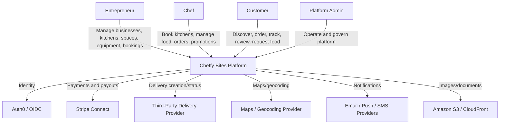

---

# 5. C4 Level 2 — Container Architecture

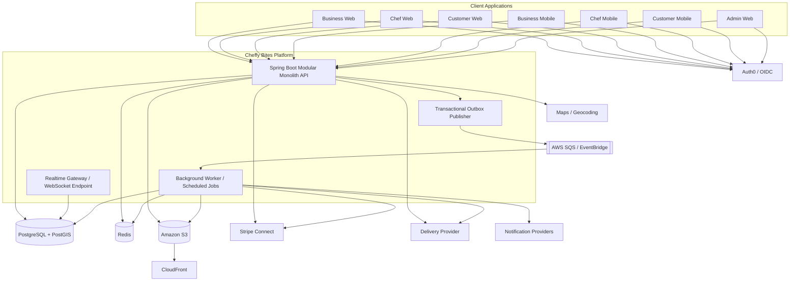

---

# 6. C4 Level 3 — Backend Component Model

The Spring Boot application is one deployable unit but is divided into bounded contexts.

```mermaid
flowchart TB
    HTTP[REST / WebSocket Adapters]

    Identity[Identity & Access]
    Org[Organization]
    Kitchen[Kitchen]
    Equipment[Equipment]
    Booking[Booking]
    Chef[Chef]
    Catalog[Master Catalog]
    Food[Food]
    Customer[Customer]
    Cart[Cart]
    Order[Order]
    Pricing[Pricing]
    Promotion[Promotion]
    Payment[Payment]
    Refund[Refund]
    Tax[Tax]
    Payout[Payout]
    Delivery[Delivery]
    Chat[Chat]
    Review[Review]
    Demand[Food Request]
    Notification[Notification]
    Admin[Administration]

    DB[(PostgreSQL)]
    Outbox[(Outbox)]
    Integrations[External Provider Adapters]

    HTTP --> Identity
    HTTP --> Org
    HTTP --> Kitchen
    HTTP --> Equipment
    HTTP --> Booking
    HTTP --> Chef
    HTTP --> Catalog
    HTTP --> Food
    HTTP --> Customer
    HTTP --> Cart
    HTTP --> Order
    HTTP --> Pricing
    HTTP --> Promotion
    HTTP --> Payment
    HTTP --> Refund
    HTTP --> Tax
    HTTP --> Payout
    HTTP --> Delivery
    HTTP --> Chat
    HTTP --> Review
    HTTP --> Demand
    HTTP --> Notification
    HTTP --> Admin

    Order --> Pricing
    Pricing --> Promotion
    Pricing --> Tax
    Order --> Payment
    Order --> Delivery
    Payment --> Payout
    Payment --> Refund
    Booking --> Pricing
    Booking --> Payment
    Food --> Catalog
    Demand --> Catalog
    Demand --> Notification
    Order --> Notification
    Booking --> Notification
    Chat --> Notification

    Identity --> DB
    Org --> DB
    Kitchen --> DB
    Equipment --> DB
    Booking --> DB
    Chef --> DB
    Catalog --> DB
    Food --> DB
    Customer --> DB
    Cart --> DB
    Order --> DB
    Pricing --> DB
    Promotion --> DB
    Payment --> DB
    Refund --> DB
    Tax --> DB
    Payout --> DB
    Delivery --> DB
    Chat --> DB
    Review --> DB
    Demand --> DB
    Notification --> DB
    Admin --> DB

    Order --> Outbox
    Booking --> Outbox
    Payment --> Outbox
    Refund --> Outbox
    Delivery --> Outbox
    Demand --> Outbox
    Promotion --> Outbox
    Outbox --> Integrations
```

---

# 7. Module / Bounded Context Boundaries

## 7.1 Identity & Access

Owns:

- Local user identity mapping to Auth0 subject.
- Role assignments.
- Permission evaluation.
- Authentication context.
- Security metadata.

Does not own:

- Kitchen data.
- Order data.
- Payment data.

Key concepts:

- UserAccount
- Role
- Permission
- UserRole

---

## 7.2 Organization

Owns:

- Business organizations.
- Organization membership.
- Organization roles.
- Business profile.

Supports:

- Entrepreneur organizations.
- Chef businesses.
- Future staff/team members.

---

## 7.3 Kitchen

Owns:

- Physical locations.
- Kitchens.
- Kitchen spaces.
- Kitchen operating schedules.
- Kitchen rules.
- Kitchen publication status.

Does not own:

- Payments.
- Food orders.
- Chef profiles.

---

## 7.4 Equipment

Owns:

- Equipment master catalog.
- Space equipment assignment.
- Rental equipment inventory.
- Equipment availability.
- Equipment rental line items.

Critical invariant:

> Equipment with finite quantity cannot be overbooked during overlapping occupancy intervals.

---

## 7.5 Booking

Owns:

- Kitchen space bookings.
- Temporary holds.
- Booking status.
- Booking occupancy interval.
- Booking cancellation.

Collaborates with:

- Kitchen.
- Equipment.
- Pricing.
- Promotion.
- Tax.
- Payment.
- Payout.

---

## 7.6 Chef

Owns:

- Chef profile.
- Chef business.
- Chef membership.
- Chef service area.

---

## 7.7 Catalog

Owns platform master data:

- Cuisine.
- Master food.
- Ingredient.
- Dietary attribute.
- Allergen.
- Nutrition profile.
- Equipment master data.

Master records are controlled by administrators.

---

## 7.8 Food

Owns:

- Chef food listings.
- Menus.
- Menu items.
- Food availability.
- Chef-specific nutrition/ingredient customization.
- Food media references.
- Recipe references.
- YouTube references.

A Chef Food Listing may reference Master Food but must never mutate the master record.

---

## 7.9 Customer

Owns:

- Customer profile.
- Customer addresses.
- Customer preferences.
- Saved food.

---

## 7.10 Cart

Owns:

- Customer carts.
- Cart items.
- Cart Kitchen identity.
- Cart expiration.

Invariant:

> A Cart belongs to exactly one Kitchen.

A cart mutation that would introduce another Kitchen is rejected.

---

## 7.11 Order

Owns:

- Order aggregate.
- Kitchen identity.
- Chef Order Groups.
- Order items.
- Order lifecycle.
- Order status history.
- Order cancellation.

Invariant:

> One Order belongs to exactly one physical Kitchen.

---

## 7.12 Pricing

Owns:

- Price composition.
- Subtotals.
- Discount application results.
- Fees.
- Delivery fee calculation result.
- Pricing snapshots.

Pricing does not own promotion definitions or payment provider data.

---

## 7.13 Promotion

Owns:

- Promotion definitions.
- Promotion rules.
- Promotion targets.
- Promo codes.
- Promotion usage.
- Promotion eligibility.
- Promotion stacking.
- Promotion applications.

Critical invariant:

> Chef promotion evaluation is scoped only to the Chef's eligible Order Group items.

---

## 7.14 Payment

Owns:

- Payment intent lifecycle.
- Payment attempts.
- Payment provider references.
- Payment webhooks.
- Payment status.

Does not own:

- Order state.
- Payout policy.

---

## 7.15 Refund

Owns:

- Refund request.
- Refund transaction.
- Partial refund allocation.
- Refund state.
- Promotion recalculation trigger.

---

## 7.16 Tax

Owns:

- Tax categories.
- Tax rules/configuration.
- Tax line calculation adapter.
- Tax snapshots.

Exact legal/tax treatment is configurable and externally validated.

---

## 7.17 Payout

Owns:

- Seller payable balances.
- Payout eligibility.
- Payout batches.
- Payout status.
- Payout provider references.

Recipients:

- Chef.
- Entrepreneur.

---

## 7.18 Delivery

Owns:

- Delivery request.
- Delivery provider reference.
- Delivery status.
- Delivery events.
- Provider adapters.

Invariant:

> A standard delivery is associated with the Kitchen Order, not with each Chef.

---

## 7.19 Chat

Owns:

- Conversations.
- Participants.
- Messages.
- Read/delivery state.
- Abuse/report metadata.

Order chat and Food Request interactions must be authorization-controlled.

---

## 7.20 Review

Owns:

- Ratings.
- Reviews.
- Review eligibility.
- Review moderation state.

Reviews require verified transaction eligibility.

---

## 7.21 Food Request / Demand

Owns:

- Food requests.
- Demand aggregation.
- Customer interest.
- Subscriptions.
- Chef responses.
- Fulfillment links.

Food Request is separate from Saved Food/Wishlist.

---

## 7.22 Notification

Owns:

- Notification records.
- Preferences.
- Delivery attempts.
- Provider adapters.

Notification processing should be asynchronous.

---

## 7.23 Administration

Owns platform operations, moderation, configuration and privileged workflows.

Admin authorization must be independently verified server-side.

---

# 8. Cross-Module Dependency Rules

1. Domain modules may depend on domain contracts, not provider SDKs.
2. Do not create arbitrary bidirectional dependencies between modules.
3. Prefer application-service orchestration for cross-module workflows.
4. Prefer domain events for asynchronous downstream effects.
5. Financial modules are authoritative for financial facts.
6. Order owns operational order state.
7. Payment owns payment state.
8. Delivery owns provider delivery state.
9. Promotion owns promotion eligibility and usage.
10. Pricing composes the commercial result but does not mutate payment state.

---

# 9. Backend Package Structure

```text
backend/
└── src/main/java/com/cheffybites/
    ├── identity/
    │   ├── api/
    │   ├── application/
    │   ├── domain/
    │   └── infrastructure/
    ├── organization/
    ├── kitchen/
    ├── equipment/
    ├── booking/
    ├── chef/
    ├── catalog/
    ├── food/
    ├── customer/
    ├── cart/
    ├── order/
    ├── pricing/
    ├── promotion/
    ├── payment/
    ├── refund/
    ├── tax/
    ├── payout/
    ├── delivery/
    ├── chat/
    ├── review/
    ├── foodrequest/
    ├── notification/
    ├── administration/
    └── common/
```

Inside each module:

```text
module/
├── api/
├── application/
├── domain/
└── infrastructure/
```

Rules:

- `api` may depend on `application`.
- `application` may depend on `domain` and domain ports.
- `domain` must remain independent of Spring MVC and provider SDKs.
- `infrastructure` implements ports.

---

# 10. Database Strategy

Use one PostgreSQL cluster/database for the MVP with explicit logical ownership.

Recommended actual PostgreSQL schemas:

```text
identity
organization
kitchen
booking
equipment
chef
catalog
food
customer
cart
orders
promotion
pricing
payment
refund
tax
payout
delivery
chat
review
food_request
notification
audit
platform
```

The `platform` schema may hold cross-cutting configuration and outbox data where appropriate.

Do not use one giant `public` schema containing every domain table without ownership boundaries.

---

# 11. Database Naming Conventions

- Tables: `snake_case`, plural.
- Columns: `snake_case`.
- Primary keys: `id`.
- Foreign keys: `<entity>_id`.
- Timestamps: `created_at`, `updated_at`.
- Version field: `version` for optimistic locking where appropriate.
- External provider IDs: explicit names, e.g. `stripe_payment_intent_id`.
- Money: `amount_minor` + `currency_code`.
- Status: controlled enum values represented by stable strings or database enum policy decided per module.

All identifiers are UUID/UUIDv7.

---

# 12. Detailed Database ERD

```mermaid
erDiagram
    USERS ||--o{ ORGANIZATION_MEMBERS : belongs_to
    ORGANIZATIONS ||--o{ ORGANIZATION_MEMBERS : has
    ROLES ||--o{ ORGANIZATION_MEMBERS : assigns

    ORGANIZATIONS ||--o{ LOCATIONS : owns
    LOCATIONS ||--o{ KITCHENS : contains
    KITCHENS ||--o{ KITCHEN_SPACES : contains

    KITCHEN_SPACES ||--o{ SPACE_EQUIPMENT : includes
    EQUIPMENT_CATALOG_ITEMS ||--o{ SPACE_EQUIPMENT : referenced_by
    KITCHEN_SPACES ||--o{ EQUIPMENT_RENTALS : offers
    EQUIPMENT_CATALOG_ITEMS ||--o{ EQUIPMENT_RENTALS : rented_as

    KITCHENS ||--o{ KITCHEN_AVAILABILITIES : defines
    KITCHEN_SPACES ||--o{ KITCHEN_SPACE_AVAILABILITIES : defines
    KITCHEN_SPACES ||--o{ KITCHEN_BOOKINGS : reserved
    CHEF_PROFILES ||--o{ KITCHEN_BOOKINGS : creates

    CHEF_BUSINESSES ||--o{ CHEF_MEMBERS : has
    USERS ||--o{ CHEF_MEMBERS : participates
    CHEF_BUSINESSES ||--o{ MENUS : owns
    MENUS ||--o{ MENU_ITEMS : contains
    FOOD_LISTINGS ||--o{ MENU_ITEMS : referenced
    CHEF_BUSINESSES ||--o{ FOOD_LISTINGS : owns
    MASTER_FOODS ||--o{ FOOD_LISTINGS : based_on

    CUISINES ||--o{ MASTER_FOODS : classifies
    MASTER_FOODS ||--o{ FOOD_INGREDIENTS : has
    INGREDIENTS ||--o{ FOOD_INGREDIENTS : used_in
    MASTER_FOODS ||--o{ NUTRITION_PROFILES : has
    FOOD_LISTINGS ||--o{ FOOD_NUTRITION_OVERRIDES : customizes
    FOOD_LISTINGS ||--o{ FOOD_AVAILABILITIES : schedules

    USERS ||--o| CUSTOMER_PROFILES : has
    CUSTOMER_PROFILES ||--o{ CUSTOMER_ADDRESSES : has

    CUSTOMER_PROFILES ||--o{ CARTS : owns
    CARTS ||--o{ CART_ITEMS : contains
    FOOD_LISTINGS ||--o{ CART_ITEMS : added
    KITCHENS ||--o{ CARTS : scopes

    CARTS ||--o| ORDERS : converts_to
    KITCHENS ||--o{ ORDERS : fulfills
    ORDERS ||--o{ CHEF_ORDER_GROUPS : contains
    CHEF_BUSINESSES ||--o{ CHEF_ORDER_GROUPS : fulfills
    CHEF_ORDER_GROUPS ||--o{ ORDER_ITEMS : contains
    FOOD_LISTINGS ||--o{ ORDER_ITEMS : purchased
    ORDERS ||--o{ ORDER_STATUS_HISTORY : changes

    PROMOTIONS ||--o{ PROMOTION_RULES : has
    PROMOTIONS ||--o{ PROMOTION_TARGETS : targets
    PROMOTIONS ||--o{ PROMO_CODES : exposes
    PROMOTIONS ||--o{ PROMOTION_USAGE : used
    ORDERS ||--o{ PROMOTION_APPLICATIONS : receives
    CHEF_ORDER_GROUPS ||--o{ PROMOTION_APPLICATIONS : scopes
    PROMOTIONS ||--o{ PROMOTION_APPLICATIONS : applied
    PROMOTIONS ||--o{ PROMOTION_SNAPSHOTS : snapshots
    PROMOTION_SNAPSHOTS ||--o{ PROMOTION_APPLICATION_ITEMS : allocates

    ORDERS ||--o{ PRICING_SNAPSHOTS : priced
    ORDERS ||--o{ FINANCIAL_SNAPSHOTS : captures
    CHEF_ORDER_GROUPS ||--o{ FINANCIAL_SNAPSHOTS : captures
    ORDERS ||--o{ PAYMENTS : paid_by
    PAYMENTS ||--o{ PAYMENT_ATTEMPTS : attempts
    PAYMENTS ||--o{ PAYMENT_TRANSACTIONS : transactions
    PAYMENTS ||--o{ PAYMENT_ALLOCATIONS : allocates
    ORDERS ||--o{ REFUNDS : refunded
    REFUNDS ||--o{ REFUND_TRANSACTIONS : transactions
    REFUNDS ||--o{ REFUND_LINES : lines

    ORDERS ||--o{ FEE_LINE_ITEMS : charged
    ORDERS ||--o{ TAX_LINE_ITEMS : taxed
    ORDERS ||--o{ LEDGER_ENTRIES : recorded

    PAYOUTS ||--o{ PAYOUT_LINES : contains
    PAYOUT_LINES ||--o{ LEDGER_ENTRIES : settles

    ORDERS ||--o| DELIVERIES : may_have
    DELIVERIES ||--o{ DELIVERY_EVENTS : emits

    USERS ||--o{ CHAT_PARTICIPANTS : participates
    CHAT_CONVERSATIONS ||--o{ CHAT_PARTICIPANTS : has
    CHAT_CONVERSATIONS ||--o{ CHAT_MESSAGES : contains

    ORDERS ||--o{ RATINGS : enables
    ORDERS ||--o{ REVIEWS : enables
    FOOD_LISTINGS ||--o{ RATINGS : receives
    CHEF_BUSINESSES ||--o{ RATINGS : receives

    CUSTOMER_PROFILES ||--o{ FOOD_REQUESTS : creates
    MASTER_FOODS ||--o{ FOOD_REQUESTS : normalized_to
    FOOD_REQUESTS ||--o{ FOOD_REQUEST_INTERESTS : aggregates
    CUSTOMER_PROFILES ||--o{ FOOD_REQUEST_INTERESTS : expresses
    FOOD_REQUESTS ||--o{ FOOD_REQUEST_SUBSCRIPTIONS : watched
    CUSTOMER_PROFILES ||--o{ FOOD_REQUEST_SUBSCRIPTIONS : owns
    FOOD_REQUESTS ||--o{ FOOD_REQUEST_RESPONSES : answered
    CHEF_BUSINESSES ||--o{ FOOD_REQUEST_RESPONSES : responds

    USERS {
        uuid id PK
        string auth_subject UK
        string status
        timestamptz created_at
        timestamptz updated_at
    }

    ORGANIZATIONS {
        uuid id PK
        string type
        string name
        string status
        timestamptz created_at
        timestamptz updated_at
    }

    ORGANIZATION_MEMBERS {
        uuid id PK
        uuid organization_id FK
        uuid user_id FK
        uuid role_id FK
        string status
        timestamptz created_at
    }

    ROLES {
        uuid id PK
        string code UK
        string name
    }

    LOCATIONS {
        uuid id PK
        uuid organization_id FK
        string name
        string address_line1
        string city
        string province
        string postal_code
        string country_code
        geography point
        string timezone
    }

    KITCHENS {
        uuid id PK
        uuid location_id FK
        string name
        text description
        string status
        string timezone
        timestamptz published_at
    }

    KITCHEN_SPACES {
        uuid id PK
        uuid kitchen_id FK
        string name
        text description
        numeric size_value
        string size_unit
        int capacity
        bigint hourly_rate_minor
        string currency_code
        int minimum_booking_minutes
        int maximum_booking_minutes
        int cleaning_minutes
        string status
        int version
    }

    EQUIPMENT_CATALOG_ITEMS {
        uuid id PK
        string category
        string name
        text description
        string image_url
        bool active
    }

    SPACE_EQUIPMENT {
        uuid id PK
        uuid kitchen_space_id FK
        uuid equipment_catalog_item_id FK
        int quantity
        bool included
        bool rental_available
    }

    EQUIPMENT_RENTALS {
        uuid id PK
        uuid kitchen_space_id FK
        uuid equipment_catalog_item_id FK
        bigint hourly_rate_minor
        string currency_code
        int quantity_available
        string status
    }

    KITCHEN_BOOKINGS {
        uuid id PK
        uuid kitchen_space_id FK
        uuid chef_profile_id FK
        timestamptz start_at
        timestamptz cooking_end_at
        timestamptz occupancy_end_at
        timestamptz hold_expires_at
        string timezone
        string status
        string cancellation_reason
        int version
    }

    CHEF_PROFILES {
        uuid id PK
        uuid user_id FK
        uuid chef_business_id FK
        string display_name
        text biography
        geography service_location
        string status
    }

    CHEF_BUSINESSES {
        uuid id PK
        uuid organization_id FK
        string name
        string status
    }

    MENUS {
        uuid id PK
        uuid chef_business_id FK
        string name
        text description
        string status
    }

    MASTER_FOODS {
        uuid id PK
        uuid cuisine_id FK
        string canonical_name
        text description
        bool active
    }

    FOOD_LISTINGS {
        uuid id PK
        uuid chef_business_id FK
        uuid kitchen_id FK
        uuid master_food_id FK
        string name
        text description
        bigint price_minor
        string currency_code
        int preparation_minutes
        int serving_size
        string status
    }

    FOOD_AVAILABILITIES {
        uuid id PK
        uuid food_listing_id FK
        timestamptz start_at
        timestamptz end_at
        int cutoff_minutes
        string recurrence_rule
        bool active
    }

    CUSTOMER_PROFILES {
        uuid id PK
        uuid user_id FK
        string display_name
        string default_currency_code
    }

    CUSTOMER_ADDRESSES {
        uuid id PK
        uuid customer_profile_id FK
        string label
        string address_line1
        string city
        string province
        string postal_code
        string country_code
        geography point
    }

    CARTS {
        uuid id PK
        uuid customer_profile_id FK
        uuid kitchen_id FK
        string status
        timestamptz expires_at
        int version
    }

    CART_ITEMS {
        uuid id PK
        uuid cart_id FK
        uuid kitchen_id FK
        uuid food_listing_id FK
        int quantity
        jsonb selected_options
        timestamptz added_at
    }

    ORDERS {
        uuid id PK
        uuid customer_profile_id FK
        uuid kitchen_id FK
        uuid cart_id FK
        string fulfillment_type
        string status
        bigint subtotal_minor
        bigint discount_minor
        bigint delivery_fee_minor
        bigint fee_minor
        bigint tax_minor
        bigint total_minor
        string currency_code
        int version
        timestamptz placed_at
        timestamptz completed_at
    }

    CHEF_ORDER_GROUPS {
        uuid id PK
        uuid order_id FK
        uuid chef_business_id FK
        string status
        bigint subtotal_minor
        bigint discount_minor
        bigint net_minor
        string currency_code
        int version
        uuid latest_financial_snapshot_id FK
        uuid latest_promotion_snapshot_id FK
    }

    ORDER_ITEMS {
        uuid id PK
        uuid order_id FK
        uuid kitchen_id FK
        uuid chef_order_group_id FK
        uuid food_listing_id FK
        string product_name_snapshot
        bigint unit_price_minor
        int quantity
        bigint gross_minor
        bigint discount_minor
        bigint net_minor
        bigint tax_minor
        string currency_code
        jsonb item_snapshot
    }

    PROMOTIONS {
        uuid id PK
        string owner_type
        uuid owner_id
        string promotion_scope
        string promotion_type
        string name
        timestamptz valid_from
        timestamptz valid_to
        int priority
        string qualifying_basis
        string compatibility_group
        string exclusivity_group
        string status
        jsonb conditions
    }

    PROMOTION_RULES {
        uuid id PK
        uuid promotion_id FK
        string rule_type
        string scope
        string qualifying_basis
        int priority
        jsonb parameters
        string status
    }

    PROMOTION_TARGETS {
        uuid id PK
        uuid promotion_id FK
        string target_type
        uuid target_id
        string status
    }

    PROMOTION_SNAPSHOTS {
        uuid id PK
        uuid promotion_id FK
        uuid order_id FK
        uuid chef_order_group_id FK
        int promotion_version
        string scope
        string qualifying_basis
        bigint qualifying_subtotal_minor
        bigint discount_minor
        string applied_status
        string rejection_reason
        jsonb snapshot_evidence
        timestamptz created_at
    }

    PROMOTION_APPLICATION_ITEMS {
        uuid id PK
        uuid promotion_snapshot_id FK
        uuid order_item_id FK
        string allocation_type
        bigint discount_minor
    }

    PROMO_CODES {
        uuid id PK
        uuid promotion_id FK
        string code_hash UK
        string display_code
        int max_global_uses
        int max_uses_per_customer
        timestamptz valid_from
        timestamptz valid_to
        string status
    }

    PROMOTION_APPLICATIONS {
        uuid id PK
        uuid promotion_id FK
        uuid order_id FK
        uuid chef_order_group_id FK
        uuid promo_code_id FK
        bigint discount_minor
        jsonb calculation_snapshot
    }

    PAYMENTS {
        uuid id PK
        uuid order_id FK
        string provider
        string provider_payment_intent_id UK
        string idempotency_key
        string status
        bigint amount_minor
        string currency_code
        jsonb provider_metadata
    }

    PAYMENT_ATTEMPTS {
        uuid id PK
        uuid payment_id FK
        string provider_attempt_id
        string status
        bigint amount_minor
        string currency_code
        jsonb provider_payload
        timestamptz attempted_at
    }

    PAYMENT_ALLOCATIONS {
        uuid id PK
        uuid payment_id FK
        uuid order_id FK
        uuid chef_order_group_id FK
        string allocation_type
        bigint amount_minor
        string currency_code
        jsonb allocation_evidence
    }

    REFUNDS {
        uuid id PK
        uuid payment_id FK
        uuid order_id FK
        string idempotency_key
        string reason
        string status
        bigint requested_minor
        bigint approved_minor
        string currency_code
        jsonb provider_metadata
    }

    REFUND_LINES {
        uuid id PK
        uuid refund_id FK
        uuid order_item_id FK NULL
        uuid chef_order_group_id FK NULL
        string line_type
        bigint amount_minor
        string currency_code
        jsonb refund_evidence
    }

    FEE_LINE_ITEMS {
        uuid id PK
        uuid order_id FK
        string fee_type
        bigint amount_minor
        string currency_code
        jsonb calculation_snapshot
    }

    TAX_LINE_ITEMS {
        uuid id PK
        uuid order_id FK
        string tax_type
        string jurisdiction
        decimal rate
        bigint amount_minor
        string currency_code
    }

    PAYOUTS {
        uuid id PK
        string recipient_type
        uuid recipient_id
        string idempotency_key
        string status
        bigint amount_minor
        string currency_code
        string provider_reference
        jsonb provider_metadata
        timestamptz created_at
    }

    PAYOUT_LINES {
        uuid id PK
        uuid payout_id FK
        uuid order_id FK
        uuid chef_order_group_id FK
        uuid kitchen_booking_id FK NULL
        string line_type
        bigint gross_minor
        bigint fee_minor
        bigint adjustment_minor
        bigint net_minor
        string currency_code
        jsonb calculation_snapshot
    }

    LEDGER_ENTRIES {
        uuid id PK
        uuid order_id FK NULL
        uuid chef_order_group_id FK NULL
        uuid payout_id FK NULL
        uuid payout_line_id FK NULL
        uuid payment_id FK NULL
        uuid refund_id FK NULL
        string entry_type
        string entry_scope
        bigint amount_minor
        string currency_code
        string direction
        jsonb entry_snapshot
        timestamptz created_at
    }

    DELIVERIES {
        uuid id PK
        uuid order_id FK
        string provider
        string provider_delivery_id
        string status
        bigint fee_minor
        string currency_code
    }

    DELIVERY_EVENTS {
        uuid id PK
        uuid delivery_id FK
        string external_event_id
        string event_type
        string status
        jsonb payload_metadata
        timestamptz event_at
    }

    FOOD_REQUESTS {
        uuid id PK
        uuid customer_profile_id FK
        uuid master_food_id FK
        string requested_name
        text description
        geography location
        string status
        bool notify_when_available
        timestamptz created_at
    }

    FINANCIAL_SNAPSHOTS {
        uuid id PK
        uuid order_id FK
        uuid chef_order_group_id FK NULL
        int snapshot_version
        string snapshot_type
        jsonb snapshot_evidence
        timestamptz created_at
    }

    IDEMPOTENCY_KEYS {
        uuid id PK
        string operation_type
        string idempotency_key UK
        uuid actor_user_id FK
        string request_hash
        jsonb response_snapshot
        string status
        timestamptz created_at
        timestamptz updated_at
    }

    PROVIDER_EVENTS {
        uuid id PK
        string provider_name
        string provider_event_id
        string aggregate_type
        uuid aggregate_id
        jsonb payload
        timestamptz received_at
        timestamptz processed_at
        string status
    }

    BOOKING_HOLDS {
        uuid id PK
        uuid kitchen_space_id FK
        uuid chef_profile_id FK
        timestamptz hold_expires_at
        string status
        jsonb hold_evidence
        timestamptz created_at
    }
```

---

# 13. Critical Database Constraints

## 13.1 One Kitchen Per Cart

`carts.kitchen_id` is mandatory.

Every `cart_item.food_listing_id` must resolve to a Chef Food Listing whose Chef Business is operating from the same Kitchen selected by the cart.

This invariant is enforced in application logic and tested transactionally. Where feasible, supporting denormalized ownership columns may permit database-level checks.

## 13.2 One Kitchen Per Order

`orders.kitchen_id` is mandatory and immutable after order creation.

Every Chef Order Group must refer to a Chef who is authorized to fulfill food from that Kitchen at the relevant order/availability context.

## 13.3 One Chef Order Group Per Chef Per Order

Unique constraint:

```text
UNIQUE(order_id, chef_business_id)
```

## 13.4 Chef Order Group Is the Financial Allocation Boundary

Every food-order `PAYOUT_LINE_ITEM` must reference the originating `chef_order_group_id`.

This allows the system to answer, without reconstructing history from Order Items:

- Which orders generated a Chef payout?
- Which Chef Order Group contributed to a payout?
- How much gross revenue came from each Chef Order Group?
- What promotion/fee/refund adjustments affected that Chef?
- Which payout line settled that Chef Order Group?

Recommended constraints:

```text
PAYOUT_LINE_ITEMS.chef_order_group_id IS NOT NULL
for FOOD_ORDER payout line types

UNIQUE(payout_id, chef_order_group_id)
for one settlement run
```

## 13.4 Unique Promo Redemption

For single-use codes:

```text
UNIQUE(promo_code_id)
```

or an equivalent concurrency-safe redemption record depending on future support for code scope.

## 13.5 Money

Persist integer minor units:

```text
amount_minor BIGINT
currency_code CHAR(3)
```

## 13.6 Optimistic Locking

Use `version` on:

- Cart
- Kitchen Space
- Kitchen Booking where appropriate
- Order
- Chef Order Group
- Payment aggregate where appropriate

---

# 14. Booking Concurrency / Double Booking Strategy

Kitchen space booking is temporal. A simple `available=true` field is insufficient.

The authoritative availability query must consider:

- Operating hours.
- Blackout periods.
- Existing confirmed bookings.
- Temporary holds.
- Cleaning buffer.
- Requested interval.

For PostgreSQL, prefer a range-based model for confirmed occupancy. A strong implementation option is:

```sql
EXCLUDE USING gist (
    kitchen_space_id WITH =,
    occupancy_range WITH &&
)
WHERE (status IN ('HELD', 'CONFIRMED'));
```

The final DDL should use a generated/maintained `tstzrange` column or equivalent transaction-safe range representation.

Equipment with quantity > 1 requires inventory allocation logic. A row-level quantity check with transaction locking is preferred initially; if inventory allocation becomes complex, introduce an allocation table keyed by booking and equipment unit.

---

# 15. Cart and Order Model

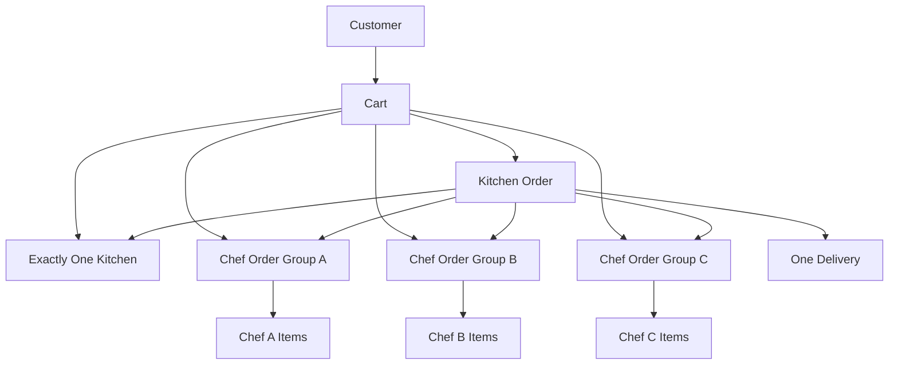

A customer can maintain several active carts, but each cart represents one kitchen. Checkout of each cart creates a separate order.

---

# 16. Pricing Architecture

Pricing must be centralized and deterministic.

```text
Base Item Prices
      ↓
Partition by ChefOrderGroup
      ↓
Item-Level Promotion Evaluation
      ↓
ChefOrderGroup Promotion Evaluation
      ↓
Delivery Promotion Evaluation
      ↓
Platform Promotion Evaluation
      ↓
Service / Platform Fees
      ↓
Tax Calculation
      ↓
Final Customer Total
```

## 16.1 Chef Promotion Scope

Chef promotions operate within a Chef Order Group.

Chef A promotions never use Chef B items, and Chef B promotions never use Chef A items.

## 16.2 Promotion Qualifying Basis

Group-level promotions must explicitly declare a qualifying basis:

- `ALL_ELIGIBLE_ITEMS`
- `NON_DISCOUNTED_ELIGIBLE_ITEMS`
- `SPECIFIC_TARGET_ITEMS`
- `GROUP_SUBTOTAL`
- `DELIVERY_FEE`

If a promotion uses `NON_DISCOUNTED_ELIGIBLE_ITEMS`, discounted item values are excluded from the qualifying subtotal before threshold evaluation.

## 16.3 Promotion Compatibility and Conflict Resolution

No blanket global `stackable` flag controls promotion resolution.

Conflicting promotions must be resolved deterministically using:

1. scope
2. compatibility
3. exclusivity
4. priority
5. savings
6. stable tie-breaker

Item-level promotions may coexist with group-level promotions when they target different eligible amounts or non-overlapping scopes.

## 16.4 Platform and Delivery Promotions

Platform promotions and delivery promotions are evaluated separately from Chef promotions.

Platform promotions may stack with Chef promotions when the scopes and compatibility rules allow it.

## 16.5 One Promo Code

Only one promo code can be attached to an order transaction.

A Chef promotion that does not require a promo code may still apply based on eligibility. A platform promo code may then be evaluated according to the explicit compatibility model.

## 16.6 Pricing Snapshot

The pricing result must preserve promotion applications, rejected promotions, qualifying basis, eligible/excluded item IDs, discount amounts, and snapshot references.

---

# 17. Pricing Result Contract

```json
{
  "currency": "CAD",
  "subtotalMinor": 11200,
  "chefGroups": [
    {
      "chefBusinessId": "uuid",
      "subtotalMinor": 5000,
      "discountMinor": 1000,
      "netMinor": 4000,
      "appliedPromotions": [
        {
          "promotionId": "uuid",
          "promotionVersion": 3,
          "scope": "ITEM",
          "qualifyingBasis": "NON_DISCOUNTED_ELIGIBLE_ITEMS",
          "eligibleItemIds": ["uuid"],
          "excludedItemIds": ["uuid"],
          "discountMinor": 1000,
          "applied": true
        }
      ]
    }
  ],
  "platformDiscountMinor": 500,
  "deliveryFeeMinor": 700,
  "feeMinor": 300,
  "taxMinor": 500,
  "totalMinor": 11000,
  "promotionDecision": {
    "applied": ["uuid"],
    "rejected": [
      {
        "promotionId": "uuid",
        "reasonCode": "NOT_ELIGIBLE",
        "qualifyingBasis": "GROUP_SUBTOTAL"
      }
    ]
  }
}
```

The pricing result becomes a snapshot when checkout is finalized.

---

# 18. Order State Machines

## 18.1 Order

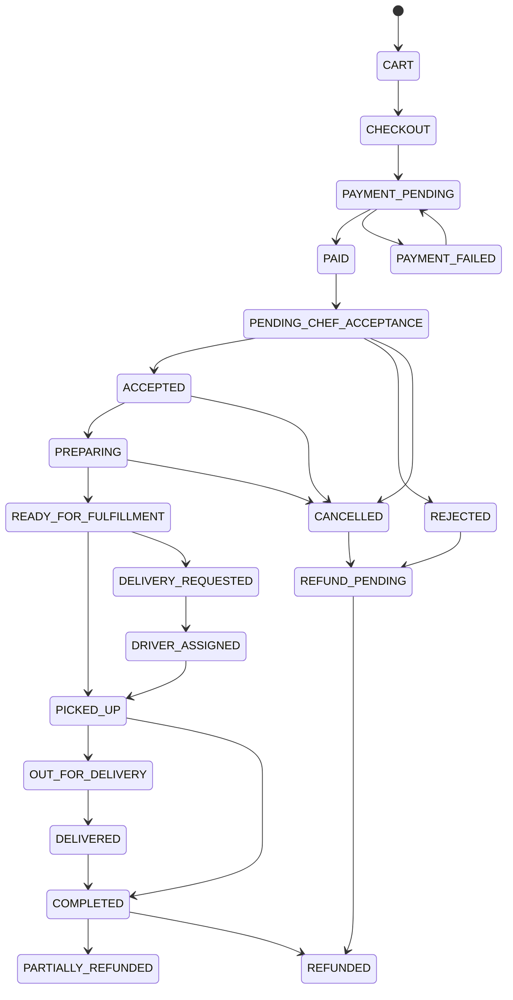

## 18.2 Chef Order Group

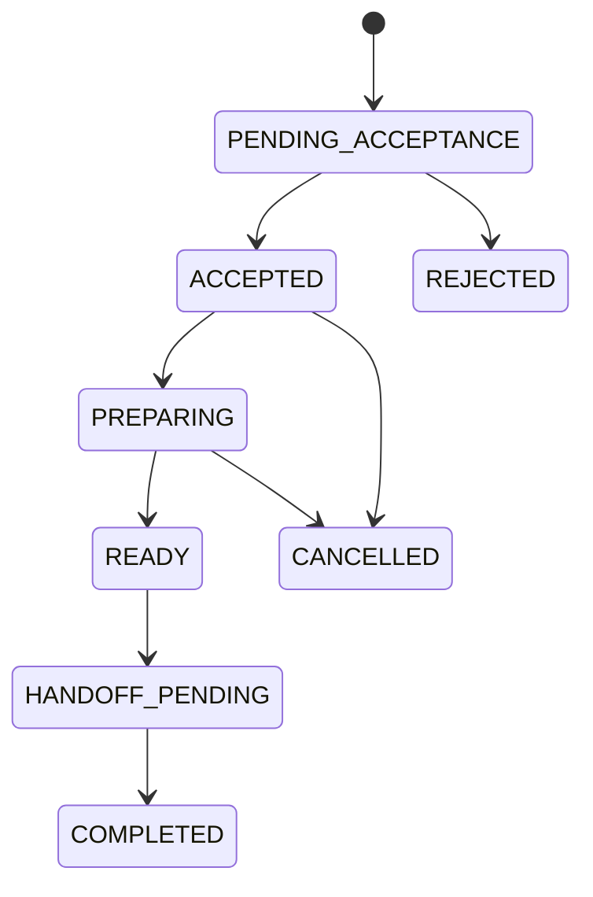

The overall Order cannot move to `READY_FOR_FULFILLMENT` while required Chef Groups remain unready.

---

# 19. Delivery Architecture

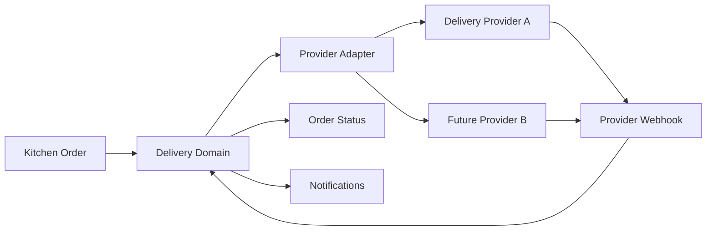

The first provider is configurable. The application-level `DeliveryGateway` interface must hide provider-specific models.

Example port:

```java
public interface DeliveryGateway {
    DeliveryQuote quote(DeliveryRequest request);
    DeliveryCreation createDelivery(DeliveryRequest request);
    DeliveryCancellation cancelDelivery(String providerDeliveryId);
    DeliveryStatus getStatus(String providerDeliveryId);
}
```

Provider webhooks must:

- Verify authenticity/signature.
- Store raw metadata safely without secrets.
- Deduplicate using external event ID.
- Map provider status to internal status.
- Enforce valid Order/Delivery transitions.

---

# 20. Payment and Payout Architecture

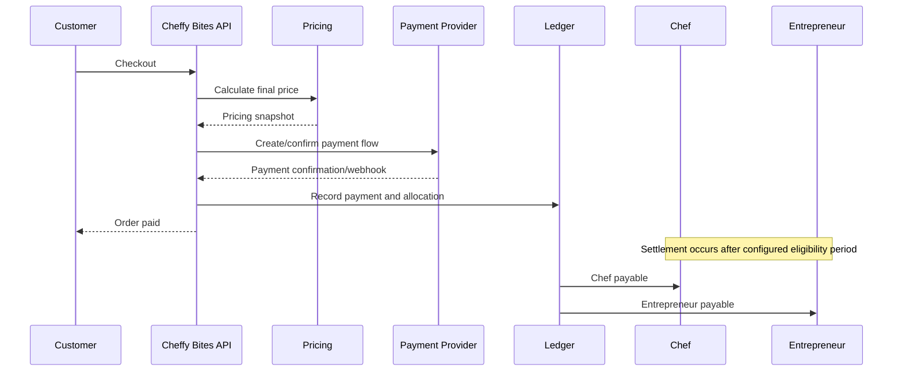

For one Kitchen Order containing multiple Chefs, the financial allocation must retain separate Chef payable amounts while charging the customer once.

The authoritative operational-to-financial relationship is: **Order → ChefOrderGroup → PayoutLineItem → Payout**.

A Chef payout must be traceable to the exact Chef Order Groups that generated the payable amount. A payout may contain multiple payout line items from multiple completed orders, but each Chef Order Group allocation must remain separately identifiable for reporting, refunds, reconciliation, and dispute handling.

The operational payment architecture is one customer payment, internal allocation, and provider-managed payouts. The legal Merchant-of-Record, tax remittance, chargeback, and refund liability decisions remain unresolved and must be finalized before production.

Stripe Connect is a likely provider baseline, but the architecture remains provider-neutral until legal/accounting sign-off.

---

# 21. Chef Settlement and Order History Model

`ChefOrderGroup` is a first-class operational **and financial aggregation boundary**.

```text
CUSTOMER ORDER
      │
      ├── Kitchen A
      │
      ├── ChefOrderGroup A
      │      ├── Chef A
      │      ├── Order Items
      │      ├── Chef Promotions
      │      ├── Chef Revenue
      │      ├── Refund Adjustments
      │      └── Payout Allocation
      │
      ├── ChefOrderGroup B
      │      ├── Chef B
      │      ├── Order Items
      │      ├── Chef Promotions
      │      ├── Chef Revenue
      │      ├── Refund Adjustments
      │      └── Payout Allocation
      │
      └── ChefOrderGroup C
             ├── Chef C
             ├── Order Items
             ├── Chef Promotions
             ├── Chef Revenue
             ├── Refund Adjustments
             └── Payout Allocation

ChefOrderGroup
      │
      ▼
PayoutLineItem
      │
      ▼
Payout
```

## 21.1 Why ChefOrderGroup Is First-Class

Every Chef Order Group identifies exactly one Chef's portion of one customer Order. It is therefore the authoritative query boundary for:

- Chef order history.
- Chef dashboard order counts.
- Chef-specific item totals.
- Chef promotions.
- Chef fulfillment status.
- Chef revenue.
- Chef refunds/adjustments.
- Chef payout calculations.
- Chef reporting and analytics.

A Chef order-history query should resolve through `ChefOrderGroup`, not by scanning all Orders for a nullable Chef identifier.

`ChefOrderGroup` must support immutable promotion snapshots, financial snapshots, payment allocations, refund allocations, payout lines, and ledger entries. A `latest_snapshot_id` may exist only as a convenience pointer and must never be treated as the source of truth.

Conceptually:

```text
Chef Business
    │
    └── ChefOrderGroups
           │
           ├── Order #10001
           ├── Order #10025
           ├── Order #10087
           └── Order #10122
```

## 21.2 Payout Allocation Rule

A Chef payout must never be derived only from the overall Order total. The payout calculation must start from the Chef's own ChefOrderGroup allocations, then apply the configured commission, taxes, refunds, adjustments, and settlement rules.

```text
ChefOrderGroup
   │
   ├── Gross food amount
   ├── Chef promotion impact
   ├── Applicable tax adjustments
   ├── Refund/return adjustments
   ├── Platform commission
   └── Other approved adjustments
           │
           ▼
      Chef Payable
           │
           ▼
    PayoutLineItem
           │
           ▼
        Payout
```

## 21.3 Partial Refund Rule

If an Order Item belonging to Chef A is refunded, only the relevant Chef A ChefOrderGroup financial allocation is recalculated, plus any shared order-level financial effects that business/tax rules require. Chef B and Chef C allocations must remain independently traceable.

## 21.4 Chef Reporting

The Chef dashboard should be able to show:

```text
Chef A
│
├── Order History
│     ├── Order #10001
│     ├── Order #10025
│     └── Order #10087
│
├── Sales
├── Discounts
├── Refunds
├── Platform Fees
├── Net Earnings
├── Pending Payout
└── Completed Payouts
```

# 21. Financial Ledger Model

The ledger is an audit-friendly record of financial facts.

Conceptual entry types:

```text
CUSTOMER_CHARGE
CHEF_REVENUE
ENTREPRENEUR_REVENUE
PLATFORM_FEE
DELIVERY_FEE
TAX_COLLECTED
PROMOTION_DISCOUNT
REFUND
PAYOUT
PAYOUT_REVERSAL
FINANCIAL_ADJUSTMENT
```

Rules:

1. Financial entries are append-only from a business perspective.
2. Corrections create new entries.
3. Historical pricing snapshots are immutable.
4. Every payout can be reconciled to ledger entries.
5. Every refund references the underlying financial allocation.
6. Payment allocations, refund allocations, payout lines, and promotion snapshots remain separately identifiable even when represented in the same ledger stream.

---

# 22. API Contract Architecture

Base URL:

```text
/api/v1
```

Authentication:

```text
Authorization: Bearer <OIDC access token>
```

Mutation idempotency for payment/reservation-sensitive APIs:

```text
Idempotency-Key: <unique-key>
```

Correlation:

```text
X-Correlation-ID: <request-id>
```

---

# 23. Standard API Response Rules

Success responses:

- `200 OK` — read/update action.
- `201 Created` — resource creation.
- `202 Accepted` — accepted asynchronous operation.
- `204 No Content` — successful deletion/action with no body.

Client errors:

- `400 Bad Request` — invalid request.
- `401 Unauthorized` — unauthenticated.
- `403 Forbidden` — authenticated but not authorized.
- `404 Not Found` — resource unavailable.
- `409 Conflict` — state/concurrency/business invariant conflict.
- `422 Unprocessable Entity` — semantic validation error.
- `429 Too Many Requests` — rate limit.

Server errors:

- `500 Internal Server Error`
- `502/503/504` where appropriate for provider/upstream dependency issues.

---

# 24. Standard Error Contract

```json
{
  "code": "KITCHEN_MISMATCH",
  "message": "All items in a cart must belong to the selected kitchen.",
  "traceId": "01H...",
  "details": {
    "cartId": "uuid",
    "existingKitchenId": "uuid",
    "requestedKitchenId": "uuid"
  }
}
```

Do not expose stack traces, SQL, provider secrets, internal hostnames, or infrastructure implementation details.

---

# 25. Core API Contracts — Identity and Organization

## 25.1 Current User

```http
GET /api/v1/me
```

Response:

```json
{
  "id": "uuid",
  "displayName": "Jane Doe",
  "roles": ["CHEF_OWNER"],
  "organizations": [
    {
      "id": "uuid",
      "name": "Jane Foods",
      "type": "CHEF_BUSINESS",
      "permissions": ["food:write", "order:read"]
    }
  ]
}
```

## 25.2 Create Organization

```http
POST /api/v1/organizations
```

Request:

```json
{
  "type": "ENTREPRENEUR_BUSINESS",
  "name": "ABC Kitchens"
}
```

---

# 26. Kitchen APIs

## List/Search Kitchens

```http
GET /api/v1/kitchens?lat=45.5&lng=-73.6&radiusMeters=10000&availableFrom=...&availableTo=...
```

Filters:

- Latitude/longitude.
- Radius.
- Date/time.
- Equipment.
- Price range.
- Capacity.
- Amenities.

## Create Kitchen

```http
POST /api/v1/kitchens
```

```json
{
  "locationId": "uuid",
  "name": "Hello Kitchen",
  "description": "Commercial kitchen facility"
}
```

## Create Space

```http
POST /api/v1/kitchens/{kitchenId}/spaces
```

```json
{
  "name": "Space 1",
  "description": "Baking and prep space",
  "capacity": 4,
  "hourlyRateMinor": 2500,
  "currency": "CAD",
  "minimumBookingMinutes": 180,
  "cleaningMinutes": 60
}
```

## Publish Kitchen

```http
POST /api/v1/kitchens/{kitchenId}/publication
```

---

# 27. Equipment APIs

## Search Master Equipment

```http
GET /api/v1/equipment/catalog?q=tandoor&category=cooking
```

## Add Included Equipment

```http
POST /api/v1/kitchen-spaces/{spaceId}/equipment
```

```json
{
  "equipmentCatalogItemId": "uuid",
  "quantity": 1,
  "included": true
}
```

## Add Rental Equipment

```http
POST /api/v1/kitchen-spaces/{spaceId}/rental-equipment
```

```json
{
  "equipmentCatalogItemId": "uuid",
  "hourlyRateMinor": 1500,
  "currency": "CAD",
  "quantityAvailable": 2
}
```

---

# 28. Kitchen Booking APIs

## Search Availability

```http
GET /api/v1/kitchen-spaces/{spaceId}/availability?from=...&to=...
```

## Quote Booking

```http
POST /api/v1/kitchen-bookings/quote
```

```json
{
  "spaceId": "uuid",
  "startAt": "2026-09-01T10:00:00Z",
  "endAt": "2026-09-01T14:00:00Z",
  "equipment": [
    {
      "equipmentRentalId": "uuid",
      "quantity": 1
    }
  ],
  "promoCode": "WELCOME10"
}
```

## Create Booking

```http
POST /api/v1/kitchen-bookings
Idempotency-Key: booking-unique-key
```

Request:

```json
{
  "spaceId": "uuid",
  "startAt": "2026-09-01T10:00:00Z",
  "endAt": "2026-09-01T14:00:00Z",
  "equipment": [
    {
      "equipmentRentalId": "uuid",
      "quantity": 1
    }
  ],
  "promoCode": "WELCOME10"
}
```

Response:

```json
{
  "bookingId": "uuid",
  "status": "PAYMENT_PENDING",
  "pricing": {
    "subtotalMinor": 10000,
    "discountMinor": 1000,
    "feeMinor": 500,
    "taxMinor": 1400,
    "totalMinor": 10900,
    "currency": "CAD"
  },
  "payment": {
    "paymentId": "uuid",
    "clientSecret": "provider-generated client secret"
  }
}
```

---

# 29. Food / Chef APIs

## Search Master Food

```http
GET /api/v1/catalog/foods?q=palak%20paneer&cuisine=indian
```

## Create Food Listing

```http
POST /api/v1/food-listings
```

```json
{
  "masterFoodId": "uuid",
  "name": "Chef Raj's Palak Paneer",
  "description": "Fresh spinach and paneer",
  "priceMinor": 1800,
  "currency": "CAD",
  "preparationMinutes": 25,
  "recipe": null,
  "youtubeUrl": "https://youtube.com/watch?v=..."
}
```

## Schedule Availability

```http
POST /api/v1/food-listings/{foodListingId}/availability
```

```json
{
  "startAt": "2026-09-05T12:00:00-04:00",
  "endAt": "2026-09-05T15:00:00-04:00",
  "cutoffMinutes": 60
}
```

---

# 30. Customer Discovery APIs

```http
GET /api/v1/discovery/foods
GET /api/v1/discovery/chefs
GET /api/v1/discovery/cuisines
```

Example filters:

```text
cuisine=indian
food=palak-paneer
chefId=uuid
lat=45.5
lng=-73.6
radiusMeters=10000
vegetarian=true
availableAt=...
```

The backend may query PostgreSQL/PostGIS directly for MVP. Do not introduce OpenSearch until justified by search requirements.

---

# 31. Cart APIs

## Create Cart

```http
POST /api/v1/carts
```

```json
{
  "kitchenId": "uuid"
}
```

## Add Item

```http
POST /api/v1/carts/{cartId}/items
```

```json
{
  "foodListingId": "uuid",
  "quantity": 2
}
```

If the item belongs to a different Kitchen:

```text
409 KITCHEN_MISMATCH
```

## Remove Item

```http
DELETE /api/v1/carts/{cartId}/items/{cartItemId}
```

## Get Cart

```http
GET /api/v1/carts/{cartId}
```

---

# 32. Pricing / Promotion APIs

## Price Cart

```http
POST /api/v1/carts/{cartId}/price
```

Returns a non-authoritative pricing preview.

## Validate Promo Code

```http
POST /api/v1/carts/{cartId}/promo-code/validate
```

```json
{
  "promoCode": "WELCOME10"
}
```

## Create Chef Promotion

```http
POST /api/v1/promotions
```

```json
{
  "ownerType": "CHEF",
  "promotionType": "PERCENTAGE",
  "name": "20% off 2 or more items",
  "priority": 100,
  "validFrom": "2026-09-01T00:00:00Z",
  "validTo": "2026-09-30T23:59:59Z",
  "conditions": {
    "minimumQuantity": 2
  },
  "targets": [
    {
      "type": "MENU",
      "id": "uuid"
    }
  ],
  "discount": {
    "percent": 20
  }
}
```

The API must validate that a Chef-owned promotion does not target another Chef's resources.

---

# 33. Order APIs

## Price Checkout

```http
POST /api/v1/carts/{cartId}/checkout/quote
```

## Create Order

```http
POST /api/v1/orders
Idempotency-Key: order-unique-key
```

Request:

```json
{
  "cartId": "uuid",
  "fulfillmentType": "DELIVERY",
  "deliveryAddressId": "uuid",
  "promoCode": "WELCOME10"
}
```

Response:

```json
{
  "orderId": "uuid",
  "status": "PAYMENT_PENDING",
  "kitchenId": "uuid",
  "chefOrderGroups": [
    {
      "id": "uuid",
      "chefBusinessId": "uuid",
      "status": "PENDING_ACCEPTANCE",
      "subtotalMinor": 5000,
      "discountMinor": 1000,
      "netMinor": 4000
    }
  ],
  "pricing": {
    "subtotalMinor": 11200,
    "discountMinor": 1500,
    "deliveryFeeMinor": 700,
    "feeMinor": 300,
    "taxMinor": 500,
    "totalMinor": 11200,
    "currency": "CAD"
  },
  "payment": {
    "paymentId": "uuid",
    "provider": "STRIPE"
  }
}
```

## Get Order

```http
GET /api/v1/orders/{orderId}
```

## Cancel Order

```http
POST /api/v1/orders/{orderId}/cancellation
```

```json
{
  "reasonCode": "CUSTOMER_CHANGED_MIND"
}
```

## Chef Accept/Reject

```http
POST /api/v1/chef-order-groups/{chefOrderGroupId}/accept
POST /api/v1/chef-order-groups/{chefOrderGroupId}/reject
```

## Chef Preparation

```http
POST /api/v1/chef-order-groups/{chefOrderGroupId}/preparing
POST /api/v1/chef-order-groups/{chefOrderGroupId}/ready
```

---

# 34. Payment APIs

## Create Payment Attempt

```http
POST /api/v1/orders/{orderId}/payments
Idempotency-Key: payment-attempt-key
```

## Payment Provider Webhook

```http
POST /api/v1/webhooks/stripe
```

This endpoint is unauthenticated at the normal user level but is protected by provider signature verification and replay protection.

Never trust the customer browser's redirect/success page as payment proof.

---

# 35. Refund APIs

## Request Refund

```http
POST /api/v1/orders/{orderId}/refunds
Idempotency-Key: refund-key
```

```json
{
  "type": "ITEM_REFUND",
  "items": [
    {
      "orderItemId": "uuid",
      "quantity": 1
    }
  ],
  "reasonCode": "ITEM_UNAVAILABLE"
}
```

Response:

```json
{
  "refundId": "uuid",
  "status": "REFUND_PENDING",
  "requestedAmountMinor": 2000,
  "currency": "CAD"
}
```

The financial engine re-evaluates promotion validity after the refund scope is known.

---

# 36. Delivery APIs

## Create Delivery

```http
POST /api/v1/orders/{orderId}/delivery
```

## Get Delivery

```http
GET /api/v1/orders/{orderId}/delivery
```

## Provider Webhook

```http
POST /api/v1/webhooks/delivery/{provider}
```

The webhook maps provider lifecycle to internal Delivery/Order states.

---

# 37. Food Request APIs

## Create Food Request

```http
POST /api/v1/food-requests
```

```json
{
  "requestedName": "Mysore Masala Dosa",
  "masterFoodId": "uuid",
  "description": "Authentic Mysore-style dosa",
  "referenceUrl": "https://youtube.com/...",
  "location": {
    "lat": 45.5,
    "lng": -73.6
  },
  "notifyWhenAvailable": true
}
```

## Nearby Requests for Chef

```http
GET /api/v1/food-requests/nearby?lat=45.5&lng=-73.6&radiusMeters=10000
```

## Add Existing Request to Wishlist

```http
POST /api/v1/food-requests/{requestId}/interest
```

## Subscribe

```http
POST /api/v1/food-requests/{requestId}/subscription
```

## Chef Responds

```http
POST /api/v1/food-requests/{requestId}/responses
```

```json
{
  "responseType": "ADDING_TO_MENU",
  "foodListingId": "uuid"
}
```

The response must not grant unrestricted customer messaging automatically.

---

# 38. Chat APIs

## Conversation History

```http
GET /api/v1/chat/conversations/{conversationId}/messages?cursor=...
```

## Send Message

```http
POST /api/v1/chat/conversations/{conversationId}/messages
```

```json
{
  "message": "Your order is almost ready."
}
```

Real-time delivery may use WebSocket.

Authorization must validate the conversation relationship on every send/read operation.

---

# 39. Review APIs

```http
POST /api/v1/orders/{orderId}/food-reviews
POST /api/v1/orders/{orderId}/chef-review
GET /api/v1/food-listings/{foodListingId}/reviews
GET /api/v1/chef-businesses/{chefBusinessId}/reviews
```

Review creation must verify the customer actually purchased the relevant item/ordered from the Chef.

---

# 40. Administration APIs

Examples:

```http
GET    /api/v1/admin/users
GET    /api/v1/admin/orders
GET    /api/v1/admin/payments
GET    /api/v1/admin/refunds
GET    /api/v1/admin/payouts
POST   /api/v1/admin/catalog/foods
POST   /api/v1/admin/catalog/equipment
POST   /api/v1/admin/promotions
POST   /api/v1/admin/delivery/providers
```

Admin APIs require dedicated permission checks such as:

```text
admin:users:read
admin:orders:read
admin:finance:read
admin:finance:write
admin:catalog:write
```

---

# 41. Event Architecture

Events are internal integration contracts, not database row dumps.

Recommended envelope:

```json
{
  "eventId": "uuid",
  "eventType": "OrderAccepted.v1",
  "eventVersion": 1,
  "occurredAt": "2026-09-01T12:00:00Z",
  "aggregateType": "ORDER",
  "aggregateId": "uuid",
  "correlationId": "uuid",
  "causationId": "uuid",
  "payload": {}
}
```

Core events:

```text
KitchenPublished.v1
KitchenBookingConfirmed.v1
KitchenBookingCancelled.v1
FoodPublished.v1
FoodAvailabilityChanged.v1
FoodRequestCreated.v1
FoodRequestInterestAdded.v1
FoodRequestFulfilled.v1
OrderCreated.v1
PaymentSucceeded.v1
PaymentFailed.v1
OrderAccepted.v1
OrderRejected.v1
ChefOrderGroupPreparing.v1
ChefOrderGroupReady.v1
DeliveryRequested.v1
DriverAssigned.v1
OrderPickedUp.v1
OrderOutForDelivery.v1
OrderDelivered.v1
OrderCancelled.v1
RefundProcessed.v1
PayoutCreated.v1
PayoutProcessed.v1
PromotionApplied.v1
PromotionInvalidated.v1
```

---

# 42. Transactional Outbox

Important domain writes and event creation happen in the same PostgreSQL transaction.

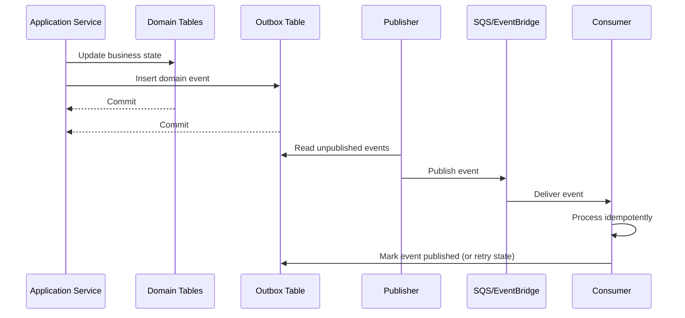

Consumer deduplication should be based on `eventId` or a consumer-specific inbox table.

---

# 43. Security Architecture

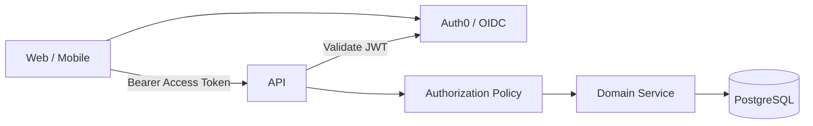

Security rules:

- Access tokens must be short-lived.
- Refresh strategy must be secure.
- All APIs must be HTTPS.
- CORS must be explicit.
- Rate limits must be enforced.
- Input validation is mandatory.
- SSRF protection is mandatory for external URL fetching.
- Uploaded content requires MIME/content validation.
- Secrets are stored in AWS Secrets Manager or equivalent.
- Financial/admin operations require audit logging.

---

# 44. Authorization Model

Authorization is evaluated through:

```text
User
 ↓
Organization / Business Membership
 ↓
Role
 ↓
Permission
 ↓
Resource Ownership
 ↓
Business Rule
```

Examples:

- Entrepreneur owner can edit all kitchens belonging to their organization.
- Kitchen manager can edit assigned kitchens only.
- Chef owner can manage their Chef Business.
- Chef can create promotions only for their own menu/food listings.
- Chef cannot read private customer contact data merely because a food request exists.
- Customer can access only their own carts, orders, addresses, and requests.

---

# 45. Media Architecture

Uploads use pre-signed S3 URLs.

```text
Client
  ↓
POST /api/v1/media/upload-intents
  ↓
Pre-signed S3 URL
  ↓
Upload directly to S3
  ↓
Media confirmation API
  ↓
Media metadata persisted
  ↓
CloudFront delivery
```

Media categories:

- Kitchen images.
- Space images.
- Equipment catalog images.
- Chef profiles.
- Food images.
- Verification documents.

Do not store image binaries in PostgreSQL.

---

# 46. Geospatial Architecture

PostGIS is the source of truth for geospatial filtering.

Core query patterns:

```sql
ST_DWithin(service_point, customer_point, radius)
```

Use GiST indexes on geography/geometry columns.

Business-defined radius examples may differ by use case:

- Kitchen search.
- Nearby Chef Food Requests.
- Delivery serviceability.

Do not expose exact customer home coordinates to unrelated Chefs.

---

# 47. Search Strategy

## MVP

Use PostgreSQL:

- Structured filters.
- Full-text search.
- PostGIS.
- Database ranking where adequate.

## Later

Introduce OpenSearch only when measurable needs exist:

- Large catalog.
- Typo tolerance.
- Advanced facets.
- Complex relevance ranking.
- High search traffic.

The search layer must not become a second source of transactional truth.

---

# 48. Redis Usage

Appropriate:

- Short-lived caches.
- Rate limiting.
- Idempotency keys where suitable.
- Frequently accessed master data.
- Temporary UI/session coordination if required.

Not appropriate as authoritative storage for:

- Booking confirmation.
- Payment state.
- Financial ledger.
- Order history.
- Tax history.

---

# 49. Deployment Architecture

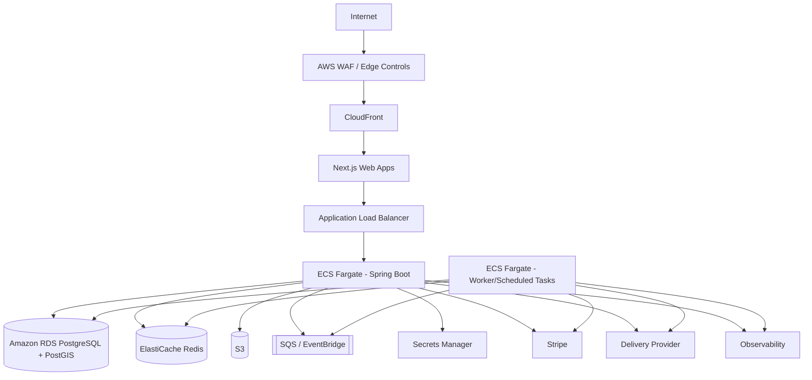

Recommended environments:

```text
DEV
QA
STAGING
PRODUCTION
```

Production should run in multiple availability zones where the selected AWS service configuration supports it.

---

# 50. Network Architecture

Recommended high-level AWS layout:

```text
Public Subnets
    ├── ALB
    └── Edge-facing components

Private Application Subnets
    ├── ECS Fargate
    └── Worker tasks

Private Data Subnets
    ├── RDS PostgreSQL
    └── ElastiCache Redis
```

No database should be directly reachable from the public Internet.

Security groups must restrict east-west access to the minimum required ports.

---

# 51. CI/CD Architecture

```mermaid
flowchart LR
    PR[Pull Request]
    CI[GitHub Actions]
    Test[Unit + Integration + E2E]
    Scan[Security / Dependency / Container Scan]
    Build[Build Artifacts]
    Registry[Container Registry]
    DeployDev[Deploy DEV]
    DeployQA[Deploy QA]
    DeployStage[Deploy STAGING]
    Approve[Production Approval]
    DeployProd[Deploy PROD]

    PR --> CI
    CI --> Test
    Test --> Scan
    Scan --> Build
    Build --> Registry
    Registry --> DeployDev
    DeployDev --> DeployQA
    DeployQA --> DeployStage
    DeployStage --> Approve
    Approve --> DeployProd
```

CI checks:

- Formatting.
- Lint.
- Static analysis.
- Unit tests.
- Integration tests.
- API contract validation.
- Container scan.
- Dependency scan.
- IaC validation.
- Build.

---

# 52. Observability

Every request should carry:

- Trace ID.
- Correlation ID.
- Authenticated user ID where safe.

Trace:

- HTTP request.
- Database query spans where practical.
- Stripe calls.
- Delivery API calls.
- SQS publish/consume.
- Background jobs.
- WebSocket message processing.

Critical metrics:

```text
API latency
API error rate
Database latency
Database connection pool saturation
Booking conflicts
Payment failures
Refund failures
Payout failures
Delivery failures
Queue depth
Notification failure rate
Promotion calculation errors
```

Never log:

- Card data.
- Access tokens.
- Secret keys.
- Passwords.
- Private payment credentials.

---

# 53. Final Accepted ADRs

## ADR-001 — Modular Monolith First

**Status:** Accepted

**Decision:** Start with one deployable Spring Boot modular monolith.

**Why:**

- Strong transactional coupling.
- Lower operational complexity.
- Easier local development.
- Easier AI-assisted cross-module changes.
- Clear extraction path later.

**Rejected:** Immediate microservices.

**Consequence:** Modules must be designed for future extraction even though they share one runtime/database initially.

---

## ADR-002 — Event-Driven Integration Through Outbox

**Status:** Accepted

**Decision:** Use transactional outbox + SQS/EventBridge for asynchronous integration.

**Why:** Notifications, delivery integration, analytics, and search indexing do not need to block the primary transaction.

**Rejected:** Kafka for MVP.

**Consequence:** Consumers must be idempotent and eventually consistent where applicable.

---

## ADR-003 — Next.js for Web

**Status:** Accepted

**Decision:** Use React + Next.js App Router + TypeScript.

**Why:** Supports public SEO-oriented customer pages and protected role-based dashboards in one technology family.

**Consequence:** Avoid business logic duplication across the three web apps. Share API client and design system packages.

---

## ADR-004 — React Native for Mobile

**Status:** Accepted

**Decision:** Use React Native + Expo + TypeScript for three mobile applications.

**Why:** Large code reuse across apps, shared TypeScript ecosystem, fast development, native capability access.

**Consequence:** Use New Architecture-compatible libraries and keep native platform integrations behind abstractions.

---

## ADR-005 — Monorepo

**Status:** Accepted

**Decision:** One Git repository managed by pnpm + Turborepo.

**Why:** Six clients plus shared types/design/API packages benefit from coordinated changes.

**Consequence:** Repository ownership and CI pipelines must remain modular; shared packages must not become dumping grounds.

---

## ADR-006 — PostgreSQL + PostGIS as System of Record

**Status:** Accepted

**Decision:** PostgreSQL with PostGIS.

**Why:** Strong transactions, relational integrity, financial consistency, scheduling, and location queries.

**Rejected:** MongoDB as primary store.

**Consequence:** Use JSONB only where domain flexibility is justified, not as a substitute for relational modeling.

---

## ADR-007 — Redis Is Cache/Coordination Only

**Status:** Accepted

**Decision:** Redis never becomes authoritative for bookings, payments, orders, or ledger state.

**Why:** Transactional correctness must remain in PostgreSQL/payment provider.

---

## ADR-008 — Auth0/OIDC for Identity

**Status:** Accepted

**Decision:** Use Auth0/OIDC rather than building password authentication.

**Why:** Reduces security burden and supports MFA, federation and OIDC.

**Consequence:** Local application user record maps external identity to business/role data.

---

## ADR-009 — Stripe Connect for Marketplace Payments

**Status:** Proposed / architecture baseline

**Decision:** Use a centralized marketplace checkout with automated allocation and provider-managed payouts as the operational payment architecture. Stripe Connect is a likely initial provider, but the legal Merchant-of-Record, tax, chargeback, refund, and reserve decisions remain unresolved.

**Why:** One Kitchen Order may allocate money to several Chefs, while Kitchen Bookings pay Entrepreneurs. The architecture must support one customer payment, internal allocation, and automated settlement without hard-coding the final legal posture.

**Gate:** Merchant-of-record, connected-account, tax, payout, reserve, and country-specific configuration must be validated legally/accounting-wise before production activation.

---

## ADR-010 — One-Kitchen / Multi-Chef Order Model

**Status:** Accepted

**Decision:** An Order belongs to exactly one physical Kitchen and may contain multiple Chef Order Groups from that Kitchen.

**Why:** Supports multiple Chefs in one location while allowing a single delivery and delivery fee.

**Consequence:** Cart must be Kitchen-scoped. Cross-Kitchen add-to-cart is rejected.

---

## ADR-011 — Chef-Level Promotion Isolation

**Status:** Accepted

**Decision:** Chef promotions evaluate only the Chef's eligible Order Group items, and Chef A / Chef B are independent promotion domains.

**Why:** Prevents Chef A's promotion from being triggered by Chef B's items.

**Consequence:** Promotion context must include Chef Order Group boundaries.

---

## ADR-012A — ChefOrderGroup as First-Class Settlement Boundary

**Status:** Accepted

**Decision:** Treat `ChefOrderGroup` as a first-class operational, reporting, and financial entity with immutable promotion/financial history and optional convenience pointers to the latest snapshot records.

**Why:** A single customer Order can contain multiple Chefs from one Kitchen. Each Chef needs independent fulfillment state, promotion scope, order history, revenue, refunds, and payouts.

**Consequence:** `OrderItem` belongs to `ChefOrderGroup`; Chef payout allocations reference `ChefOrderGroup`; Chef order history queries start from `ChefOrderGroup`; and refunds/adjustments preserve Chef-level traceability without overwriting historical facts.

---

## ADR-012 — Promotion Evaluation Order

**Status:** Accepted

**Decision:** Evaluate promotions by scope and qualifying basis: item-level promotions first, then ChefOrderGroup promotions, then delivery promotions, then platform promotions. Conflicts are resolved by compatibility, exclusivity, priority, savings, and deterministic tie-breaker. Item-level and group-level promotions may coexist when their scopes do not overlap.

**Chef rules:**

- Chef A and Chef B promotion domains are independent.
- ChefOrderGroup is the Chef promotion boundary.
- Group-level Chef promotions must declare an explicit qualifying basis.

**Platform:**

- May stack with Chef promotion when compatibility rules allow it.

**Promo code:**

- Maximum one promo code per transaction.
- Promo code is single-use.

**Consequence:** Pricing snapshot must preserve qualifying basis, eligible/excluded item IDs, selection evidence, and applied/rejected promotion outcomes.

---

## ADR-013 — Financial Immutability

**Status:** Accepted

**Decision:** Financial facts are append-only from a business perspective.

**Why:** Auditing, reconciliation, refunds and payouts require historical truth.

**Consequence:** Corrections are adjustments/refunds, not destructive updates.

---

## ADR-014 — Payment/Order State Separation

**Status:** Accepted

**Decision:** Payment status and Order operational status are separate aggregates/concepts.

**Why:** An order can have multiple payment attempts, refunds, and adjustments.

**Consequence:** Never derive payment truth from a client page or order status alone.

---

## ADR-015 — Delivery Provider Adapter

**Status:** Accepted

**Decision:** External delivery providers are behind a `DeliveryGateway` port.

**Why:** Prevent provider lock-in and isolate webhook/API models.

**Consequence:** The first provider is an implementation detail selected during rollout.

---

## ADR-016 — PostGIS for Nearby Demand

**Status:** Accepted

**Decision:** Use PostGIS for nearby kitchen/Chef/Food Request queries.

**Why:** Nearby Chef discovery is a core product feature.

**Consequence:** Customer exact locations are protected; Chef-facing queries expose only business-appropriate location information.

---

## ADR-017 — PostgreSQL Search First

**Status:** Accepted

**Decision:** PostgreSQL full-text + structured search + PostGIS for MVP.

**Why:** Avoid an extra search cluster before scale/relevance requirements justify it.

**Consequence:** OpenSearch may be introduced later behind a search port.

---

## ADR-018 — S3 for Media

**Status:** Accepted

**Decision:** Images/documents live in S3, served through CloudFront.

**Why:** Scalability, cost, CDN support and separation from transactional data.

---

## ADR-019 — ECS Fargate for MVP Runtime

**Status:** Accepted

**Decision:** Deploy Spring Boot and worker workloads on ECS Fargate.

**Why:** Lower operational overhead than Kubernetes while supporting horizontal scaling.

**Consequence:** Kubernetes is deferred until concrete requirements justify it.

---

## ADR-020 — REST + OpenAPI

**Status:** Accepted

**Decision:** Public/application APIs are REST and specified by OpenAPI.

**Why:** Web/mobile interoperability, generated TypeScript client, clear contracts, simple observability.

**Consequence:** Internal module calls remain in-process unless asynchronous/event behavior is justified.

---

## ADR-021 — Flyway Migrations

**Status:** Accepted

**Decision:** Every schema change is a version-controlled Flyway migration.

**Why:** Reproducible environments and safe deployment history.

**Consequence:** Never edit an already-applied production migration.

---

## ADR-022 — Tax Configuration Over Hard-Coding

**Status:** Accepted with legal validation gate

**Decision:** Tax calculation is configuration/provider driven and versioned.

**Why:** Tax rules vary by jurisdiction, transaction type and effective date.

**Consequence:** Tax decisions are snapshotted into finalized transactions. Legal/accounting review is mandatory before production launch.

---

## ADR-023 — Food Request Is a Separate Domain

**Status:** Accepted

**Decision:** Food Request/Demand is separate from Saved Food/Wishlist.

**Why:** Food Request represents market demand and can aggregate multiple customers.

**Consequence:** Chefs can discover demand and respond through controlled workflows.

---

## ADR-024 — No AI in Core Transaction Path

**Status:** Accepted

**Decision:** AI may enrich catalog, matching, recommendation and demand features, but cannot be required for payment, booking, promotion eligibility, tax, order state, or refunds.

**Why:** Core transactional workflows require deterministic and auditable behavior.

---

# 54. ADRs Requiring Commercial/Legal Sign-Off

The technical architecture is designed to accommodate these decisions without redesign, but the values must be finalized before production:

1. Merchant of Record.
2. Platform commission percentages.
3. Chef payout percentages.
4. Entrepreneur payout percentages.
5. Settlement delay.
6. Customer cancellation windows.
7. Chef cancellation policy.
8. Kitchen cancellation policy.
9. No-show policies.
10. Delivery provider and coverage.
11. Delivery fee formula.
12. Tax registration/responsibility.
13. Exact Stripe Connect account/charge/transfer configuration.
14. Refund tax treatment.
15. Chargeback/dispute policy.
16. Nearby Chef radius.
17. Food Request customer-location rule.

These should be configuration/policy decisions, not hard-coded assumptions.

---

# 55. Testing Architecture

## Unit tests

Mandatory for:

- Promotion evaluation.
- Pricing order.
- Order state machine.
- Chef Order Group state machine.
- Booking conflict detection.
- Equipment capacity.
- Refund recalculation.
- Fee calculation.
- Authorization.
- Tax adapter contracts.

## Integration tests

Use Testcontainers for:

- PostgreSQL.
- PostGIS.
- Redis where needed.
- Messaging integration where needed.

## Contract tests

- OpenAPI request/response behavior.
- Stripe webhook contract fixtures.
- Delivery provider webhook fixtures.

## End-to-end tests

Mandatory scenarios:

1. Entrepreneur creates Kitchen.
2. Entrepreneur creates multiple Spaces.
3. Entrepreneur adds included equipment.
4. Entrepreneur lists rental equipment.
5. Chef books Space.
6. Concurrent booking of same Space rejects second booking.
7. Chef creates food from Master Food.
8. Chef schedules availability.
9. Customer creates Kitchen A cart.
10. Customer adds Chef A + Chef B food from Kitchen A.
11. Cross-Kitchen item is rejected.
12. Chef promotion uses only Chef A quantity.
13. Platform promotion stacks with Chef promotion.
14. Expired promotion becomes invalid.
15. Single-use code cannot be reused.
16. Payment succeeds only after provider confirmation.
17. Chef rejection creates refund.
18. Partial refund recalculates promotion.
19. Delivery webhook updates order.
20. Food Request visible to nearby Chef.
21. Another customer adds interest to request.
22. Chef response triggers customer notification.
23. Customer receives order status updates.
24. Review requires verified purchase.

---

# 56. AI Implementation Contract

Any AI coding assistant receiving this package must follow these rules.

## Rule 1 — Inspect First

Before changing code, inspect:

- Repository structure.
- Current modules.
- Existing migrations.
- Existing OpenAPI.
- Existing tests.
- Existing CI/CD.
- Existing conventions.

## Rule 2 — No Silent Architecture Changes

If a change is architecturally significant, the AI must state:

```text
PROPOSED ARCHITECTURE CHANGE
```

and provide:

- Reason.
- Alternatives.
- Impact.
- Migration path.
- ADR update.

## Rule 3 — Vertical Slice

Implement one coherent slice at a time:

```text
Domain
↓
Migration
↓
Repository
↓
Use Case
↓
Authorization
↓
API
↓
OpenAPI
↓
Frontend Client
↓
UI
↓
Tests
```

## Rule 4 — Backend Is Authoritative

Do not implement these only on clients:

- Promotion eligibility.
- Final price.
- Tax.
- Booking availability.
- Payment confirmation.
- Refund amount.
- Payout amount.
- Order transitions.

## Rule 5 — Financial Correctness

Payment/refund/payout code must use:

- Idempotency.
- Provider webhook verification.
- Immutable transaction records.
- Reconciliation identifiers.
- Audit logs.

## Rule 6 — Database Safety

- Never modify old migrations silently.
- Add a migration for schema changes.
- Add indexes and constraints.
- Use locking where concurrency requires it.
- Use transactions around booking, payment allocation, promo redemption and refund recalculation.

## Rule 7 — No Fake Completion

Do not mark a feature complete with placeholder business logic.

If a provider cannot yet be configured, implement a clean adapter and test double, clearly marked as integration-pending.

---

# 57. Suggested Development Order

```text
1. Monorepo + CI foundation
2. Auth0/OIDC + user bootstrap
3. Organization + roles + permissions
4. PostgreSQL schema foundation + Flyway
5. Master catalog
6. Entrepreneur business
7. Locations + Kitchens
8. Kitchen Spaces
9. Equipment catalog + space equipment
10. Kitchen schedules
11. Equipment availability
12. Kitchen booking
13. Chef profile/business
14. Food master + cuisine
15. Chef food listings
16. Food media + nutrition
17. Food availability
18. Customer profile + addresses
19. Discovery/search
20. Kitchen-scoped carts
21. Multi-Chef single-Kitchen Order
22. Pricing engine
23. Chef promotions
24. Platform promotions
25. Payment integration
26. Chef acceptance/fulfillment
27. Pickup flow
28. Delivery adapter
29. Refunds/cancellations
30. Payouts/ledger
31. Tax provider/configuration
32. Notifications
33. Chat
34. Ratings/reviews
35. Food Requests
36. Demand aggregation
37. Administration
38. Analytics
39. Search enhancement
40. AI enrichment/recommendations
```

---

# 58. MVP Exit Criteria

The first production-ready release should not be considered complete until:

- A real Entrepreneur can create a business, Kitchen and Space.
- A Chef can find and book a Space.
- A Chef can create food from the master catalog and publish availability.
- A Customer can discover food.
- A Customer can create a cart for one Kitchen.
- A Customer can add multiple Chefs from that Kitchen.
- The backend rejects cross-Kitchen cart mixing.
- Chef promotions respect Chef scope.
- Platform promotions stack correctly.
- Payment provider confirms payment server-side.
- Order lifecycle works end-to-end.
- Pickup works.
- At least one delivery provider works if delivery is included in launch scope.
- Refunds work with promotion recalculation.
- Payouts are auditable.
- Every food-order payout allocation is traceable to a ChefOrderGroup.
- Every Chef can retrieve complete order history through ChefOrderGroup.
- Tax behavior is validated for launch jurisdictions.
- Notifications work.
- Authorization prevents cross-organization access.
- Audit/observability are operational.
- CI/CD is reproducible.
- Automated tests cover critical invariants.

---

# 59. Architecture Review Checklist

Before production launch, verify:

### Domain

- [ ] Every module has clear ownership.
- [ ] No circular domain dependency has been introduced.
- [ ] One-Kitchen Order invariant is enforced.
- [ ] Chef promotion scope is enforced.

### Database

- [ ] All migrations are versioned.
- [ ] Money uses exact representation.
- [ ] Time uses UTC plus business timezone.
- [ ] Booking overlap is concurrency safe.
- [ ] Financial tables are auditable.

### Security

- [ ] OIDC is configured.
- [ ] Authorization is backend enforced.
- [ ] Admin permissions are separated.
- [ ] Secrets are externalized.
- [ ] Upload validation exists.
- [ ] Rate limiting exists.

### Payments

- [ ] Stripe Connect configuration is approved.
- [ ] Merchant-of-record decision is documented.
- [ ] Webhook signatures are verified.
- [ ] Idempotency is implemented.
- [ ] Refunds are audited.
- [ ] Payouts reconcile to ledger entries.

### Delivery

- [ ] Provider adapter exists.
- [ ] Webhook deduplication exists.
- [ ] Delivery states map correctly.
- [ ] One delivery per Kitchen Order is enforced.

### Operations

- [ ] Logs are structured.
- [ ] Tracing works.
- [ ] Critical metrics exist.
- [ ] Alerts exist.
- [ ] Backups are tested.
- [ ] Disaster recovery is documented.

---

# 60. Final Architecture Summary

```text
                                  CHEFFY BITES
                                       │
        ┌──────────────────────────────┼─────────────────────────────┐
        │                              │                             │
        ▼                              ▼                             ▼
  Kitchen Marketplace            Food Marketplace              Demand Marketplace
        │                              │                             │
 Entrepreneur                      Chefs                         Customers
        │                              │                             │
 Kitchens / Spaces               Food Listings                 Food Requests
        │                              │                             │
 Booking / Equipment              Menus / Availability          Demand Aggregation
        │                              │                             │
        └──────────────┐               │               ┌──────────────┘
                       ▼               ▼               ▼
                       ┌──────────────────────────────┐
                       │     MODULAR MONOLITH         │
                       │       Spring Boot            │
                       │                              │
                       │ Identity / Org               │
                       │ Kitchen / Booking            │
                       │ Equipment                    │
                       │ Chef / Food / Catalog        │
                       │ Customer / Cart              │
                       │ Order / Pricing / Promotion  │
                       │ Payment / Refund / Tax       │
                       │ Payout / Delivery            │
                       │ Chat / Review / Demand       │
                       └─────────────┬────────────────┘
                                     │
                       ┌─────────────┼───────────────┐
                       │             │               │
                       ▼             ▼               ▼
                 PostgreSQL      Redis          Transactional Outbox
                  + PostGIS                         │
                                                    ▼
                                             SQS/EventBridge
                                                    │
                           ┌────────────────────────┼──────────────────┐
                           │                        │                  │
                           ▼                        ▼                  ▼
                       Payments                 Delivery          Notifications
                       Stripe Connect           Provider           Providers
```

The architecture is intentionally designed so the platform can start as a manageable modular monolith and later extract high-scale/independent domains without rebuilding the business model.

The core invariants — **one Kitchen per Order, multiple Chefs per Kitchen Order, Chef-scoped promotions, immutable financial history, concurrency-safe booking, and provider abstraction** — are the architectural foundations that must not be violated by implementation choices.

---

# 61. AI Prompt — Architecture Implementation Mode

Use the following prompt when giving this package to a coding AI:

> You are the Staff/Principal Engineer implementing Cheffy Bites.
>
> Treat this document as the approved architecture contract.
>
> Do not redesign the architecture silently.
>
> Inspect the repository before writing code.
>
> Implement one vertical slice at a time.
>
> Preserve the following invariants at all times:
>
> 1. One Order belongs to one physical Kitchen.
> 2. Multiple Chefs may contribute to one Order only when they operate from that Kitchen.
> 3. One Kitchen Order has one standard delivery and delivery fee.
> 4. Chef promotions operate only against that Chef's eligible items.
> 5. Chef promotions are evaluated independently within each ChefOrderGroup and resolved through scope, compatibility, exclusivity, priority, savings, and a deterministic tie-breaker.
> 6. Platform promotions may stack with Chef promotions according to the approved pricing sequence.
> 7. Only one promo code may be used per transaction.
> 8. Promo codes are single-use.
> 9. Financial history is immutable and auditable.
> 10. Payment state is confirmed by the backend/provider, never by the UI.
> 11. Booking/resource reservation is concurrency-safe.
> 12. Authorization is enforced server-side.
>
> For every change, report:
>
> - Architecture/domain impact.
> - Files created/changed.
> - Database migration.
> - API/OpenAPI changes.
> - Authorization changes.
> - Tests.
> - Operational/observability changes.
> - Any ADR impact.
>
> Do not claim a feature is complete unless the implementation, tests, migrations, API contract and security rules are complete.

---

# 62. Document Ownership

This package should be stored under:

```text
docs/architecture/cheffy-bites-detailed-architecture-package.md
```

Related documents:

```text
docs/architecture/
├── cheffy-bites-detailed-architecture-package.md
├── c4-context.md
├── c4-container.md
├── c4-components.md
├── deployment.md
├── data-model.md
└── api-contracts.md

docs/adr/
├── ADR-001-modular-monolith.md
├── ADR-002-transactional-outbox.md
├── ADR-003-nextjs.md
├── ...
└── ADR-024-no-ai-core-transaction-path.md
```

The single package is the reviewable baseline. Once architecture is approved, individual diagrams/API/ADR files can be split into separate source-controlled artifacts.

---

# 63. Source of Truth Hierarchy

When documents disagree, use this hierarchy:

```text
1. Approved Business Rules
2. Approved ADRs
3. This Detailed Architecture Package
4. Master Product/Architecture Specification
5. API/OpenAPI Implementation
6. Source Code
```

If source code conflicts with an approved architecture decision, do not silently reinterpret the architecture. Raise an architecture/documentation correction and make the implementation consistent.

---

**End of Detailed Architecture Package**
