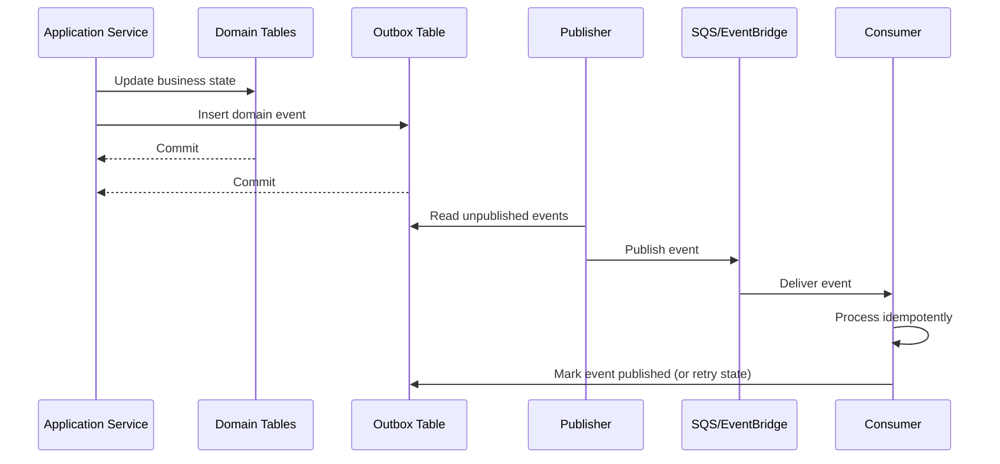

# Cheffy Bites — Event Contracts

Source: `02-detailed-architecture.md` Sections 41–42.

# 41. Event Architecture

Events are internal integration contracts, not database row dumps.

Recommended envelope:

```json
{
  "eventId": "uuid",
  "eventType": "OrderAccepted.v1",
  "occurredAt": "2026-09-01T12:00:00Z",
  "aggregateType": "ORDER",
  "aggregateId": "uuid",
  "correlationId": "uuid",
  "causationId": "uuid",
  "schemaVersion": 1,
  "payload": {}
}
```

Core events:

```text
KitchenPublished.v1
KitchenBookingConfirmed.v1
KitchenBookingCancelled.v1
FoodPublished.v1
FoodAvailabilityChanged.v1
FoodRequestCreated.v1
FoodRequestInterestAdded.v1
FoodRequestFulfilled.v1
OrderCreated.v1
PaymentSucceeded.v1
PaymentFailed.v1
OrderAccepted.v1
OrderRejected.v1
ChefOrderGroupPreparing.v1
ChefOrderGroupReady.v1
DeliveryRequested.v1
DriverAssigned.v1
OrderPickedUp.v1
OrderOutForDelivery.v1
OrderDelivered.v1
OrderCancelled.v1
RefundProcessed.v1
PayoutCreated.v1
PayoutProcessed.v1
PromotionApplied.v1
PromotionInvalidated.v1
```

---

# 42. Transactional Outbox

Important domain writes and event creation happen in the same PostgreSQL transaction.



Consumer deduplication should be based on `eventId` or a consumer-specific inbox table.

---

