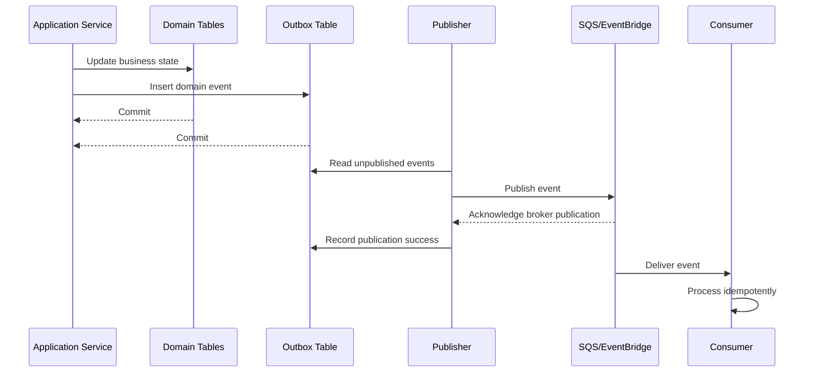

# Cheffy Bites — Event Contracts

> **Canonical ownership:** This document is the canonical human-readable event-contract specification for Cheffy Bites.
> Accepted ADRs, including ADR-002, ADR-009, and ADR-016, govern event architecture, outbox persistence, and versioning rules; Proposed ADRs remain Proposed until explicitly accepted.
> [`02-detailed-architecture.md`](02-detailed-architecture.md) may summarize event architecture for integrated understanding, but it must not maintain a competing authoritative event catalogue or override the envelopes, event semantics, compatibility rules, or event representation defined here.
> The machine-readable AsyncAPI artifact must be generated and maintained consistently with this canonical contract.

---

# 41. Event Architecture

Events are internal integration contracts, not database row dumps.

Recommended envelope:

```json
{
  "eventId": "uuid",
  "eventType": "OrderAccepted.v1",
  "eventVersion": 1,
  "occurredAt": "2026-09-01T12:00:00Z",
  "aggregateType": "ORDER",
  "aggregateId": "uuid",
  "correlationId": "uuid",
  "causationId": "uuid",
  "payload": {}
}
```

Compatibility rules:

- Additive optional changes within a version are allowed where consumers tolerate unknown fields.
- Breaking changes require a new event version.
- Consumers must tolerate unknown fields.
- `eventType` and `eventVersion` are separate fields and must agree. If `eventType` is `<Name>.vN`, then `eventVersion` must equal `N`. For example, `OrderAccepted.v1` with `eventVersion: 1` is valid; `OrderAccepted.v2` with `eventVersion: 1` is invalid.
- `schemaVersion` is not a replacement for `eventVersion`.
- Consumers must route and process by a supported complete event type/version. They must not deserialize or process an unknown higher version as an older supported version.
- Unsupported versions must follow an explicit consumer policy appropriate to criticality, such as skip, retry, park, dead-letter queue, or alert. Each consumer uses the applicable policy; every option is not mandatory for every consumer.

Core events:

```text
KitchenPublished.v1
KitchenBookingConfirmed.v1
KitchenBookingCancelled.v1
KitchenBookingHeld.v1
KitchenBookingHoldExpired.v1
FoodPublished.v1
FoodAvailabilityChanged.v1
FoodRequestCreated.v1
FoodRequestInterestAdded.v1
FoodRequestFulfilled.v1
OrderCreated.v1
ChefOrderGroupCreated.v1
ChefOrderGroupAdjusted.v1
ChefOrderGroupAccepted.v1
ChefOrderGroupRejected.v1
ChefOrderGroupCancelled.v1
PromotionSnapshotCreated.v1
PaymentInitiated.v1
PaymentSucceeded.v1
PaymentFailed.v1
PaymentCaptured.v1
PaymentAllocated.v1
OrderAccepted.v1
OrderRejected.v1
ChefOrderGroupPreparing.v1
ChefOrderGroupReady.v1
OrderReadyForFulfillment.v1
DeliveryRequested.v1
DriverAssigned.v1
OrderPickedUp.v1
DriverPickedUp.v1
OrderOutForDelivery.v1
OrderDelivered.v1
OrderCompleted.v1
OrderCancelled.v1
RefundRequested.v1
RefundProcessed.v1
RefundAllocated.v1
PayoutCreated.v1
PayoutProcessed.v1
PayoutFailed.v1
PayoutReconciled.v1
LedgerTransactionPosted.v1
PromotionApplied.v1
PromotionInvalidated.v1
```

Fulfillment event semantics:

- `OrderReadyForFulfillment.v1` is emitted when parent Order coordination determines that all required ChefOrderGroups are ready and the Order reaches `READY_FOR_FULFILLMENT`. One ChefOrderGroup reaching `READY` does not make the Order ready while another required group remains unready.
- `OrderPickedUp.v1` means the customer or authorized pickup party has picked up a `PICKUP` Order.
- `DriverPickedUp.v1` means the delivery driver has taken possession of a `DELIVERY` Order.
- `OrderPickedUp.v1` and `DriverPickedUp.v1` are distinct event types with distinct business meanings. `OrderPickedUp.v1` must not represent driver possession.
- `OrderCompleted.v1` is the parent Order final-completion event after the applicable pickup or delivery lane reaches its completion transition. ChefOrderGroup does not own final completion.

ChefOrderGroup event semantics:

- `ChefOrderGroupAccepted.v1` means the Chef accepted preparation responsibility for the group and its preparation status transitioned from `PENDING_ACCEPTANCE` to `ACCEPTED`.
- `ChefOrderGroupRejected.v1` means the Chef rejected the group before acceptance and its preparation status transitioned from `PENDING_ACCEPTANCE` to `REJECTED`.
- `ChefOrderGroupPreparing.v1` means preparation began and the group transitioned from `ACCEPTED` to `PREPARING`.
- `ChefOrderGroupReady.v1` means Chef preparation reached `READY` from `PREPARING`.
- `ChefOrderGroupCancelled.v1` means an authorized workflow transitioned an already accepted or preparing group to `CANCELLED`. It is an operational cancellation fact, not a Refund event or evidence that money was refunded.

Each ChefOrderGroup event uses `aggregateType: CHEF_ORDER_GROUP`, identifies the ChefOrderGroup as both `aggregateId` and `payload.chefOrderGroupId`, and provides the parent `orderId`, owning `chefBusinessId`, and resulting preparation `status`. The event preserves Chef preparation-state ownership only. Parent Order pickup, delivery, and final completion remain parent Order responsibilities. Payment, PaymentAllocation, Refund, RefundLine, Payout, PayoutLine, and Ledger aggregates remain owned by the Financial domain and are not embedded in these payloads.

Canonical `ChefOrderGroupAccepted.v1` contract:

```json
{
  "eventId": "uuid",
  "eventType": "ChefOrderGroupAccepted.v1",
  "eventVersion": 1,
  "occurredAt": "2026-09-01T12:00:00Z",
  "aggregateType": "CHEF_ORDER_GROUP",
  "aggregateId": "uuid",
  "correlationId": "uuid",
  "causationId": "uuid",
  "payload": {
    "chefOrderGroupId": "uuid",
    "orderId": "uuid",
    "chefBusinessId": "uuid",
    "status": "ACCEPTED"
  }
}
```

Canonical `ChefOrderGroupRejected.v1` contract:

```json
{
  "eventId": "uuid",
  "eventType": "ChefOrderGroupRejected.v1",
  "eventVersion": 1,
  "occurredAt": "2026-09-01T12:00:00Z",
  "aggregateType": "CHEF_ORDER_GROUP",
  "aggregateId": "uuid",
  "correlationId": "uuid",
  "causationId": "uuid",
  "payload": {
    "chefOrderGroupId": "uuid",
    "orderId": "uuid",
    "chefBusinessId": "uuid",
    "status": "REJECTED"
  }
}
```

Canonical `ChefOrderGroupCancelled.v1` contract:

```json
{
  "eventId": "uuid",
  "eventType": "ChefOrderGroupCancelled.v1",
  "eventVersion": 1,
  "occurredAt": "2026-09-01T12:00:00Z",
  "aggregateType": "CHEF_ORDER_GROUP",
  "aggregateId": "uuid",
  "correlationId": "uuid",
  "causationId": "uuid",
  "payload": {
    "chefOrderGroupId": "uuid",
    "orderId": "uuid",
    "chefBusinessId": "uuid",
    "status": "CANCELLED",
    "reason": "Unable to complete preparation"
  }
}
```

Financial event semantics remain provider-neutral. Payment, allocation, Refund, and Payout events describe Cheffy Bites domain outcomes rather than provider-specific models and do not assert Merchant-of-Record status.

`LedgerTransactionPosted.v1` represents one successfully POSTED, balanced LedgerTransaction as a posting unit. It does not represent creation of an individual LedgerEntry and does not embed every entry. Its aggregate identity is the LedgerTransaction: `aggregateType` is `LEDGER_TRANSACTION`, and `aggregateId` equals `payload.ledgerTransactionId`.

The event is inserted into the transactional outbox in the same local PostgreSQL transaction as the authoritative financial state change, ledger header and entries, database-controlled balance/finalization, and transition to POSTED. It is never emitted for DRAFT or failed postings. Before insertion, total debits and credits must be equal and positive for the transaction's one currency. Posted evidence is immutable; corrections create a new compensating LedgerTransaction and a later event.

Canonical `LedgerTransactionPosted.v1` contract:

```json
{
  "eventId": "uuid",
  "eventType": "LedgerTransactionPosted.v1",
  "eventVersion": 1,
  "occurredAt": "2026-09-01T12:00:00Z",
  "aggregateType": "LEDGER_TRANSACTION",
  "aggregateId": "uuid",
  "correlationId": "uuid",
  "causationId": "uuid",
  "payload": {
    "ledgerTransactionId": "uuid",
    "currencyCode": "CAD",
    "postingType": "PAYMENT_CAPTURE",
    "postedAt": "2026-09-01T12:00:00Z",
    "sourceType": "PAYMENT",
    "sourceId": "uuid",
    "compensatesLedgerTransactionId": null,
    "entryCount": 4,
    "totalDebitMinor": 4200,
    "totalCreditMinor": 4200,
    "orderId": "uuid",
    "paymentId": "uuid",
    "refundId": null,
    "payoutId": null
  }
}
```

The required minimum payload is `ledgerTransactionId`, `currencyCode`, `postingType`, `postedAt`, `sourceType`, `sourceId`, `entryCount`, `totalDebitMinor`, and `totalCreditMinor`. `postingType` is the controlled Financial-domain classification of the accounting posting; it is distinct from `sourceType` and `sourceId`, which identify the authoritative business origin/reference that caused the posting. Posting types are provider-neutral controlled values owned by the Financial domain.

`compensatesLedgerTransactionId` is optional and nullable. It is absent or null for an ordinary posting that does not explicitly compensate a prior transaction. When populated, it conceptually references `financial.ledger_transactions.id` for the previously POSTED LedgerTransaction being explicitly compensated or corrected. The new LedgerTransaction remains an independent balanced posting, and the original transaction and its entries remain immutable; the event does not imply that original rows were updated or deleted. Source-based traceability remains valid where an explicit compensation link is not applicable.

`orderId`, `paymentId`, `refundId`, and `payoutId` are optional contextual references and are included only when applicable; absent references do not need null placeholders. `entryCount`, `totalDebitMinor`, and `totalCreditMinor` are finalized posting evidence. Debit and credit totals are integer minor-unit amounts and must be equal and positive for a successfully posted transaction. The event does not embed all LedgerEntries. It is provider-neutral, follows the ADR-016 envelope, uses matching `.v1` and `eventVersion: 1`, and has no `schemaVersion`.

---

# 42. Transactional Outbox

Important domain writes and event creation happen in the same PostgreSQL transaction.



The producer-side publisher owns publication lifecycle state. Its `attempts`, `last_error`, and `next_attempt_at` values govern retries when broker publication fails; publication success such as `published_at` is recorded only after the broker acknowledges publication according to the publishing strategy. The consumer never updates or reverts the producer's outbox row.

Consumer deduplication should be based on `eventId` or a consumer-specific inbox table. Consumer processing retry and dead-letter handling are independent of producer outbox publication retry; consumer failure does not revert producer publication success. No distributed transaction spans producer, broker, and consumer.

Provider webhooks are inbound events and must be deduplicated separately through provider-event storage rather than the outbox.

---
