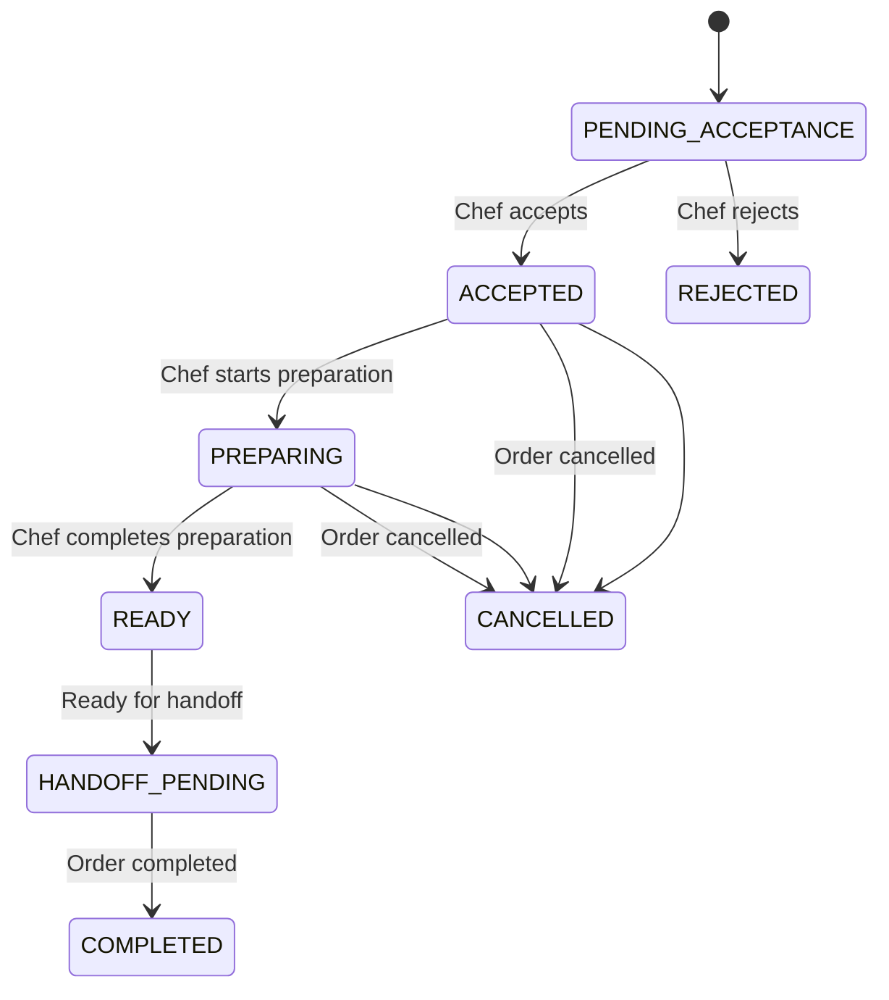
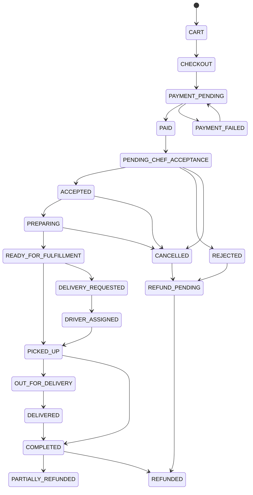

# ADR-013 — ChefOrderGroup Aggregate + Financial Boundary

## Status

Proposed

## Context

The Cheffy Bites platform has a critical architectural requirement: **one customer Order belongs to exactly one physical Kitchen, but may contain multiple Chef Order Groups from different Chefs operating at that Kitchen.**

This creates a complex financial and operational boundary:
- A single customer payment is allocated to multiple Chefs
- Each Chef needs independent fulfillment state, promotion scope, order history, revenue, refunds, and payouts
- The system must answer questions like "Which orders generated a Chef payout?" without reconstructing from Order Items

The `ChefOrderGroup` entity serves as the authoritative boundary for:
- Chef order history
- Chef dashboard order counts
- Chef-specific item totals
- Chef promotions
- Chef fulfillment status
- Chef revenue
- Chef refunds/adjustments
- Chef payout calculations
- Chef reporting and analytics

## Decision

We will treat `ChefOrderGroup` as a first-class operational **and financial aggregation boundary** with:

### Core Principles

1. **First-Class Aggregate**
   - `ChefOrderGroup` is a standalone aggregate with its own state machine
   - It exists independently of the parent `Order` aggregate
   - It supports immutable promotion snapshots, financial snapshots, payment allocations, refund allocations, payout lines, and ledger entries

2. **Optional Convenience Pointers**
   - A `latest_snapshot_id` may exist only as a convenience pointer
   - It must never be treated as the source of truth
   - Historical queries should go through the aggregate's own history

3. **Financial Allocation Boundary**
   - Every food-order `PAYOUT_LINE_ITEM` must reference the originating `chef_order_group_id`
   - This allows answering business questions without reconstructing from Order Items

### Architecture Components

#### ChefOrderGroup Aggregate Structure
```text
ChefOrderGroup
├── Order Reference (to parent Order)
├── Chef Business Reference
├── Status (PENDING_ACCEPTANCE, ACCEPTED, PREPARING, READY, etc.)
├── Financial State
│   ├── Subtotal
│   ├── Discount
│   └── Net
├── Promotion Snapshots (immutable history)
├── Financial Snapshots (immutable history)
├── Payment Allocations
├── Refund Allocations
├── Payout Lines
└── Ledger Entries
```

#### Database Schema

```sql
-- Core ChefOrderGroup table
CREATE TABLE order.chef_order_groups (
    id UUID PRIMARY KEY DEFAULT gen_random_uuid(),
    order_id UUID NOT NULL REFERENCES order.orders(id),
    chef_business_id UUID NOT NULL REFERENCES chef.chef_businesses(id),
    status VARCHAR(50) NOT NULL DEFAULT 'PENDING_ACCEPTANCE',
    subtotal_minor BIGINT NOT NULL,
    discount_minor BIGINT NOT NULL,
    net_minor BIGINT NOT NULL,
    currency_code CHAR(3) NOT NULL,
    version INT NOT NULL DEFAULT 0,
    latest_financial_snapshot_id UUID NULL REFERENCES order.financial_snapshots(id),
    latest_promotion_snapshot_id UUID NULL REFERENCES order.promotion_snapshots(id),
    created_at TIMESTAMPTZ NOT NULL DEFAULT now(),
    updated_at TIMESTAMPTZ NOT NULL DEFAULT now(),
    
    -- Business constraints
    CONSTRAINT chef_order_group_order_kitchen_match
        CHECK (EXISTS (
            SELECT 1 FROM order.orders o
            JOIN kitchen.kitchens k ON o.kitchen_id = k.id
            WHERE o.id = order_id
            AND EXISTS (
                SELECT 1 FROM chef.chef_profiles cp
                JOIN chef.chef_businesses cb ON cp.chef_business_id = cb.id
                WHERE cp.chef_business_id = chef_business_id
                AND cb.kitchen_id = k.id
            )
        )),
    
    -- Unique constraint: one ChefOrderGroup per Chef per Order
    CONSTRAINT unique_chef_per_order UNIQUE(order_id, chef_business_id)
);

-- Order Items belong to ChefOrderGroup
CREATE TABLE order.order_items (
    id UUID PRIMARY KEY DEFAULT gen_random_uuid(),
    order_id UUID NOT NULL REFERENCES order.orders(id),
    kitchen_id UUID NOT NULL REFERENCES kitchen.kitchens(id),
    chef_order_group_id UUID NOT NULL REFERENCES order.chef_order_groups(id),
    food_listing_id UUID NOT NULL REFERENCES food.food_listings(id),
    product_name_snapshot VARCHAR(255) NOT NULL,
    unit_price_minor BIGINT NOT NULL,
    quantity INT NOT NULL,
    gross_minor BIGINT NOT NULL,
    discount_minor BIGINT NOT NULL,
    net_minor BIGINT NOT NULL,
    tax_minor BIGINT NOT NULL,
    currency_code CHAR(3) NOT NULL,
    item_snapshot JSONB NOT NULL,
    created_at TIMESTAMPTZ NOT NULL DEFAULT now()
);

-- Promotion Snapshots (immutable per ChefOrderGroup)
CREATE TABLE order.promotion_snapshots (
    id UUID PRIMARY KEY DEFAULT gen_random_uuid(),
    promotion_id UUID NOT NULL REFERENCES promotion.promotions(id),
    order_id UUID NOT NULL REFERENCES order.orders(id),
    chef_order_group_id UUID NOT NULL REFERENCES order.chef_order_groups(id),
    promotion_version INT NOT NULL,
    scope VARCHAR(50) NOT NULL,
    qualifying_basis VARCHAR(50) NOT NULL,
    qualifying_subtotal_minor BIGINT NOT NULL,
    discount_minor BIGINT NOT NULL,
    applied_status VARCHAR(20) NOT NULL, -- 'APPLIED', 'REJECTED'
    rejection_reason VARCHAR(255) NULL,
    snapshot_evidence JSONB NOT NULL,
    created_at TIMESTAMPTZ NOT NULL DEFAULT now()
);

-- Financial Snapshots (immutable per ChefOrderGroup)
CREATE TABLE order.financial_snapshots (
    id UUID PRIMARY KEY DEFAULT gen_random_uuid(),
    order_id UUID NOT NULL REFERENCES order.orders(id),
    chef_order_group_id UUID NULL REFERENCES order.chef_order_groups(id),
    snapshot_version INT NOT NULL,
    snapshot_type VARCHAR(50) NOT NULL, -- 'ORDER_TOTAL', 'CHEF_GROUP_TOTAL', etc.
    snapshot_evidence JSONB NOT NULL,
    created_at TIMESTAMPTZ NOT NULL DEFAULT now()
);
```

#### State Machine



#### Order State Machine (Parent)



### Operational Rules

#### 1. One Order / One Kitchen / Multiple Chefs
```text
Order
    └── Kitchen A
         ├── ChefOrderGroup A (Chef A)
         ├── ChefOrderGroup B (Chef B)
         └── ChefOrderGroup C (Chef C)
```

#### 2. ChefOrderGroup Is Financial Allocation Boundary
```text
Customer Payment
    ↓
Order (Kitchen A)
    ├── ChefOrderGroup A
    │   ├── Order Items (Chef A)
    │   ├── Chef Promotions (Chef A)
    │   ├── Chef Revenue
    │   ├── Refund Adjustments
    │   └── Payout Allocation
    ├── ChefOrderGroup B
    │   ├── Order Items (Chef B)
    │   ├── Chef Promotions (Chef B)
    │   ├── Chef Revenue
    │   ├── Refund Adjustments
    │   └── Payout Allocation
    └── ChefOrderGroup C
        ├── Order Items (Chef C)
        ├── Chef Promotions (Chef C)
        ├── Chef Revenue
        ├── Refund Adjustments
        └── Payout Allocation
```

#### 3. Payout Allocation Traceability
```text
ChefOrderGroup
    │
    ▼
PayoutLineItem
    │
    ▼
Payout
```

Every ChefOrderGroup must be independently queryable for:
- Chef order history
- Chef dashboard order counts
- Chef-specific item totals
- Chef promotions
- Chef fulfillment status
- Chef revenue
- Chef refunds/adjustments
- Chef payout calculations
- Chef reporting and analytics

#### 4. Partial Refund Rule
If an Order Item belonging to Chef A is refunded:
1. Only the relevant Chef A ChefOrderGroup financial allocation is recalculated
2. Any shared order-level financial effects that business/tax rules require are applied
3. Chef B and Chef C allocations remain independently traceable

### Event Integration

#### Core Events
```text
ChefOrderGroupCreated.v1
ChefOrderGroupAdjusted.v1
PromotionSnapshotCreated.v1
PaymentAllocated.v1
RefundAllocated.v1
PayoutCreated.v1
```

#### Event Payload Example
```json
{
  "eventId": "550e8400-e29b-41d4-a716-446655440000",
  "eventType": "ChefOrderGroupCreated.v1",
  "eventVersion": 1,
  "occurredAt": "2026-09-01T12:00:00Z",
  "aggregateType": "CHEF_ORDER_GROUP",
  "aggregateId": "550e8400-e29b-41d4-a716-446655440001",
  "correlationId": "550e8400-e29b-41d4-a716-446655440002",
  "payload": {
    "chefOrderGroupId": "550e8400-e29b-41d4-a716-446655440001",
    "orderId": "550e8400-e29b-41d4-a716-446655440003",
    "chefBusinessId": "550e8400-e29b-41d4-a716-446655440004",
    "status": "PENDING_ACCEPTANCE",
    "subtotalMinor": 10000,
    "discountMinor": 1000,
    "netMinor": 9000,
    "currencyCode": "CAD"
  }
}
```

### Consequences

#### Positive
- **Clear Business Boundaries**: ChefOrderGroup is the authoritative query boundary for Chef operations
- **Financial Traceability**: Every payout can be traced to the exact ChefOrderGroup that generated it
- **Independent Fulfillment**: Each Chef can manage their portion of the order independently
- **Historical Accuracy**: Chef order history is preserved without reconstruction

#### Negative
- **Increased Complexity**: Additional aggregate adds operational complexity
- **Database Joins**: Queries require joins through ChefOrderGroup
- **State Management**: Two-level state machine (Order + ChefOrderGroup) requires coordination

### Implementation Notes

1. **Database Schema**
   - Add `chef_order_group_id` to `order_items` table
   - Add foreign key constraint
   - Add indexes for common queries

2. **Service Implementation**
   - Create `ChefOrderGroupService` for aggregate management
   - Implement state transitions with validation
   - Add authorization checks

3. **API Layer**
   - Add ChefOrderGroup-specific endpoints
   - Include state transition actions (accept, reject, preparing, ready)

4. **Testing**
   - Unit tests for state transitions
   - Integration tests for multi-Chef order scenarios
   - E2E tests for Chef fulfillment workflow

### Alternatives Considered

1. **Order-Level Financial Tracking**
   - Rejected: Would lose Chef-level granularity
   - ChefOrderGroup provides necessary independence

2. **Chef Order Group as Read Model**
   - Rejected: Need for operational boundaries
   - First-class aggregate ensures consistency

3. **Separate Chef Order Aggregates**
   - Rejected: Would break Order-Kitchen invariant
   - Single Order with multiple ChefOrderGroups preserves architecture

## References

- One-Kitchen-Per-Order invariant (Master Spec §6)
- Chef promotion scope requirements (Master Spec §22)
- Financial immutability principles (Master Spec §43)
- Payment allocation architecture (ADR-012)

## Dependencies

- Requires implementation of Order aggregate with Kitchen invariant
- Requires Chef promotion engine with Chef-scoped evaluation
- Requires financial ledger architecture (ADR-015)
- Requires event versioning (ADR-016)