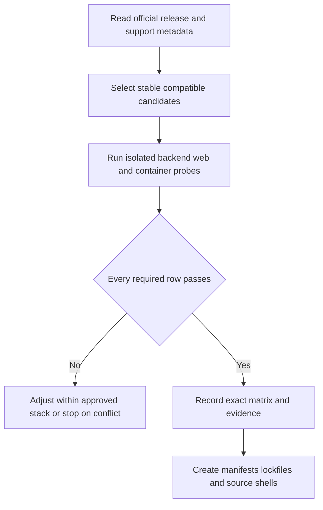

# P1-S00-T01 — Bounded Checkpoint-1 Implementation Plan

**Status:** Architecture prerequisite satisfied — ready for final implementation approval
**Task:** P1-S00-T01 — Bootstrap the reproducible local/CI foundation and compatibility proof
**Target branch:** `feature/p1-foundation`
**Implementation baseline HEAD:** `d6fa1983ce77b10a9dbd574788f1de74004038be`
**Implementation state:** Planning only; no application, migration, container, or CI file has been changed by this plan

### Pre-implementation branch and ADR baseline precondition

Before Code mode or any scaffolding, run and record:

```text
git branch --show-current
git rev-parse HEAD
git status --short
git log --oneline -- docs/adr/ADR-026-spring-boot-4-junit-6.md
```

The current branch must be `feature/p1-foundation`, and that feature branch's
ancestry must contain the committed
[`ADR-026`](../docs/adr/ADR-026-spring-boot-4-junit-6.md:1) baseline. Merely
having the file in the working tree, or stating its versions in this plan, does
not make it canonical. If ADR-026 is missing, uncommitted, or not incorporated
from `develop`, T01 stops before dependency discovery or scaffolding.

The verified implementation baseline is `feature/p1-foundation` at
`d6fa1983ce77b10a9dbd574788f1de74004038be`, matching both `develop` and
`origin/develop`. The path-specific history identifies commit `d6fa198` with
subject `docs: reconcile Spring Boot 4 JUnit 6 baseline`; therefore ADR-026 is
committed and present in the current feature-branch ancestry. The architecture
precondition is satisfied. This records readiness for final implementation
approval only; implementation has neither started nor completed.

## 1. Understanding

This task implements only checkpoint 1 of the foundation slice described in the [Phase-1 implementation plan](../docs/product/P1-IMP-01-phase1-implementation-plan.md:637):

- discover, prove, and pin the unresolved dependency, tooling, container, and CI-action versions;
- establish the reproducible pnpm and backend Gradle workspaces;
- add pinned PostgreSQL/PostGIS and Mailpit development containers;
- add minimal runnable Spring Boot and Next.js shells;
- establish the machine-readable OpenAPI contract and deterministic generated TypeScript client;
- add CI and a durable compatibility report.

The user explicitly bounded this task to checkpoint 1. Foundation Flyway migrations and the transactional-outbox runtime are deferred to a follow-on task. No identity, Kitchen, booking, marketplace, financial, or notification behavior is part of this task.

## 2. Architecture impact

The existing architecture is sufficient. No architecture change or new ADR is required.

- The modular-monolith boundary remains governed by [ADR-001](../docs/adr/ADR-001-modular-monolith.md:5).
- The web shell remains the one Phase-1 deployment under [ADR-025](../docs/adr/ADR-025-phase1-unified-pilot-web.md:24).
- With the committed-ancestry precondition satisfied at the recorded baseline HEAD, Java 21, Spring Boot 4.1.1, and JUnit 6 remain governed by [ADR-026](../docs/adr/ADR-026-spring-boot-4-junit-6.md:28); this plan remains a record rather than an independent architecture authority.
- The checked-in OpenAPI artifact must remain consistent with the canonical [API contract](../docs/04-api-contracts.md:1).
- No production event is activated and the canonical [event contract](../docs/05-event-contracts.md:1) remains unchanged.
- Proposed [ADR-010](../docs/adr/ADR-010-uuidv7-identifiers.md:1) may inform an isolated UUIDv7 compatibility proof, but this task must not present it as an Accepted platform-wide decision.

The tracked IntelliJ metadata currently selects JDK 17 in [`.idea/misc.xml`](../.idea/misc.xml:3). The command-line Java toolchain and CI remain authoritative, but this stale project metadata should be aligned to JDK 21 as one narrowly related metadata correction after the compatibility gate passes. No other IDE workspace file should be changed.

## 3. Hard scope boundary

### Included

1. Version discovery, compatibility probes, exact pins, lockfiles, checksums, and image digests.
2. Root pnpm workspace and stable repository commands using [`package.json`](../package.json) scripts, `pnpm --filter`, and recursive/workspace commands as needed; no orchestration framework.
3. A backend-local Gradle root in [`backend`](../backend), using its repository-owned wrapper.
4. Docker Compose services for PostgreSQL/PostGIS and Mailpit only.
5. A minimal Spring Boot application shell with health/readiness, safe defaults, explicit profiles, deny-by-default security, correlation handling, standard error representation, and disabled-by-default telemetry export.
6. A minimal Next.js App Router shell in [`apps/customer-web`](../apps/customer-web), including English/French framing, TanStack Query wiring, generated-client consumption, and fail-closed/non-cacheable protected route shells.
7. A checked-in OpenAPI baseline containing only canonical shared transport components and no invented business endpoint.
8. Deterministic TypeScript client generation and generated-drift detection.
9. Pull-request CI for backend, web, OpenAPI/client drift, containers, dependency checks, and secret scanning.
10. A compatibility report recording exact evidence and commands.

### Excluded and deferred

- Every Flyway migration, including schema/extension, data-scope, pilot-stage, and outbox migrations.
- Production schemas, tables, seeds, JPA entities, repositories, and domain aggregates.
- Outbox persistence, polling, claiming, retries, broker adapters, metrics, or event registry implementation.
- Any production event or edit to the canonical [event contract](../docs/05-event-contracts.md).
- Auth0 user bootstrap, local user/profile persistence, memberships, roles, permissions, or a live tenant dependency.
- Kitchen, Space, RentalOffer, availability, Chef, booking, notification, feedback, or administration use cases.
- Complete LP-01 pages or copy, marketplace screens, forms, media, Redis, S3, AWS adapters, Terraform, native mobile, payment, or Phase-2 work.
- Turborepo implementation and any replacement workspace-orchestration framework in this checkpoint.
- Commits, pushes, merges, external account creation, or production credentials.

Turborepo remains the adopted long-term monorepo orchestration choice in the
canonical architecture. P1-S00-T01 defers Turborepo implementation because
checkpoint 1 can be reproducibly executed with pnpm workspace commands alone.
This is sequencing, not an architecture reversal.

## 4. Dependency and container metadata audit

### 4.1 Exact versions already supported by repository evidence

Only these baseline versions have repository evidence before
implementation-time discovery. The branch/ancestry precondition has identified
the committed ADR-026 baseline at the recorded implementation HEAD:

| Component | Exact baseline | Evidence and pinning rule |
|---|---:|---|
| Java | 21 LTS | Approved baseline in [`AGENTS.md`](../AGENTS.md:62); use the Gradle Java toolchain and the same major in CI. Do not claim a vendor patch is selected until the gate records it. |
| Gradle Wrapper | 9.7.1 | Recorded in [ADR-026](../docs/adr/ADR-026-spring-boot-4-junit-6.md:15); wrapper distribution and checksum must be committed. |
| Spring Boot | 4.1.1 | Accepted pin in committed [ADR-026](../docs/adr/ADR-026-spring-boot-4-junit-6.md:32). |
| JUnit Jupiter | 6.0.3 | Accepted managed baseline in committed [ADR-026](../docs/adr/ADR-026-spring-boot-4-junit-6.md:32); do not override it to JUnit 5. |

Spring Boot dependency management remains authoritative for its mutually compatible Spring Framework and JUnit module set. Managed transitives must be captured in the resolved dependency evidence, not redundantly overridden.

### 4.2 Metadata not present in the repository

The application and package directories are empty. There is currently no root [`package.json`](../package.json), [`pnpm-lock.yaml`](../pnpm-lock.yaml), [`.nvmrc`](../.nvmrc), [`compose.yaml`](../compose.yaml), backend [`build.gradle.kts`](../backend/build.gradle.kts), Gradle version catalog, dependency lock, container tag/digest, OpenAPI generator configuration, or CI workflow. Consequently, the repository itself does not yet establish exact versions for:

- the Node LTS patch, pnpm, TypeScript, or workspace lint/test tooling;
- Next.js, React, Tailwind CSS, TanStack Query, Zod, the Auth0-compatible web SDK probe, or browser/component test tooling;
- non-Boot-managed Gradle plugins and libraries, including OpenAPI, architecture-test, UUIDv7, formatting, or dependency-analysis tools;
- Testcontainers, unless selected through a verified BOM compatible with the accepted Spring Boot/JUnit baseline;
- the PostgreSQL JDBC driver, Flyway modules, Hibernate, Spring Security, and OpenTelemetry versions beyond whatever Spring Boot 4.1.1 resolves;
- the OpenAPI dialect, validator, generator, and deterministic TypeScript fetch-client template version;
- the PostgreSQL/PostGIS image, PostgreSQL major, PostGIS extension version, image digest, and matching Testcontainers reference;
- the Mailpit image version and digest;
- GitHub Actions and their immutable commit pins.

No guessed exact value for these items belongs in source scaffolding. Discovery and pinning is the first implementation gate.

## 5. Mandatory version-discovery gate

No application source shell may be scaffolded until this gate passes. Temporary compatibility probes must live in an ignored scratch location and be removed before final diff review.



### 5.1 Rows to resolve and prove

| Matrix area | Required resolution and proof before scaffolding |
|---|---|
| Java/Gradle | Select and record a Java 21 CI distribution; verify Gradle 9.7.1 starts with it; commit the wrapper checksum; run a Kotlin DSL compilation probe. |
| Spring ecosystem | Resolve Spring Boot 4.1.1 starters for MVC, validation, security/resource server, JPA, Actuator, Flyway/PostgreSQL, and telemetry; compile and load one application context; record the managed graph. |
| JUnit/Testcontainers | Confirm JUnit Jupiter 6.0.3 execution and no resolved JUnit 5 engine/API; select a compatible Testcontainers BOM/release; start the selected PostGIS image and execute JDBC smoke SQL. |
| OpenAPI backend tooling | Select Spring Boot 4-compatible documentation/contract tooling without changing the canonical contract; prove compilation and spec handling. If no runtime documentation library is needed for this endpoint-free shell, omit it rather than adding an unused runtime dependency. |
| Node/pnpm | Select a currently supported Node LTS accepted by the selected Next.js line; select a compatible pnpm release; prove Corepack activation, frozen installation, scripts, and lockfile reproduction. |
| Web runtime | Select mutually compatible stable Next.js App Router, React, React DOM, TypeScript, Tailwind CSS, TanStack Query, and optional Zod versions; prove lint, type-check, unit test, production build, and server start. |
| Auth/cache probe | Select the Auth0 Next.js SDK line intended for the later identity slice and compile an isolated session/cache-boundary probe. Do not retain the runtime package in the application if T01 does not use it. Record that live tenant integration remains deferred. |
| OpenAPI client | Select a validator and generator that support the chosen OpenAPI 3.x dialect and deterministic fetch-based TypeScript output; validate, generate twice, compare outputs, compile, and import the client from the web shell. |
| PostgreSQL/PostGIS | Select a supported PostgreSQL major and official PostGIS image line compatible with the intended AWS RDS/PostGIS target class; pin tag plus digest; prove `postgis` and `btree_gist` creation and a test-only GiST exclusion. Use the same image reference in Compose and Testcontainers. |
| Mailpit | Select and digest-pin a stable official image; prove container health, SMTP acceptance, and web health without real credentials. |
| CI actions | Select supported action releases, resolve immutable commit SHAs, and record the human-readable release behind each SHA; no floating branch or mutable major-only action reference. |
| Supply-chain tooling | Select only the minimum compatible dependency, license, and secret-scanning tools needed by CI; prove they run without requiring production secrets. |

### 5.2 Pinning and evidence rules

1. Use stable supported releases only; no preview, release candidate, dynamic range, `latest` tag, or unverified transitive override.
2. Exact direct JavaScript versions and the pnpm version belong in root [`package.json`](../package.json) and [`pnpm-lock.yaml`](../pnpm-lock.yaml); the Node version belongs in [`.nvmrc`](../.nvmrc) and matching engine metadata.
3. The Gradle distribution version and SHA-256 checksum belong in [`gradle-wrapper.properties`](../backend/gradle/wrapper/gradle-wrapper.properties); direct non-managed dependencies/plugins are exact, while Spring Boot-managed modules remain BOM-managed.
4. Enable Gradle dependency locking and verification metadata in [`backend`](../backend) after the graph passes. Do not lock failed probe candidates.
5. Compose and Testcontainers must use the same exact PostGIS tag and immutable digest. Mailpit must also use a tag and digest.
6. Generated output is committed, but the generator and validator are development-only pinned dependencies.
7. Every GitHub Action is pinned to an immutable SHA and annotated with its corresponding release tag.
8. The compatibility report records source URL, retrieval date, selected version or digest, support constraint, resolved transitives, exact probe, result, and any deferred risk for every row.
9. If a compatible patch/tool cannot be found without replacing an approved technology, stop and use the Architecture Change Protocol. Do not silently substitute frameworks, databases, test generations, or container families.

The durable evidence target is [`docs/implementation/P1-S00-T01-compatibility-report.md`](../docs/implementation/P1-S00-T01-compatibility-report.md). It starts as the gate worksheet and is finalized only after all repository checks run against the committed manifests.

## 6. Files to create or change

The inventory below is the maximum intended checkpoint-1 surface. Generated-client files are represented by their owned directory. A version-specific generated filename may differ only when the selected official tool requires it; that difference must be recorded in the compatibility report. Any additional runtime dependency or file family requires explicit diff justification.

### 6.1 Root workspace and developer environment

| File | Purpose |
|---|---|
| [`.gitignore`](../.gitignore) | Ignore secrets, local environment overrides, dependency/build outputs, test reports, and temporary compatibility probes while retaining the safe example environment file. |
| [`.editorconfig`](../.editorconfig) | Minimal cross-language whitespace and line-ending rules. |
| [`.env.example`](../.env.example) | Safe names/defaults only for local database, Mailpit, allowed origins, telemetry-off mode, and future Auth0 placeholders; no secret value. |
| [`.nvmrc`](../.nvmrc) | Exact Node version selected by the gate. |
| [`README.md`](../README.md) | Authoritative start/test/stop flow, prerequisites, backend-local Gradle-root decision, disposable database reset warning, and checkpoint exclusions. |
| [`package.json`](../package.json) | Private workspace, exact package-manager pin, engines, and stable root scripts for install, build, lint, type-check, test, OpenAPI validation, API-client generation, API-client drift checking, and workspace verification, implemented with plain pnpm workspace/filter commands. |
| [`pnpm-workspace.yaml`](../pnpm-workspace.yaml) | Include only currently implemented app/package workspaces. |
| [`pnpm-lock.yaml`](../pnpm-lock.yaml) | Frozen exact JavaScript graph generated after the gate. |
| [`tsconfig.base.json`](../tsconfig.base.json) | Strict shared TypeScript baseline. |
| [`eslint.config.mjs`](../eslint.config.mjs) | Root flat lint configuration compatible with the selected Next.js/TypeScript versions. |
| [`compose.yaml`](../compose.yaml) | Digest-pinned PostgreSQL/PostGIS and Mailpit services, named development volume, health checks, and localhost-only development ports. |
| [`redocly.yaml`](../redocly.yaml) | OpenAPI lint rules if the gate selects Redocly; otherwise replace this one conditional file with the selected validator's single equivalent configuration and record why. |
| [`tools/verify-foundation-metadata.mjs`](../tools/verify-foundation-metadata.mjs) | Assert version consistency, forbidden dynamic versions/tags, expected lockfiles, image pins, and no accidental JUnit 5 declaration. |
| [`tools/check-api-client-drift.mjs`](../tools/check-api-client-drift.mjs) | Regenerate into a temporary location and compare deterministically without mutating accepted output. |
| [`.github/workflows/ci.yml`](../.github/workflows/ci.yml) | Immutable-action-pinned backend, web, contract, container, and security jobs. |
| [`.idea/misc.xml`](../.idea/misc.xml:3) | Change only the stale JDK 17 project level to JDK 21 after the command-line gate passes. |
| [`docs/implementation/P1-S00-T01-compatibility-report.md`](../docs/implementation/P1-S00-T01-compatibility-report.md) | Exact compatibility matrix, official evidence, resolved graphs, commands/results, failures tried, and final checkpoint verdict. |

### 6.2 Backend build and shell

| File | Purpose |
|---|---|
| [`backend/settings.gradle.kts`](../backend/settings.gradle.kts) | Declare the single backend build root, repositories, dependency verification, and stable project name. |
| [`backend/build.gradle.kts`](../backend/build.gradle.kts) | Java 21 toolchain, Spring Boot 4.1.1, exact non-managed plugins, managed dependencies, unit/integration source sets, locking, and verification tasks. |
| [`backend/gradle.properties`](../backend/gradle.properties) | Reproducible Gradle/JVM defaults with no credential. |
| [`backend/gradlew`](../backend/gradlew) | Repository-owned Unix wrapper. |
| [`backend/gradlew.bat`](../backend/gradlew.bat) | Repository-owned Windows wrapper. |
| [`backend/gradle/wrapper/gradle-wrapper.jar`](../backend/gradle/wrapper/gradle-wrapper.jar) | Official wrapper binary generated by Gradle 9.7.1. |
| [`backend/gradle/wrapper/gradle-wrapper.properties`](../backend/gradle/wrapper/gradle-wrapper.properties) | Gradle 9.7.1 distribution and verified checksum. |
| [`backend/gradle/dependency-locks`](../backend/gradle/dependency-locks) | Resolved lock state for configurations selected by the build. |
| [`backend/gradle/verification-metadata.xml`](../backend/gradle/verification-metadata.xml) | Dependency checksum/signature verification generated only from the passing graph. |
| [`backend/src/main/java/com/cheffybites/CheffyBitesApplication.java`](../backend/src/main/java/com/cheffybites/CheffyBitesApplication.java) | Minimal single deployable application entry point. |
| [`backend/src/main/java/com/cheffybites/common/api/ApiErrorResponse.java`](../backend/src/main/java/com/cheffybites/common/api/ApiErrorResponse.java) | DTO matching the canonical standard error shape without exposing internals. |
| [`backend/src/main/java/com/cheffybites/common/api/GlobalExceptionHandler.java`](../backend/src/main/java/com/cheffybites/common/api/GlobalExceptionHandler.java) | Minimal safe fallback and validation mapping needed to establish the convention; no domain error invention. |
| [`backend/src/main/java/com/cheffybites/common/infrastructure/config/FoundationProperties.java`](../backend/src/main/java/com/cheffybites/common/infrastructure/config/FoundationProperties.java) | Typed non-secret foundation configuration. |
| [`backend/src/main/java/com/cheffybites/common/infrastructure/http/CorrelationIdFilter.java`](../backend/src/main/java/com/cheffybites/common/infrastructure/http/CorrelationIdFilter.java) | Validate/propagate correlation IDs and expose them safely in response/log context. |
| [`backend/src/main/java/com/cheffybites/common/infrastructure/security/SecurityConfiguration.java`](../backend/src/main/java/com/cheffybites/common/infrastructure/security/SecurityConfiguration.java) | Permit operational health only and deny all unimplemented application routes; explicit CORS and stateless API/CSRF rationale. |
| [`backend/src/main/resources/application.yml`](../backend/src/main/resources/application.yml) | Safe defaults, profile imports, health groups, Hibernate schema validation, and telemetry export disabled unless explicitly configured. |
| [`backend/src/main/resources/application-local.yml`](../backend/src/main/resources/application-local.yml) | Host-run local database and Mailpit endpoints sourced from environment variables. |
| [`backend/src/test/resources/application-test.yml`](../backend/src/test/resources/application-test.yml) | Isolated test-safe overrides with no external account. |
| [`backend/src/test/java/com/cheffybites/CheffyBitesApplicationTest.java`](../backend/src/test/java/com/cheffybites/CheffyBitesApplicationTest.java) | JUnit 6 application-context and health smoke test. |
| [`backend/src/test/java/com/cheffybites/common/api/ApiErrorResponseContractTest.java`](../backend/src/test/java/com/cheffybites/common/api/ApiErrorResponseContractTest.java) | Canonical error serialization and redaction proof. |
| [`backend/src/test/java/com/cheffybites/common/infrastructure/http/CorrelationIdFilterTest.java`](../backend/src/test/java/com/cheffybites/common/infrastructure/http/CorrelationIdFilterTest.java) | Accepted, generated, invalid, and response-propagation cases. |
| [`backend/src/test/java/com/cheffybites/common/infrastructure/security/SecurityConfigurationTest.java`](../backend/src/test/java/com/cheffybites/common/infrastructure/security/SecurityConfigurationTest.java) | Health allow-list, unknown API denial, CORS, and no accidental public application endpoint. |
| [`backend/src/test/java/com/cheffybites/common/time/JavaTimeCompatibilityTest.java`](../backend/src/test/java/com/cheffybites/common/time/JavaTimeCompatibilityTest.java) | Isolated ADR-011 gap/overlap and explicit-offset assumptions; no booking utility yet. |
| [`backend/src/integrationTest/java/com/cheffybites/foundation/PostgisContainerCompatibilityIT.java`](../backend/src/integrationTest/java/com/cheffybites/foundation/PostgisContainerCompatibilityIT.java) | Exact-image JDBC, `postgis`, `btree_gist`, test-only range/GiST, and cleanup proof. |
| [`backend/src/integrationTest/java/com/cheffybites/foundation/UuidV7CompatibilityIT.java`](../backend/src/integrationTest/java/com/cheffybites/foundation/UuidV7CompatibilityIT.java) | Selected-library RFC 9562 version/variant/uniqueness and PostgreSQL UUID round-trip proof; no production identifier port yet. |

There must be no [`backend/src/main/resources/db/migration`](../backend/src/main/resources/db/migration) content in this checkpoint.

### 6.3 OpenAPI and generated client

| File | Purpose |
|---|---|
| [`packages/api-client/package.json`](../packages/api-client/package.json) | Exact validator/generator/tool dependencies and generation, validation, type-check, and drift scripts. |
| [`packages/api-client/tsconfig.json`](../packages/api-client/tsconfig.json) | Strict generated-client compilation. |
| [`packages/api-client/openapi/cheffy-bites-v1.yaml`](../packages/api-client/openapi/cheffy-bites-v1.yaml) | OpenAPI 3.x baseline for `/api/v1`, canonical error/correlation/locale/instant/cursor/idempotency/ETag components, and no invented business operation. |
| [`packages/api-client/openapi-generator-config.yaml`](../packages/api-client/openapi-generator-config.yaml) | Deterministic fetch-based TypeScript generation settings with timestamps and environment-specific server values excluded. |
| [`packages/api-client/src/index.ts`](../packages/api-client/src/index.ts) | Stable package entry point that re-exports generated transport artifacts only. |
| [`packages/api-client/src/generated`](../packages/api-client/src/generated) | Checked-in deterministic generated output; never hand edited. |
| [`packages/api-client/test/generated-client.test.ts`](../packages/api-client/test/generated-client.test.ts) | Import/serialization smoke test for common components. |

The manually maintained machine-readable artifact remains subordinate to and consistent with the canonical [API contract](../docs/04-api-contracts.md:10). T01 does not modify that human-readable contract.

### 6.4 Shared web foundation and Next.js shell

| File | Purpose |
|---|---|
| [`packages/design-tokens/package.json`](../packages/design-tokens/package.json) | Minimal private workspace package for shared token assets. |
| [`packages/design-tokens/src/tokens.css`](../packages/design-tokens/src/tokens.css) | Small accessible colour, spacing, focus, and typography token baseline; no product redesign. |
| [`apps/customer-web/package.json`](../apps/customer-web/package.json) | Exact runtime/dev dependencies and stable dev/build/lint/type-check/test scripts. |
| [`apps/customer-web/next.config.ts`](../apps/customer-web/next.config.ts) | Strict build settings and private/no-store headers for the protected route family. |
| [`apps/customer-web/tsconfig.json`](../apps/customer-web/tsconfig.json) | Strict app configuration extending the root baseline. |
| [`apps/customer-web/postcss.config.mjs`](../apps/customer-web/postcss.config.mjs) | Tailwind/PostCSS integration matching the selected release line. |
| [`apps/customer-web/vitest.config.ts`](../apps/customer-web/vitest.config.ts) | Component/unit test setup selected by the gate. |
| [`apps/customer-web/playwright.config.ts`](../apps/customer-web/playwright.config.ts) | Minimal production-build browser smoke and cache-header test. |
| [`apps/customer-web/src/app/globals.css`](../apps/customer-web/src/app/globals.css) | Tailwind import plus shared design tokens and basic accessible shell styling. |
| [`apps/customer-web/src/app/layout.tsx`](../apps/customer-web/src/app/layout.tsx) | Root metadata, document frame, providers, and English default. |
| [`apps/customer-web/src/app/page.tsx`](../apps/customer-web/src/app/page.tsx) | Neutral English foundation shell only; no unapproved LP-01 copy or marketplace claim. |
| [`apps/customer-web/src/app/fr/page.tsx`](../apps/customer-web/src/app/fr/page.tsx) | Neutral French shell proving locale route structure without claiming completed localization. |
| [`apps/customer-web/src/app/loading.tsx`](../apps/customer-web/src/app/loading.tsx) | Accessible loading primitive. |
| [`apps/customer-web/src/app/error.tsx`](../apps/customer-web/src/app/error.tsx) | Accessible, non-sensitive error primitive. |
| [`apps/customer-web/src/app/app/layout.tsx`](../apps/customer-web/src/app/app/layout.tsx) | Fail-closed, dynamic, no-store protected-family boundary until P1-S01 supplies real session integration. |
| [`apps/customer-web/src/app/app/operator/page.tsx`](../apps/customer-web/src/app/app/operator/page.tsx) | Non-data-bearing operator route shell hidden behind the fail-closed boundary. |
| [`apps/customer-web/src/app/app/chef/page.tsx`](../apps/customer-web/src/app/app/chef/page.tsx) | Non-data-bearing Chef route shell hidden behind the fail-closed boundary. |
| [`apps/customer-web/src/components/providers/QueryProvider.tsx`](../apps/customer-web/src/components/providers/QueryProvider.tsx) | Browser-safe TanStack Query provider with conservative defaults. |
| [`apps/customer-web/src/lib/api/client.ts`](../apps/customer-web/src/lib/api/client.ts) | Generated-client construction with server-safe environment access and no duplicated transport types. |
| [`apps/customer-web/src/lib/i18n/locales.ts`](../apps/customer-web/src/lib/i18n/locales.ts) | Bounded `en-CA` and `fr-CA` locale constants/mapping only. |
| [`apps/customer-web/src/test/setup.ts`](../apps/customer-web/src/test/setup.ts) | DOM/component test initialization. |
| [`apps/customer-web/src/app/page.test.tsx`](../apps/customer-web/src/app/page.test.tsx) | Public shell, language link, loading, and error accessibility smoke tests. |
| [`apps/customer-web/e2e/foundation.spec.ts`](../apps/customer-web/e2e/foundation.spec.ts) | Public build smoke plus protected-route denial and non-public-cache assertions. |

The reserved [`apps/business-web`](../apps/business-web), [`apps/chef-web`](../apps/chef-web), and all mobile application directories remain untouched.

## 7. Database and container changes

### Persistent schema

None. T01 creates no Flyway migration and no application-owned schema/table/index/seed. Hibernate remains in schema-validation mode rather than generating DDL.

### Disposable compatibility proof

The exact PostGIS Testcontainers database may create extensions and an ephemeral proof table solely inside its disposable database. The integration test must clean up or destroy the container and must not copy proof DDL into production resources. It verifies:

- PostgreSQL connectivity through the selected JDBC/Testcontainers graph;
- successful `postgis` and `btree_gist` extension creation;
- a simple half-open timestamp-range GiST exclusion conflict and a back-to-back non-conflict;
- UUID round-trip for the selected UUIDv7 library;
- explicit reporting of PostgreSQL and PostGIS versions.

The Compose database is local disposable infrastructure. Normal shutdown preserves its named volume; an explicitly named destructive developer reset command identifies the exact Compose project/volume and is clearly different from the future application DEMO reset.

## 8. Backend implementation behavior

1. Use [`backend`](../backend) as the Gradle root; root documentation and scripts must not imply a separate root Gradle multiproject.
2. Load one Spring Boot deployable with no business-domain package scaffold.
3. Expose only Actuator liveness/readiness operational endpoints. Do not invent a public `/api/v1` product/status endpoint merely to make OpenAPI non-empty.
4. Keep all unimplemented application paths denied by default. The health allow-list is narrow.
5. Configure explicit allowed origins from typed configuration; use a stateless bearer-API security posture, with the CSRF decision documented. A live Auth0 decoder/session is deferred rather than faked.
6. Return the canonical error shape for framework-level invalid requests where applicable and never expose stack traces, SQL, hostnames, or secrets.
7. Accept a valid inbound correlation identifier or generate one, return it, place it in structured log context, and clear context safely after the request.
8. Enable health/metrics hooks while keeping external telemetry export disabled by default. T01 must not require a collector.
9. Compile the approved JPA/Flyway/Security/telemetry surface to prove ecosystem compatibility, but add no entities, repositories, or migrations.
10. Keep JUnit 6 managed by Spring Boot and fail metadata verification if a JUnit 5 API or engine is directly declared or resolved unexpectedly.

## 9. Frontend and generated-client behavior

1. Establish one plain pnpm workspace containing only the workspaces used by this checkpoint. Root [`package.json`](../package.json) scripts use `pnpm --filter` and recursive/workspace commands as needed; Turborepo implementation and any replacement orchestration package are deferred from T01.
2. Build one Next.js App Router app in [`apps/customer-web`](../apps/customer-web), consistent with [ADR-025](../docs/adr/ADR-025-phase1-unified-pilot-web.md:26).
3. Keep public shell output static-safe and free of private data, fake inventory, unapproved public claims, or complete LP-01 content.
4. Make the protected route family fail closed until the identity slice installs a real Auth0 session boundary. Protected responses must be dynamic and carry private/no-store cache policy; route hiding is not treated as authorization.
5. Prove `en-CA` and `fr-CA` route framing and equivalent language navigation without creating a full localization platform.
6. Wire TanStack Query conservatively and import API transport types/client only from [`packages/api-client`](../packages/api-client).
7. Use Tailwind and the minimal shared tokens package; do not create a broad component library or unrelated design system.
8. Generate a fetch-based TypeScript client deterministically. No Axios or second HTTP abstraction is introduced unless separately justified after the gate.

## 10. API and event effects

### API/OpenAPI

- Add a machine-readable OpenAPI 3.x baseline under [`packages/api-client/openapi`](../packages/api-client/openapi).
- Set the base server path to `/api/v1` and define only shared canonical schemas/headers from [API sections 22–24](../docs/04-api-contracts.md:10).
- Keep the path map empty in T01 rather than inventing an endpoint.
- Validate the artifact, generate twice deterministically, compile the package, consume it from the web shell, and fail CI on drift.
- Do not edit the canonical [API contract](../docs/04-api-contracts.md) unless implementation exposes a real contradiction; none is currently identified.

### Events/outbox

- No event is emitted, registered, consumed, or changed.
- No AsyncAPI artifact is introduced in T01.
- No outbox table, entity, repository, publisher, scheduler, broker adapter, or event metric is implemented.
- The canonical [outbox schema](../docs/03-database-erd.md:1916), [ADR-009](../docs/adr/ADR-009-outbox-schema.md:13), and [ADR-016](../docs/adr/ADR-016-event-versioning.md:11) are inputs for the follow-on task only.

## 11. Test plan

### Compatibility gate tests

- Java 21 plus Gradle 9.7.1 wrapper startup and Kotlin DSL compilation.
- Spring Boot 4.1.1 context startup with its managed JUnit Jupiter 6.0.3.
- Resolved-dependency assertion that prevents an accidental JUnit 5 override.
- Compile/load probes across Security, JPA/Hibernate, Flyway/PostgreSQL, Actuator/telemetry, OpenAPI tooling, and Testcontainers.
- Node/pnpm/Corepack and Next.js/React/Tailwind/TanStack Query compatibility.
- OpenAPI validator/generator deterministic-output and TypeScript import proof.
- Exact PostGIS and Mailpit image health with digest evidence.

### Backend unit/security tests

- Context and Actuator liveness/readiness load.
- Unknown application API paths are denied.
- Allowed-origin and disallowed-origin behavior is explicit.
- Valid correlation IDs propagate; malformed/untrusted values are replaced or rejected according to the documented convention; log context is cleared.
- Error serialization includes stable code, safe message, trace identifier, and safe details only.
- Toronto DST gap and overlap plus one non-Toronto zone prove Java-time assumptions without implementing booking semantics.

### PostgreSQL integration tests

- Testcontainers uses the exact Compose PostGIS reference.
- PostgreSQL/PostGIS versions are captured.
- `postgis` and `btree_gist` install successfully.
- Test-only GiST exclusion rejects overlap while allowing a half-open back-to-back interval.
- Selected UUIDv7 values report version 7, the RFC variant, uniqueness in a bounded sample, and lossless PostgreSQL UUID round-trip.

### OpenAPI/client tests

- OpenAPI validation and policy lint pass.
- Shared error, locale, instant, cursor, correlation, idempotency, and ETag components match the canonical contract.
- Offset-free values do not satisfy the real-instant schema.
- Two clean generations are byte-for-byte stable.
- Checked-in output equals regenerated output and compiles under strict TypeScript.

### Web tests

- English and French public shells build and render accessibly.
- Loading and error primitives have usable accessible names/status semantics and reveal no internals.
- The generated API package imports without duplicate hand-written transport types.
- Operator and Chef route shells fail closed before Auth0 bootstrap.
- Protected route responses are never publicly cacheable; the public shell remains eligible for static rendering.
- Production build/start smoke passes, not only development mode.

### CI/supply-chain tests

- Frozen pnpm installation and Gradle dependency verification/locking pass from a clean checkout.
- Stable root scripts build, lint, type-check, test, generate, and verify every implemented JavaScript workspace; `pnpm --filter` independently targets `@cheffybites/customer-web` and `@cheffybites/api-client`.
- No dynamic package range, mutable container tag, unpinned CI action, secret, local environment file, build output, or generated drift enters the diff.
- Dependency and secret scans run with no production credential.
- [`git diff --check`](../.git) passes and the final diff contains only this checkpoint's intended files.

## 12. Verification sequence

1. Before Code mode or edits, run `git branch --show-current`, `git rev-parse HEAD`, `git status --short`, and `git log --oneline -- docs/adr/ADR-026-spring-boot-4-junit-6.md`; record the exact branch, HEAD, status, and baseline commit containing ADR-026. Stop unless the branch is `feature/p1-foundation` and its ancestry includes the committed ADR incorporated from `develop`. Do not commit or push.
2. Run the version-discovery gate in an ignored temporary probe area, finalize the candidate matrix, and stop before scaffolding if any required row fails.
3. Generate [`backend/gradlew`](../backend/gradlew) with Gradle 9.7.1, verify its distribution checksum, and run its version output under Java 21; all backend commands continue to run from [`backend`](../backend).
4. Create manifests and lockfiles, then perform a frozen pnpm reinstall and Gradle dependency verification from clean caches where practical. Prove that root [`package.json`](../package.json) scripts work from the repository root and that `pnpm --filter @cheffybites/customer-web` and `pnpm --filter @cheffybites/api-client` target their respective workspaces.
5. Validate [`compose.yaml`](../compose.yaml), start both services, wait for health, run extension/SMTP smoke checks, and stop normally without deleting the volume.
6. From [`backend`](../backend), run the clean build, unit checks, integration checks, dependency report/lock verification, and application startup smoke.
7. Run root build, lint, type-check, unit test, and minimal browser smoke tasks through plain pnpm workspace commands.
8. Run OpenAPI validation, generation, deterministic regeneration, generated-client drift, and package compilation.
9. Run metadata consistency, dependency, license where configured, and secret scans.
10. Re-run all CI-equivalent jobs using the same underlying root pnpm and backend-local Gradle commands used by developers, then run whitespace/diff validation and inspect every changed path for scope or sensitive-data leakage.
11. Finalize [`docs/implementation/P1-S00-T01-compatibility-report.md`](../docs/implementation/P1-S00-T01-compatibility-report.md) with exact command outcomes and unresolved deferred items.

## 13. Acceptance criteria and exit gate

T01 is complete only when all of the following are true:

1. The `feature/p1-foundation` branch contains the committed ADR-026 baseline in its ancestry before any implementation scaffolding is accepted, and the compatibility report records the exact baseline commit/HEAD.
2. Every unresolved version row has exact official evidence and a passing compatibility probe before application scaffolding was accepted.
3. Java 21, Gradle 9.7.1, Spring Boot 4.1.1, and managed JUnit Jupiter 6.0.3 remain unchanged after the committed ADR precondition passes.
4. Node, pnpm, all direct dependencies/dev tools, container images, and CI actions are immutably pinned through the appropriate manifest, lock, digest, checksum, or SHA.
5. A clean checkout can install reproducibly and CI uses the same underlying repository commands as local development.
6. The pnpm workspace can reproducibly build, lint, type-check, test, generate, and verify all implemented JavaScript workspaces using stable root commands; plain `pnpm --filter` can target customer-web and api-client independently.
7. One documented command starts healthy PostGIS and Mailpit dependencies; backend and web shells run on the host.
8. Spring context, health, deny-by-default security, correlation/error conventions, and telemetry-off defaults pass.
9. The exact PostGIS image supports `postgis`, `btree_gist`, test-only GiST exclusion, Testcontainers, and UUID round-trip.
10. OpenAPI validates, generation is deterministic, checked-in generated output has no drift, and the web shell compiles against it.
11. The public shell is static-safe; protected route shells fail closed and are not publicly cacheable.
12. CI backend, web, contract, container, dependency, and secret jobs pass using immutable action references.
13. Turborepo implementation is deferred from T01: no Turborepo package, [`turbo.json`](../turbo.json), or replacement orchestration framework is present in this checkpoint; this does not reverse its canonical long-term adoption.
14. No migration, production schema, outbox runtime, event, business endpoint, domain behavior, live identity integration, or adjacent application is present.
15. The compatibility report is complete, the diff is clean and bounded, and no secret/sensitive value is logged or committed.

This checkpoint does **not** satisfy the full P1-S00 exit gate by itself. A separately planned follow-on task must add migration groups 1–2, canonical outbox runtime/tests, and any remaining approved common foundation before P1-S01 begins.

## 14. Risks and controls

| Risk | Control |
|---|---|
| A current package release is incompatible with Spring Boot 4.1.1 or JUnit 6 | Probe before scaffolding; prefer Boot-managed versions; adjust only compatible tooling/patches; never force JUnit 5. |
| Next.js, React, Auth0 SDK, or cache APIs have changed across release lines | Select from official support matrices; compile a scratch proof; keep live Auth0 bootstrap deferred and protected shells fail closed. |
| A mutable PostGIS or Mailpit tag changes beneath local/CI | Pin readable tag plus immutable digest and verify consistency automatically. |
| Local PostGIS differs from future RDS capabilities | Record PostgreSQL/PostGIS extension versions and RDS compatibility evidence; do not claim production readiness from a local container alone. |
| Generator output is non-deterministic | Disable timestamps/environment output, generate twice, compare in a temporary directory, and fail CI on drift. |
| Empty OpenAPI paths tempt invention of a health/product endpoint | Keep operational Actuator health outside the public API contract and allow an empty path map until a canonical business endpoint lands. |
| Shell scaffolding grows into domain or LP-01 implementation | Enforce the explicit file inventory and exclusions during final diff review. |
| Stale IDE metadata causes JDK mismatch | Align only [`.idea/misc.xml`](../.idea/misc.xml:3) to JDK 21 after CLI proof; keep CLI/CI authoritative. |

## 15. Implementation handoff checklist

- [ ] Run the four required Git baseline commands; verify `feature/p1-foundation`, record HEAD/status and the exact committed ADR-026 baseline in branch ancestry, and stop if that precondition fails.
- [ ] Complete and pass the exact dependency/container/CI-action discovery matrix before scaffolding source.
- [ ] Record selected versions, official evidence, failed candidates, checksums, and digests in the compatibility report.
- [ ] Create root workspace metadata, safe environment example, ignore rules, scripts, and lockfiles.
- [ ] Add digest-pinned PostGIS and Mailpit Compose services with health/smoke checks.
- [ ] Bootstrap the backend-local Gradle 9.7.1 wrapper and Spring Boot 4.1.1/JUnit 6 build.
- [ ] Implement the minimal backend shell, safe configuration, health, security, correlation, error, and telemetry conventions.
- [ ] Add Testcontainers PostGIS/GiST/UUID and Java-time compatibility tests without migrations or production DDL.
- [ ] Add the canonical-component-only OpenAPI baseline and deterministic generated TypeScript client.
- [ ] Bootstrap the minimal unified Next.js shell, shared tokens, generated-client wiring, locale framing, and fail-closed cache-safe protected routes.
- [ ] Add immutable-action-pinned CI jobs and supply-chain checks.
- [ ] Run the complete local/CI verification sequence and finalize the compatibility report.
- [ ] Review the diff for scope, secrets, generated drift, and explicit absence of migrations/outbox/domain behavior.
- [ ] Report exact results without committing, pushing, or claiming the full P1-S00 exit gate.
